# C Language Tutorial

Raspberry Pi and electronic components are controlled via C language here.


## 1. Install Raspberry Pi OS System：

**Hardware Tool：**

-   Raspberry Pi 4B/3B/2B

-   Above 8G TFT SD Card

-   Card Reader

-   Computer and other parts

**Install Software Tool**

**Windows System：**

Install putty firstly:

Download Putty：<https://www.chiark.greenend.org.uk//~sgtatham/putty/>


After downloading the driver file，double-click it and tap“Next”


Click“Next”


Select“Install Putty files”and click“Install”.


After a few seconds, click“Finish”.


**SSH Remote Login software -WinSCP**

Download WinSCP: <https://winscp.net/eng/download.php>

After the download, clickand.


Click“Accept”


Follow the below steps to finish the installation.


After a few seconds, the installation is completed and click“Finish”;


**SD Card Formatter**

Format TFT card tool

Download SD Card Formatter ：

<http://www.canadiancontent.net/tech/download/SD_Card_Formatter.html>


Unzip the SDCardFormatterv5_WinEN package, double-clickto run it.


Click“Next”and choose, then tap“Next”


Click“Next”and“Install”.


After a few seconds, click“Finish”


**Burn Win32DiskImager**

Download Link：<https://sourceforge.net/projects/win32diskimager/>


a. After the download, double-click and tap“Run”


b. Select  and tap“Next”.


c. Click“Browse...”and find out the folder where the Win32DiskImager is located, tap“Next”.


d. Tick, click“Next”and“Install”


d. Tick, click“Next”and“Install”


e. After a few seconds, click“Finish”. The installation is finished


Scan to search ip address software tool---WNetWatcher

Download Link：<http://www.nirsoft.net/utils/wnetwatcher.zip>

**Raspberry Pi Imager**

<https://www.raspberrypi.org/downloads/raspberry-pi-os/>

(recommend downloading the version with desktop and commonly used software)


## 2. Install Raspberry Pi OS on Raspberry Pi 4B

Insert TFT RAM card to card reader, then interface card reader to USB port of computer.

Format TFT RAM card with SD Card Formatter software, as shown below:

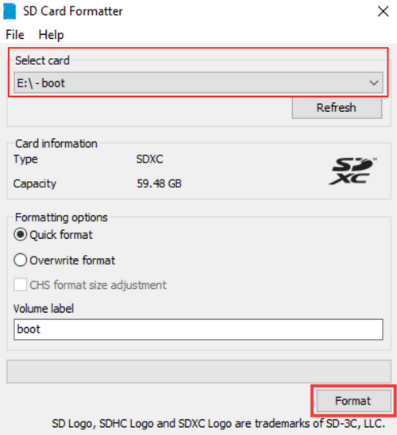


**Burn System**

Burn the Raspberry Pi OS system to TFT card using Win32DiskImager software


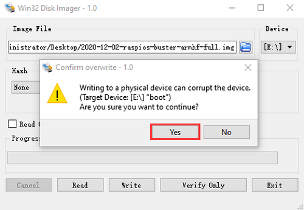


Don’t eject card reader after burning mirror system, build a file named SSH, then delete .txt.

The SSH login function can be activated by copying SSH file to boot category, as shown below.


**Eject Card Reader**

Log in system（raspberry and PC should be in the same local area network）

Insert TFT card into Raspberry, connect internet cable and plug in power.

If you have screen and HDMI cable of Raspberry Pi, you could view Raspberry Pi OS system activating.

If not, you can enter the desktop of Raspberry Pi via SSH remote login software---WinSCP and xrdp login.

**Remote Login**

**Enter default user name, password and host name on WinSCP to log in.**

**Only a Raspberry Pi is connected in same network.**


**Check ip and mac address**

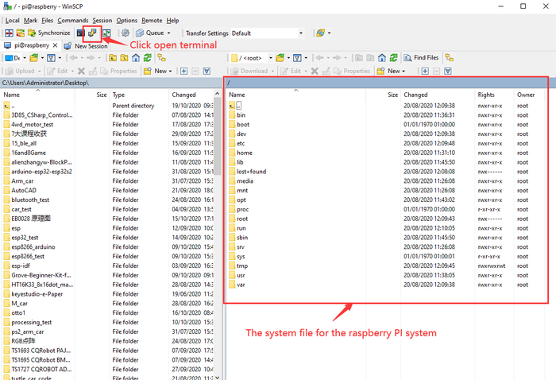

Click to open terminal input the password：raspberry, and press“Enter”on keyboard.


Logging in successfully, open the terminal, input ip a and tap“Enter”to check ip and mac address.


Form the above figure, mac address of this Raspberry Pi is dc:a6:32:17:61:9c, and ip address is 192.168.1.128(use ip address to finish xrdp login)

Since mac address never changes, you could confirm ip via it.

**Fix ip address of Raspberry Pi**

Ip address is changeable, therefore, we need to make ip address fixed for convenient use.

Follow the below steps：

Switch to root user

If without root user’s password

①Set root passward

Input passwordin the terminal：sudo passwd root to set password

②Switch to root user

su root

③ Fix the configuration file of ip address

Firstly change ip address of the following configuration file

（\#New ip address：address 192.168.1.99）

Copy the above new address to terminal and press“Enter”

Configuration File：

echo -e '

auto eth0

iface eth0 inet static

\#Change IP address

address 192.168.1.99

netmask 255.255.255.0

gateway 192.168.1.1

network 192.168.1.0

broadcast 192.168.1.255

dns-domain 119.29.29.29

dns-nameservers 119.29.29.29

metric 0

mtu 1492

'\>/etc/network/interfaces.d/eth0

As shown below:


④Reboot the system and activate the configuration file

Input the restart command in the terminal: sudo reboot

You could log in via fixed ip afterwards.

⑤Check IP and insure ip address fixed well


**Log in Desktop on Raspberry Pi Wirelessly**

In fact, we can log in desktop on Raspberry Pi Wirelessly even without screen and HDMI cable.

VNC and Xrdp are commonly used to log in desktop of Raspberry Pi wirelessly. Let’s take example of Xrdp.

**Install Xrdp Service in the terminal**

Install Command：

Switch to Root User: su root

Install ：apt-get install xrdp

Enter y and press “Enter”

As shown below:


**Open the remote desktop connection on Windows**

Press WIN+R on keyboard and enter mstsc.exe

As shown below：


Input ip address of Raspberry Pi, as shown below.

Click“Connect”and tap“Connect”.

192.168.1.99 is ip address we use, you could change into yours ip address.


Click“Yes”.


Input user name: pi, default password: raspberry, as shown below:


Click“OK”or“Enter”, you will view the desktop of Raspberry Pi OS, as shown below:


Now, we finish the basic configuration of Raspberry Pi OS.

## 3. Preparations for C Language

C is a procedural programming language. It was initially developed by Dennis Ritchie in the year 1972. It was mainly developed as a system programming language to write an operating system. The main features of C language include low-level access to memory, a simple set of keywords, and clean style, these features make C language suitable for system programmings like an operating system or compiler development.

Next to control 40 pins of Raspberry Pi via C language

### Hardware：

**Raspberry Pi 4B：**

|          **Raspberry Pi 4B**           |            **Raspberry Pi 4B Model**            |
| :------------------------------------: | :---------------------------------------------: |
|  |  |

**Hardware Interfaces：**


**40-Pin GPIO Header Description：**

GPIO pins are divided into BCM GPIO number, physics number and WiringPi GPIO number.

We usually use WiringPi GPIO number when using C language and BCM GPIO and physics number are used to Python, as shown below:

In these lessons, we use C language, so WiringPi GPIO number is adopted.

Note: pin(3.3 V) on the left hand is square, but other pins are round. Turn Raspberry Pi over, there is a square GPIO on the back.(you could tell from pin(3.3V).


Note: the largest current of each pin on Raspberry Pi 4B is 16mA and the aggregate current of all pins is not less than 51mA.

### GPIO Extension Board：

This extension board is led out by 40-pin headers of Raspberry Pi for convenient connection.

Note: the silk mark is also printed according to BCM GPIO number.


Since the Raspberry Pi itself does not have AD/DA function, an expansion board with this function is required when it is connected to external analog sensors. And the PCF8591 chip, welded behind RPI GPIO-PCF8591 shield , has four AD pins
and one DA pin which can be connected to the Raspberry Pi via the I2C interface on the Pi.

There are two ways to fix Raspberry Pi with the RPI GPIO-PCF8591 shield available below:

①Fix it with screws,nuts and pillar copper;


②Fix without screws,nuts and pillar copper;


### Install WiringPi GPIO Library

We will control IO ports of Raspberry Pi by WiringPi GPIO library, let’s install WiringPi GPIO library.

Click the terminal icon of Raspberry Pi and open the terminal, as shown below:


Enter the following commands in the terminal and tap“Enter”

cd /tmp

wget <https://project-downloads.drogon.net/wiringpi-latest.deb>

sudo dpkg -i wiringpi-latest.deb

As shown below：


Check the version of WiringPi GPIO library and corresponding definition of 40-pin headers

Input the following commands and press“Enter”

gpio -v

gpio readall

The version of WiringPi GPIO library is 2.52


Pins definition of WiringPi GPIO Library

(note: the silk mark of our extension board is defined by pins of BCM GPIO as well)


### Run Example Code1：

Copy the C_code.zip we provide to pi folder, and extract the example code from zip file, as shown below:


Double-click C_code folder to look through example code, as shown below:


Set the default editor of file with .c

Enter lesson1_Hello_World and right-click Open with...


Click Programming to select Geany Programmer’s Editor :


Then, we can directly open file by doubl-click Geany Programmer’s Editor

**The Use of Geany Programmer’s Editor**

Open“HelloWorld.c”via it, clickto compile code to check grammar errors.


**Run Example Code**

Terminal enters the corresponding courses，for example, enter lesson1_Hello_World.

Enter the route with terminal command cd

cd /home/pi/C_code/lesson1_Hello_World

Input the compilation command

gcc HelloWorld.c -o HelloWorld -lwiringPi

Input ls to check file of the current folder:

The compilation file:HelloWorld

Run a compilation file: HelloWorld

Input command：sudo ./HelloWorld(as shown below)


Command Explanation


You could select the folder and right-click to choose Openin the terminal as shown below, if you feel it complicated to enter the route.


## 4. Projects：

**Note: G, - and GND marked on sensors and modules are so-called positive, which are connected to GND of RPI GPIO-PCF8591 Shield ; V and VCC are known as positive, which are interfaced 3V3 or 5V on extension board.**

### Project 1：Hello World

(1)Run Example Code：

Input the following commands in the terminal, and press“Enter”:

cd /home/pi/C_code/lesson1_Hello_World

gcc HelloWorld.c -o HelloWorld -lwiringPi

sudo ./HelloWorld

(2)Test Results：

Terminal prints Hello World ! , as shown below:


(3)Example Code:

```c++
#include <wiringPi.h>   //wiringPi GPIO library
#include <stdio.h>  //standard input & output library

int main()  //Main function, the entry of the program
{
  
  wiringPiSetup();  //Initializes the wiringPi GPIO library
  while(1)  //An infinite loop
  {
    printf("Hello World!\n");  //\n is a newline print
    delay(1000);  //delay 1000ms
  }
}
```

### Project 2：LED Blinks

(1)Description：

Let’s start from a rather basic and simple experiment----LED Blinks.

**(2)Components Needed:**

|  |  |  |  |
| -------------------------------------- | ------------------------------------------------------------ | -------------------------------------- | ----------------------------------------------- |
| Raspberry Main Board*1                 | RPI GPIO-PCF8591 Shield*1                                    | White LED Module *1                    | F-F DuPont Wires                                |

**(3)Knowledge about Component :**

**The white LED module** is a commonly used LED module. It is a F5 LED with white appearance and white light display. During experiments, when the G and V on the module are powered up and the signal end S is at high level ,the white LED is on while when the S is at low level, the LED is off.

The module is compatible with various microcontroller control boards, such as arduino series microcontrollers. The white LED module can open and close the S8050 NPN transistor by controlling the high and low level of the IO port of the single-chip microcomputer so as to turn on and off the LED.

(4)Connection Diagram：

| White LED Module | RPI GPIO-PCF8591 Shield |
| :--------------: | :---------------------: |
|        S         |        S（IO18）        |
|        V         |           5V            |
|        G         |            G            |


**(5)Working Principle**

According to the diagram above we can find out that the positive pole(V) is connected to 5V, negative pole(G) to GND and signal terminal(S) to the pin of GPIO18. When GPIO18 outputs high level, LED is on; when it outputs low level, LED is off.

(6)Run Example Code：

Input the following commands in the terminal and press“Enter”

cd /home/pi/C_code/lesson2_LED_Blinking

gcc LED_Blinking.c -o LED_Blinking -lwiringPi

sudo ./LED_Blinking

(7)Test Results：

Terminal prints and LED flashes.


Note: Press Ctrl + C on keyboard and exit code running.

(8)Example Code：

```c++
#include <wiringPi.h>
#include <stdio.h>

#define ledPin 1  //define led pin, BCM GPIO 18

int main()
{
  wiringPiSetup();  //Initialize wiringPi
  
  pinMode(ledPin,OUTPUT);  //set the ledPin OUTPUT mode
  
  while(1)
  { 
        digitalWrite(ledPin,HIGH);  //turn on led
        printf("turn on the LED\n");
        delay(500);       //delay 500ms
        digitalWrite(ledPin,LOW);   //turn off led
        printf("turn off the LED\n");
        delay(500);	  
  }
}
```

### Project 3：SOS Light

(1)Description：

S.O.S is a Morse code distress signal , used internationally, that was originally established for maritime use. We will present it with flashing LED.

(2)Components Needed:

|  |  |  |  |
| ------------------------------------------------------------ | ------------------------------------------------------------ | ------------------------------------------------------------ | ----------------------------------------------- |
| Raspberry Main Board*1                                       | RPI GPIO-PCF8591 Shield*1                                    | White LED Module *1                                          | F-F DuPont Wires                                |

**(3)Connection Diagram：**

| White LED Module | RPI GPIO-PCF8591 Shield |
| :--------------: | :---------------------: |
|        S         |        S（IO18）        |
|        V         |           5V            |
|        G         |            G            |


(4)Run Example Code：

Input the following commands and press "Enter"

cd /home/pi/C_code/lesson3_SOS

gcc SOS.c -o SOS -lwiringPi

sudo ./SOS

(5)Test Results：

LED flashes quickly for three times, three times slowly and quickly three times, the terminal prints ... \_ \_ \_ ...


Note: Press Ctrl + C on keyboard and exit code running.

(6)Example Code:

```c++
#include <wiringPi.h>
#include <stdio.h> //The stdio.h header file defines three variable types, 
                   //some macros, and various functions to perform input and output.

#define ledPin 1  //define led pin
int i1,i2,i3;

int main()
{
	wiringPiSetup();  //Initialize wiringPi

	pinMode(ledPin,OUTPUT);  //set the ledPin OUTPUT mode

	while(1)
	{
		while(i1<3)
		{
			digitalWrite(ledPin,HIGH);  //turn on led
			delay(100);       //delay 100ms
			digitalWrite(ledPin,LOW);   //turn off led
			delay(100);
			i1 = i1 + 1;
			printf(".\n");
		}
		while(i2<3)
		{
			digitalWrite(ledPin,HIGH);  //turn on led
			delay(1000);       //delay 1000ms      
			digitalWrite(ledPin,LOW);   //turn off led
			delay(1000);
			i2 = i2 + 1;
			printf("-\n");
		}
		while(i3<3)
		{
			digitalWrite(ledPin,HIGH);  //turn on led
			delay(100);       //delay 100ms      
			digitalWrite(ledPin,LOW);   //turn off led
			delay(100);
			i3 = i3 + 1;
			printf(".\n");
		}
		//clean
		i1 = 0;
		i2 = 0;
		i3 = 0;
		printf(" \n");
		delay(500);
	}
	
}
```

### Project 4：Breathing LED

(1)Description：

A“breathing LED” is a phenomenon where an LED's brightness smoothly changes from dark to bright and back to dark, continuing to do so and giving the illusion of an LED“breathing.” This phenomenon is similar to a lung breathing in and out. So how to control LED’s brightness? We need to take advantage of PWM.

(2)Components Needed：

|  |  |  |  |
| -------------------------------------- | ------------------------------------------------------------ | -------------------------------------- | ----------------------------------------------- |
| Raspberry Main Board*1                 | RPI GPIO-PCF8591 Shield*1                                    | Red LED Module *1                      | F-F DuPont Wires                                |

**(3)Working Principle**

We use the PWM output of GPIO, PWM outputs analog signals and output value is 0\~100 which is equivalent to output voltage 0\~3.3V from GPIO port.

According to Ohm's law: U/R = I, the resistance is 220Ω, and the value of voltage U changes, so does the value of current I, which can control the brightness of the LED lamp.

PWM (Pulse Width Modulation) is the control of the analog circuit through the digital output of microcomputer and a method that makes digital coding on analog signal levels.

It sends square waves with certain frequency through digital pins, that is, high level and low level output alternately for a period of time. Total time of each group high and low level is fixed, which is called cycle.

The time of high level output is pulse width whose percentage is called Duty Cycle. The longer that high level lasts, the larger the duty cycle of analog signals is, and the corresponding voltage as well.

Below chart is pulse width 50%, then the output voltage is 3.3 \* 50% = 1.65V，and the brightness of LED is medium.


(4)Connection Diagram：

| Red LED Module | RPI GPIO-PCF8591 Shield |
| :------------: | :---------------------: |
|       S        |        S（IO18）        |
|       V        |           5V            |
|       G        |            G            |


(5)Run Example Code 1：

Input the following commands and press "Enter":

cd /home/pi/C_code/lesson4_Breathing_LED

gcc Breathing_LED1.c -o Breathing_LED1 -lwiringPi

sudo ./Breathing_LED1

(6)Test Result 1：

LED gradually brightens then darkens and changes in a loop.

Note: Press Ctrl + C on keyboard and exit code running.

(7)Example Code 1：

```c++
#include <stdio.h>
#include <wiringPi.h>
 
#define LED 1  //define led pin

int main(void)
{
    int bright;
    printf("Raspberry Pi wiringPi PWM test program\n");
    wiringPiSetup();  //Initialize wiringPi
    pinMode(LED,PWM_OUTPUT);  //set the ledPin OUTPUT mode
    
    while(1)
    {
        for (bright = 0; bright < 1024; ++bright)   // pwm 0~1024
        {
            pwmWrite(LED,bright);
            printf("bright:%d\n",bright);  //%d is the integer output, bright is the variable to output
            delay(10);
        }
        for (bright = 1023; bright >= 0; --bright)
        {
            pwmWrite(LED,bright);
            printf("bright:%d\n",bright);
            delay(10);
        }
    }
    return 0;
 }
```

(8)Run Example Code 2：

Software simulates PWM output:

Input the following commands and press "Enter":

cd /home/pi/C_code/lesson4_Breathing_LED

gcc Breathing_LED2.c -o Breathing_LED2 -lwiringPi

sudo ./Breathing_LED2

(9)Test Results2：

LED gradually brightens then darkens and repeats this pattern.

Note: Press Ctrl + C on keyboard and exit code running

**(10)Example Code2：**

```c++
#include <stdio.h>
#include <wiringPi.h>
#include <softPwm.h>  //Software PWM library

#define LED 1 

int main(void)
{
       int i = 0;
       wiringPiSetup();  //Initialize wiringPi
       softPwmCreate(LED, 0, 100);  //Create pin LED as the PWM output(0~100)
       while (1)
       {
              for(i=0; i<100; i++)
              {
                     softPwmWrite(LED, i);  //pwm write
                     delay(20);
                     printf("PWM = %d\n",i);
              }
              for(i=99; i>0; i--)
              {
                     softPwmWrite(LED, i);
                     delay(20);
                     printf("PWM = %d\n",i);
              }
       }
       return 0;
}
```

### Project 5：Traffic Lights

(1)Description：

In this lesson, we will learn how to control multiple LED lights and simulate the operation of traffic lights.

Traffic lights are signaling devices positioned at road intersections, pedestrian crossings, and other locations to control flows of traffic.

Green light allows traffic to proceed in the direction denoted if it is safe to do so and there is room on the other side of the intersection.

Red light prohibits any traffic from proceeding. A flashing red indication requires traffic to stop and then proceed when it is safe (equivalent to a stop sign).

Amber light (also known as 'orange light' or 'yellow light'):

Warns that the signal is about to change to red, with some jurisdictions requiring drivers to stop if it is safe to do so, and others allowing drivers to go through the intersection if safe to do so.

(2)Components Needed：

|  |  |  |  |
| -------------------------------------- | ------------------------------------------------------------ | -------------------------------------- | ----------------------------------------------- |
| Raspberry Main Board*1                 | RPI GPIO-PCF8591 Shield*1                                    | Traffic Light Module *1                | F-F DuPont Wires                                |

(3)Connection Diagram：

| Traffic Light Module | RPI GPIO-PCF8591 Shield |
| :------------------: | :---------------------: |
|          R           |          IO18           |
|          Y           |          IO23           |
|          G           |          IO24           |
|         GND          |           GND           |


(4)Run Example Code：

Input the following commands and press "Enter":

cd /home/pi/C_code/lesson5_Traffic_Light

gcc Traffic_Light.c -o Traffic_Light -lwiringPi

sudo ./Traffic_Light

(5)Test Results：

Note: Press Ctrl + C on keyboard and exit code running.

Red light is on 5s and off, yellow light flashes 3s and turn off, green light is lit for 5s and off, in loop way.

(6)Example Code：

```c++
#include <wiringPi.h>

#define R_pin 1  //BCM GPIO 18
#define G_pin 5  //BCM GPIO 24
#define Y_pin 4  //BCM GPIO 23

int main()
{
  wiringPiSetup();
  char j;
  pinMode(R_pin,OUTPUT);
  pinMode(G_pin,OUTPUT);
  pinMode(Y_pin,OUTPUT);
  
  digitalWrite(R_pin, LOW);
  digitalWrite(G_pin, LOW);
  digitalWrite(Y_pin, LOW);
  
  while(1)
  { 
   digitalWrite(R_pin, HIGH);//// turn on red LED
   delay(5000);// wait 5 seconds
   digitalWrite(R_pin, LOW); // turn off red LED
   for(j=0;j<3;j++) // blinks for 3 times
   {
   digitalWrite(Y_pin, HIGH);// turn on yellow LED
   delay(500);// wait 0.5 second
   digitalWrite(Y_pin, LOW);// turn off yellow LED
   delay(500);// wait 0.5 second
   } 

   digitalWrite(G_pin, HIGH);// turn on green LED
   delay(5000);// wait 5 second
   digitalWrite(G_pin, LOW);// turn off green LED
   } 
}
```

### Project 6：Illuminating Lamp

(1)Description：

Nowadays, illuminating lamps are indispensable in our lives for we need them to light the surroundings for us, especially at night. In this experiment, we will use a LED of 3W . This LED is of high brightness because the lamp beads it carries are 3W, that is, the luminous power is 3W. We can apply this module to Arduino, Raspberry Pi and other projects. For example, smart robots can use the module for lighting purposes. However, please note that for safety reasons, do not touch your eyes with this LED directly. Otherwise your eyes maybe damaged.

(2)Components Needed：

|  |  |  |  |
| -------------------------------------- | ------------------------------------------------------------ | -------------------------------------- | ----------------------------------------------- |
| Raspberry Main Board*1                 | RPI GPIO-PCF8591 Shield*1                                    | 3W LED Module *1                       | F-F DuPont Wires                                |

Connection Diagram：

| 3W LED Module | RPI GPIO-PCF8591 Shield |
| :-----------: | :---------------------: |
|       S       |        S（IO18）        |
|       V       |           5V            |
|       G       |            G            |


(3)Run Example Code：

Input the following commands and press "Enter":

cd /home/pi/C_code/lesson6_3W_LED

gcc 3W_LED.c -o 3W_LED -lwiringPi

sudo ./3W_LED

(4)Test Results：

When the program runs, the 3W LED lights and it is shown on the terminal.

Note: Press Ctrl + C on keyboard and exit code running.

**Example Code：**

```c++
#include <wiringPi.h>
#include <stdio.h>

#define ledPin 1  //define led pin, BCM GPIO 18

int main()
{
  wiringPiSetup();  //Initialize wiringPi
  
  pinMode(ledPin,OUTPUT);  //set the ledPin OUTPUT mode
  
  while(1)
  { 
        digitalWrite(ledPin,HIGH);  //turn on led
        printf("turn on the LED\n");  
  }
}
```

### Project 7：RGB Light

(1)Description：

In this chapter, we will demonstrate how RGB lights show different colors via programming

(2)Components Needed：

|  |  |  |  |
| -------------------------------------- | ------------------------------------------------------------ | -------------------------------------- | ----------------------------------------------- |
| Raspberry Main Board*1                 | RPI GPIO-PCF8591 Shield*1                                    | RGB Module *1                          | F-F DuPont Wires                                |

**(3)Knowledge about Component:**

**RGB Module：**

The RGB module integrates with three LEDs in red, green and blue respectively. These three LEDs also share the same anode. The combinations of these three colors can form almost all other colors visible to human eyes. Thus, it has found wide applications in terms of colors.

Red, green and blue are three primary colors. They could produce all kinds of visible lights when mixing them up. Computer screen, single pixel mobile phone screen, neon light work under this principle.


Theoretically, if we use three 8-bit PWM (Pulse Width Modulation) signals to control a RGB LED, we can create $2^8$ \* $2^8$ \* $2^8$ = 16777216 (about 16 million) different combinations.

Now, let’s make a RGB LED display all kinds of colors.

(4)Connection Diagram：

| RGB Module | RPI GPIO-PCF8591 Shield |
| :--------: | :---------------------: |
|     R      |          IO24           |
|     G      |          IO23           |
|     B      |          IO18           |
|     V      |           5V            |


(5)Run Example Code：

Input the following commands and press "Enter":

cd /home/pi/C_code/lesson7_RGB_LED

gcc RGB_LED.c -o RGB_LED -lwiringPi

sudo ./RGB_LED

(6)Test Results：

RGB lights show colors randomly

Note: Press Ctrl + C on keyboard and exit code running

RGB light shows the all kinds of colors randomly.

(7)Example Code：

```c++
#include <stdio.h>
#include <stdlib.h>
#include <stdint.h>
#include <wiringPi.h>
#include <softPwm.h>
#include <time.h>

#define pin_R 5 //BCM GPIO 24
#define pin_G 4 //BCM GPIO 23
#define pin_B 1 //BCM GPIO 18
 

int main(void){
     int red,green,blue;
     if (wiringPiSetup() == -1){
          printf("Setup GPIO error!\n");
          return -1;
     }
     softPwmCreate(pin_R, 0, 100); 
     softPwmCreate(pin_G, 0, 100); 
     softPwmCreate(pin_B, 0, 100); 
     
     while (1){
          srand((unsigned)time(NULL));
          red = rand()%101 + 0;
          green = rand()%101 + 0;
          blue = rand()%101 + 0;
          softPwmWrite(pin_R, red);
          softPwmWrite(pin_G, green);
          softPwmWrite(pin_B, blue);
          delay(100);
     }
     return 0;
}
```

### Project 8：Doorbell

(1)Description：

Doorbells have made our daily life more convenient. When a guest arrives, we will get this information when he/she rings the bell. In this project, we will learn to make a doorbell by ourselves.

(2)Components Needed：

|  |  |  |  |  |
| -------------------------------------- | -------------------------------------- | -------------------------------------- | -------------------------------------- | ----------------------------------------------- |
| Raspberry Main Board*1                 | RPI GPIO-PCF8591 Shield*1              | Active Buzzer Module *1                | Push Button Sensor*1                   | F-F DuPont Wires                                |

**(3)Knowledge about Component:**

**Active Buzzer Module：**The active buzzer is equipped with an internal oscillator, which makes it possible to automatically generate a tone as long as current flows through. It is very easy and convenient. But it also has its shortcoming that the fixed frequency means it can only makes a monotone.

**Push Button Sensor：**

It can control circuits. Before pressed, the current can’t pass from one end to the other end. Both ends are like two mountains. There is a river in between. We can't cross this mountain to another mountain. When pressed, the internal metal piece is connecting the two sides to let the current pass, just like building a bridge to connect the two mountains.

Inner structure:, 1 and 1 , 2 and 2 are connected. However, 1 and 2 are disconnected when the button is not pressed; 1 and 2 are connected when pressing the button.

(4)Connection Diagram：

| Active Buzzer Module | RPI GPIO-PCF8591 Shield |      | Push Button Sensor | RPI GPIO-PCF8591 Shield |
| :------------------: | :---------------------: | ---- | :----------------: | :---------------------: |
|          S           |        S（IO16）        |      |         S          |        S（IO18）        |
|          V           |           5V            |      |         V          |           5V            |
|          G           |            G            |      |         G          |            G            |


(5)Run Example Code：

Input the following commands and press "Enter":

cd /home/pi/C_code/lesson8_Active_Buzzer

gcc Active_Buzzer.c -o Active_Buzzer -lwiringPi

sudo ./Active_Buzzer

(6)Test Results：

After running the program and pressing the button, the buzzer makes a sound and the terminal prints 0 (low level); otherwise, the buzzer makes no sounds and the terminal prints 1 (high level).

Note: Press Ctrl + C on keyboard and exit code running.

(7)Example Code：

```c++
#include <wiringPi.h>
#include <stdio.h>
#define button 1   //button pin BCM GPIO 18
#define buzzer 27   //buzzer pin BCM GPIO 16
int main()
{
  wiringPiSetup();
  char val;
  {
    pinMode(button,INPUT);  //set the button pin INPUT mode
    pinMode(buzzer,OUTPUT);
  }
  
  while(1)
  {
    val=digitalRead(button);  // digital read
    printf("val = %d\n", val);
    if(val==0)//check if the button is pressed, if yes, turn on the Buzzer
      digitalWrite(buzzer,HIGH);  //The buzzer made a sound
    else
      digitalWrite(buzzer,LOW);
  }	
}
```

### Project 9：Passive Buzzer

(1)Description：

We will conduct an interesting experiment-----control passive buzzer to compose a song.

(2)Components Needed：

|  |  |  |  |
| -------------------------------------- | -------------------------------------- | -------------------------------------- | ----------------------------------------------- |
| Raspberry Main Board*1                 | RPI GPIO-PCF8591 Shield*1              | Passive Buzzer Module *1               | F-F DuPont Wires                                |

(3)Knowledge about Component：

**Passive buzzer**：

Passive buzzer is a type of electronic buzzer with integrated structure.

Buzzers can be categorized as active and passive ones (see the following picture).

An active buzzer has a built-in oscillating source, so it will make sounds when electrified. But a passive buzzer does not have such source, so it will not tweet if DC signals are used; instead, you need to use square waves whose frequency is between 2K and 5K to drive it. The active buzzer is often more expensive than the passive one because of multiple built-in oscillating circuits.

Turn the pins of two buzzers face up, and the one with a green circuit board is a passive buzzer, while the other enclosed with a black tape is an active one, as shown：

Passive buzzer provides alternating current to sound coils to make electronic magnet and permanent magnet attraction or repulsion so as to push vibration film to emit sound, according to electromagnetic induction.

Only certain frequency with high and low levels can make passive buzzer emit sound, since DC current only makes vibration film vibrated continuously rather than producing sound.

(4)Connection Diagram：

| Passive Buzzer Module | RPI GPIO-PCF8591 Shield |
| :-------------------: | :---------------------: |
|           S           |        S（IO18）        |
|           V           |           5V            |
|           G           |            G            |

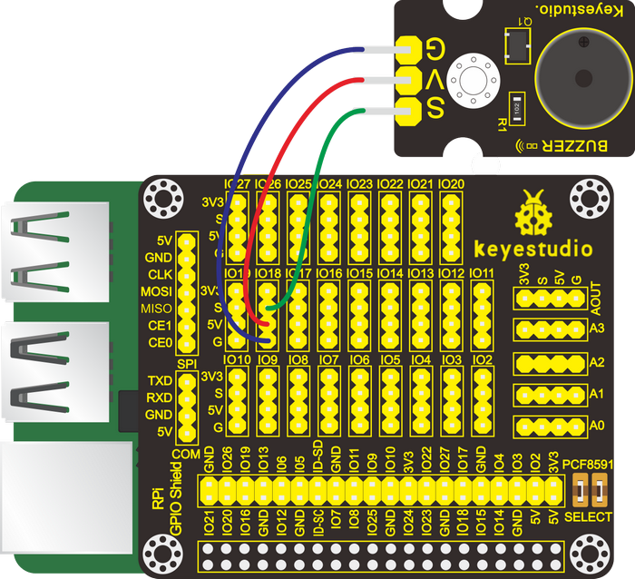

(5)Run Example Code1：

Input the following commands and press "Enter":

cd /home/pi/C_code/lesson9_Passive_Buzzer

gcc Passive_Buzzer1.c -o Passive_Buzzer1 -lwiringPi

sudo ./Passive_Buzzer1

(6)Test Results1：

After running the program, the passive buzzer makes the sound “didi”.

Note: Press Ctrl + C on keyboard and exit code running.

(7)Example Code1：

```c++
#include <stdio.h>
#include <stdlib.h>
#include <stdint.h>
#include <wiringPi.h>

#define buzPin 1  //BCM GPIO 18

void init()
{
   if (wiringPiSetup () == -1)
       exit (1) ;
   pinMode(buzPin, PWM_OUTPUT); //Set the pin to PWM output mode
   pwmSetMode(PWM_MODE_MS);  // Set PWM signal mode to MS mode
   pwmSetClock(32);  // Set the clock base frequency to 19.2m /32=600KHZ
}

void beep(int freq,int t_ms)
{
   int range;
   if(freq<100||freq>1000)
   {
      printf("invalid freq");
      return;
   }
   // Set the range to 600KHZ/ Freq. That is, 
   //the freQ frequency period is composed of the range of 1/600khz.
   range=600000/freq;
   pwmSetRange(range);
   pwmWrite(buzPin,range/2);  // Set the duty cycle to 50%.
   if(t_ms>0)
   {
      delay(t_ms);
   }
}

int main()
{
   wiringPiSetup();
   init();

   while(1)
   { 
      beep(262,300);  //Frequency and time
      printf("do\n");
      beep(294,300);
      printf("re\n");
      beep(330,300);
      printf("mi\n");
      beep(349,300);
      printf("fa\n");
      beep(392,300);
      printf("so\n");
      beep(440,300);
      printf("la\n");
      beep(494,300);
      printf("si\n");
      beep(523,300);
      printf("Do\n");
      pwmWrite(buzPin,0);   //turn off the buzzer 
      delay(2000);  
   } 	  
}
```

(8)Run Example Code2：

Input the following commands and press "Enter":

cd /home/pi/C_code/lesson9_Passive_Buzzer

gcc Passive_Buzzer2.c -o Passive_Buzzer2 -lwiringPi

sudo ./Passive_Buzzer2

(9)Test Results2：

The passive buzzer plays a “Happy Birthday”song.

Note: Press Ctrl + C on keyboard and exit code running.

(10)Example Code2：

```c++
#include <stdio.h>
#include <stdlib.h>
#include <stdint.h>
#include <wiringPi.h>
#define Do 262
#define Re 294
#define Mi 330
#define Fa 349
#define Sol 392
#define La 440
#define Si 494
#define Do_h 532
#define Re_h 587
#define Mi_h 659
#define Fa_h 698
#define Sol_h 784
#define La_h 880
#define Si_h 988

#define buzPin 1   //buzzer pin BCM GPIO 18

//The tones
int song_1[]=
{
    Sol,Sol,La,Sol,Do_h,Si,
    Sol,Sol,La,Sol,Re_h,Do_h,
    Sol,Sol,Sol_h,Mi_h,Do_h,Si,La,
    Fa_h,Fa_h,Mi_h,Do_h,Re_h,Do_h
};

//To the beat
float beat_1[]=
{
    0.5,0.5,1,1,1,1+1,
    0.5,0.5,1,1,1,1+1,
    0.5,0.5,1,1,1,1,1,
    0.5,0.5,1,1,1,1+1
};

int length;
int x;

void init()
{
   if (wiringPiSetup () == -1)
       exit (1) ;
   pinMode(buzPin, PWM_OUTPUT); //Set the pin to PWM output mode
   pwmSetMode(PWM_MODE_MS);  // Set PWM signal mode to MS mode
   pwmSetClock(32);  // Set the clock base frequency to 19.2m /32=600KHZ
}

void beep(int freq,int t_ms)
{
   int range;
   if(freq<100||freq>1000)
   {
      printf("invalid freq");
      return;
   }
   // Set the range to 600KHZ/ Freq. That is, 
   //the freQ frequency period is composed of the range of 1/600khz.
   range=600000/freq;
   pwmSetRange(range);
   pwmWrite(buzPin,range/2);  // Set the duty cycle to 50%.
   if(t_ms>0)
   {
      delay(t_ms);
   }
}

int main()
{
  wiringPiSetup();
  init();
  length=sizeof(song_1)/sizeof(song_1[0]); //Number of tones
  
  while(1)
  {
    for(x=0;x<length;x++)  //play
    {
      beep(song_1[x],500*beat_1[x]);
    }
    pwmWrite(buzPin,0);   //turn off buzzer
    delay(2000);  
  } 	  
}
```

### Project 10：Button-controlled LED

(1)Description：

Usually a complete open loop control is made of external information input, controller and actuator.

The external information is input into controller which can analyze the input data and send to control signals to make actuator to react.

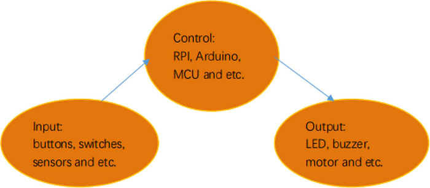

A button-controlled LED is decided by an open loop control. Next, we will make a desk lamp with a button, an LED and RPi. LED is on when button is pressed, on the contrary, it will be off.

(2)Components Needed：

|  |  |  |  |  |
| -------------------------------------- | ------------------------------------------------------------ | -------------------------------------- | -------------------------------------- | ----------------------------------------------- |
| Raspberry Main Board*1                 | RPI GPIO-PCF8591 Shield*1                                    | Red LED Module *1                      | Push Button Sensor*1                   | F-F DuPont Wires                                |

(3)Connection Diagram：

| Red LED Module | RPI GPIO-PCF8591 Shield |      | Push Button Sensor | RPI GPIO-PCF8591 Shield |
| :------------: | :---------------------: | ---- | :----------------: | :---------------------: |
|       S        |        S（IO16）        |      |         S          |        S（IO18）        |
|       V        |           5V            |      |         V          |           5V            |
|       G        |            G            |      |         G          |            G            |


(4)Eliminate button jitters

When the button is pressed, its state does not change immediately because it is a mechanical vibration and continuous jitters exists before entering another state. It is similar to release the button.

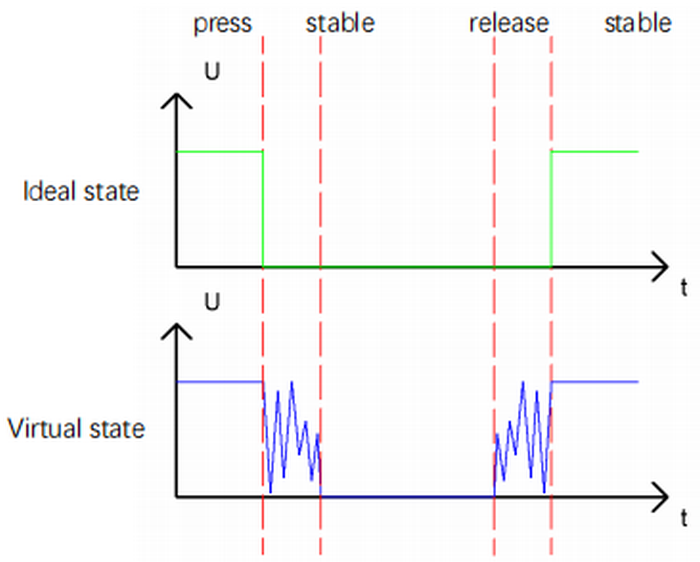

Therefore, if we directly detect the state of the button, there will be multiple presses and releases. Jitters will mislead the high-speed operation of the MCU to cause considerable misjudgments. To eliminate the button jitters, here we put forward a solution that we design to detect the button state for more than once. After a while, the stable button state is adopted to represent that the button is pressed.

(5)Run Example Code：

Input the following commands and press "Enter":

cd /home/pi/C_code/lesson10_Button_controlled_LED

gcc Button_controlled_LED.c -o Button_controlled_LED -lwiringPi

sudo ./Button_controlled_LED

(6)Test Results：

Press button, LED turns on, press again, LED is off and then repeats this pattern.

Note: Press Ctrl + C on keyboard and exit code running.

(7)Example Code：

```c++
#include <wiringPi.h>
#include <stdio.h>
#define btnPin 1  // button Pin BCM GPIO 18
#define ledPin 27  // LED pin BCM GPIO 16
  
int main()
{
  wiringPiSetup();
  int val; //Button variables
  int count = 0; //Record the number of button presses
  int flag = 0;  //Odd even variable
  pinMode(btnPin,INPUT);
  pinMode(ledPin,OUTPUT);
  digitalWrite(ledPin,LOW);  //turn off led
  
  while(1)
  { 
    val=digitalRead(btnPin);  //Receive button value
    if(val == 0)
    {
      delay(10);
      val=digitalRead(btnPin);  //Receive button value
      if(val == 1)
      {
        count = count + 1;
        printf("count = %d",count);
      }
    }
    flag = count % 2; //Remainder 2 ,Even is 0, odd is 1
    if(flag == 1)
      digitalWrite(ledPin,HIGH);  //turn on led
    else
      digitalWrite(ledPin,LOW);  //turn off led
  }	 
}
```

### Project 11：PIR Motion Sensor

(1)Description：

Lamps only light up when people passes by installed in some places, which are conductive to energy and cost saving. Have you ever thought about the principle behind these lamps? It is because of PIR motion sensors. In this lesson, we will learn about PIR motion sensor.

(2)Components Needed：

|  |  |  |  |  |
| -------------------------------------- | ------------------------------------------------------------ | -------------------------------------- | -------------------------------------- | ----------------------------------------------- |
| Raspberry Main Board*1                 | RPI GPIO-PCF8591 Shield*1                                    | Red LED Module *1                      | PIR Motion Sensor*1                    | F-F DuPont Wires                                |

(3)Knowledge about Component：

**PIR Motion Sensor：**

The principle of human infrared sensor is that when certain crystals, such as lithium tantalate and triglyceride sulfate, are heated, the two ends of the crystal will generate an equal number of charges, with opposite signs, which can be converted into voltage output by an amplifier.

Human body will emit IR ray, although weak but can be detected. This sensor outputs 1 (high level ) when human being is detected; otherwise, it outputs 0(low level).

Note: Nothing but moving person can be detected, with the detection distance up to 3m.

(4)Connection Diagram：

| Red LED Module | RPI GPIO-PCF8591 Shield |      | PIR Motion Sensor | RPI GPIO-PCF8591 Shield |
| :------------: | :---------------------: | ---- | :---------------: | :---------------------: |
|       S        |        S（IO5）         |      |         S         |        S（IO18）        |
|       V        |           5V            |      |         V         |           5V            |
|       G        |            G            |      |         G         |            G            |


(5)Working Principle：

When the PIR motion sensor detects movements around, the LED lights and the terminal prints somebody; while when there is no movements sensed, the LED reminds off and the terminal prints nobody.

(6)Run Example Code：

Input the following commands and press "Enter":

cd /home/pi/C_code/lesson11_PIR_Led

gcc PIR_Led.c -o PIR_Led -lwiringPi

sudo ./PIR_Led

(7)Test Results：

LED will turn on and terminal prints somebody if PIR motion sensor detects people; if not, LED will be off and terminal will print nobody.

Note: Press Ctrl + C on keyboard and exit code running.

(8)Example Code：

```c++
#include <wiringPi.h>
#include <pcf8591.h>
#include <stdio.h>

#define PIR_pin 1  //PIR pin  BCM GPIO 18
#define led_pin 21  //LED pin BCM GPIO 5

int main(void)
{
   int val = 0;
   wiringPiSetup();
   pinMode(PIR_pin,INPUT);
   pinMode(led_pin,OUTPUT);
     
   while(1)
   {
      val=digitalRead(PIR_pin);
      if(val==1)
      {
         printf("somebody\n");
         digitalWrite(led_pin,HIGH);
      }
      else
      {
         printf("nobody\n");
         digitalWrite(led_pin,LOW);
      }
   }
}
```

### Project 12：Fire Alarm

(1)Description：

A flame detector is a sensor designed to detect and respond to the presence of flames or fire, allowing flame detection.

(2)Components Needed：

|  |  |  |  |  |
| -------------------------------------- | ------------------------------------------------------------ | -------------------------------------- | -------------------------------------- | ----------------------------------------------- |
| Raspberry Main Board*1                 | RPI GPIO-PCF8591 Shield*1                                    | Active Buzzer Module *1                | Flame Sensor*1                         | F-F DuPont Wires                                |

(3)Knowledge about Component：

**Flame Sensor：**

Flame sensor is made based on the principle that infrared ray is highly sensitive to flame. It has an infrared receiving tube specially designed to detect fire, and then convert the flame brightness to fluctuating level signal. The signals are then input into the central processor and be dealt with accordingly.

Flame sensor is used to detect fire source with wavelength in 760nm～1100nm, detection angle is 60°. When its IR waves length is close to 940nm, and its sensitivity is the highest.

Notice that keep flame sensor away from fire source to defend its damage for its working temperature is between -25°-85°

Note: a potentiometer is built in the sensor so its sensitivity can be adjusted by rotating it.

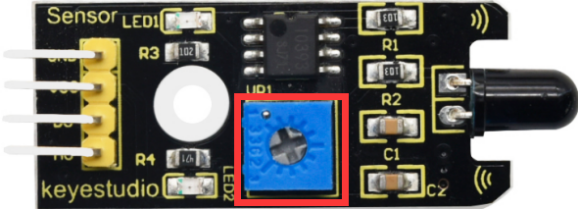

(4)Connection Diagram：

| Active Buzzer Module | RPI GPIO-PCF8591 Shield |      | Flame Sensor | RPI GPIO-PCF8591 Shield |
| :------------------: | :---------------------: | ---- | :----------: | :---------------------: |
|          S           |        S（IO16）        |      |      D0      |        S（IO18）        |
|          V           |           5V            |      |     VCC      |           5V            |
|          G           |            G            |      |     GND      |            G            |


(5)Run Example Code：

Input the following commands and press "Enter":

cd /home/pi/C_code/lesson12_Flame_Buzzer

gcc Flame_Buzzer.c -o Flame_Buzzer -lwiringPi

sudo ./Flame_Buzzer

(6)Test Results：

After running the program, when the sensor detects flame, the buzzer makes noises, the LED1 lights and the terminal prints 0 (low level); otherwise, the buzzer makes no sounds, the LED1 reminds off and the terminal prints 1 (high level).

Note: Press Ctrl + C on keyboard and exit code running.

(7)Example Code：

```c++
#include <wiringPi.h>
#include <stdio.h>
#define flamePin 1  //BCM GPIO 18
#define buzPin 27  //define buzzer pin  BCM GPIO 16

int main()
{
  wiringPiSetup();
  char val;
  {
    pinMode(flamePin,INPUT);
    pinMode(buzPin,OUTPUT);
  }
  
  while(1)
  { 
   val=digitalRead(flamePin);
   printf("val = %d\n",val);
   if(val==0) //When flame is detected
    digitalWrite(buzPin,HIGH);  //Buzzer turn on
   else
    digitalWrite(buzPin,LOW);  //Buzzer turn off
  }	
}
```

### Project 13：Electronic Hourglass

(1)Description：

An hourglass (or sand glass, sand timer, sand clock or egg timer) is a device used to measure the passage of time. It comprises two glass bulbs connected vertically by a narrow neck that allows a regulated flow of a substance(historically sand) from the upper bulb to the lower one. Typically the upper and lower bulbs are symmetric so that the hourglass will measure the same
duration regardless of orientation. The specific duration of time a given hourglass measures is determined by factors including the quantity and coarseness of the particulate matter, the bulb size, and the neck width.

(2)Components Needed：

|  |  |           |
| -------------------------------------- | -------------------------------------- | ----------------------------------------------- |
| Raspberry Main Board*1                 | RPI GPIO-PCF8591 Shield*1              | Red LED Module *1                               |
|  |  |  |
| White LED Module *1                    | Tilt Sensor*1                          | F-F DuPont Wires                                |

(3)Knowledge about Component：

**Tilt Sensor**：

Tilt sensors (tilt ball switch) allow you to detect orientation or inclination. They are small, inexpensive, low-power and easy-to-use. If used properly, they will not wear out.

The tilt-switch twig is the equivalent of a button, and is used as a digital input. Inside the tilt switch is a ball that make contact with the pins when the case is upright. Tilt the case over and the balls don't touch, thus not making a connection. When the switch is level it is open, and when tilted, the switch closes.

It can be used for orientation detection, alarm device or others.

Here is the principle of tilt sensor to illustrate how it works:

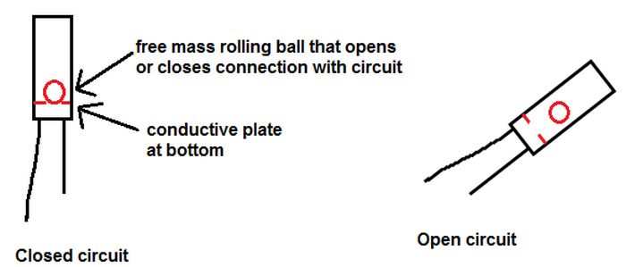

(4)Connection Diagram：

|  Red LED Module  | RPI GPIO-PCF8591 Shield |      | Ball Tilt Sensor | RPI GPIO-PCF8591 Shield |
| :--------------: | :---------------------: | ---- | :--------------: | :---------------------: |
|        S         |        S（IO27）        |      |        S         |        S（IO18）        |
|        V         |           5V            |      |        V         |           5V            |
|        G         |            G            |      |        G         |           GND           |
| White LED Module | RPI GPIO-PCF8591 Shield |      |                  |                         |
|        S         |        S（IO17）        |      |                  |                         |
|        V         |           5V            |      |                  |                         |
|        G         |            G            |      |                  |                         |


(5)Run Example Code：

Input the following commands and press "Enter":

cd /home/pi/C_code/lesson13_Ball_Tilt_Sensor

gcc Ball_Tilt_Sensor.c -o Ball_Tilt_Sensor -lwiringPi

sudo ./Ball_Tilt_Sensor

(6)Test Results：

LED1 gradually brightens and LED2 gradually darkens when placing electronic hourglass. However, when you make it upside down, LED1 gradually darkens and LED2 gets bright.

Note: Press Ctrl + C on keyboard and exit code running.

(7)Example Code：

```c++
 #include <stdio.h>
 #include <stdlib.h>
 #include <stdint.h>
 #include <wiringPi.h>
 #include <softPwm.h>

//define led pin
 #define LED1 0  //BCM GPIO 17
 #define LED2 2  //BCM GPIO 27
 //define Ball Tilt Sensor Pin
 #define tiltPin 1  //BCM GPIO 18

 int main(void){
     int val;
     int val1 = 50;  //Initial value of LED brightness
     int val2 = 50;
     if (wiringPiSetup() == -1)
     {
        printf("Setup GPIO error!\n");
        return -1;
     }
     softPwmCreate(LED1, 0, 100);  //Define the pin as PWM output
     softPwmCreate(LED2, 0, 100); 
     while (1)
     {
        val=digitalRead(tiltPin); //Read the value of the tilt sensor
        if(val==0)  //upright
        {
          val1++;  //The value of LED1 increases
          val2--;  //Led2 value reduced
          if(val1>=100)  //The size of the limit
          {
            val1 = 100;
          }
          if(val2<=0) //The size of the limit
          {
            val2 = 0;
          }
          softPwmWrite(LED1, val1);  //The value after PWM output changes
          softPwmWrite(LED2, val2);
          delay(50);  //Delay, adjust the speed
        }
        else
        {
          val1--;
          val2++;
          if(val1<=0)
          {
            val1 = 0;
          }
          if(val2>=100)
          {
            val2 = 100;
          }
          softPwmWrite(LED1, val1);
          softPwmWrite(LED2, val2);
          delay(50);
        }
     }
  return 0;
}
```

### Project 14：Collision Alarm

(1)Description：

We can use the collision sensor to detect whether crash happens. When the metal plate above the push button switch of the sensor is knocked, it outputs low level signals; and when the button is open, it remind in high level. In this project, collision sensor will be applied to control the active buzzer.

(2)Components Needed：

|  |           |  |
| -------------------------------------- | ----------------------------------------------- | -------------------------------------- |
| Raspberry Main Board*1                 | RPI GPIO-PCF8591 Shield*1                       | Active Buzzer Module *1                |
|  |  |                                        |
| Collision Sensor*1                     | F-F DuPont Wires                                |                                        |

(3)Knowledge about Component：

**Collision Sensor:**

It is a widely used collision sensor that has a push button switch covered by a mental plate. When the plate is pushed, the button is pressed, the sensor outputs low level and the LED on it lights; or it outputs high level and the LED reminds off.

This sensor is often used as a limit switch in a 3D printer.

(4)Connection Diagram：

| Active Buzzer Module | RPI GPIO-PCF8591 Shield |      | Collision Sensor | RPI GPIO-PCF8591 Shield |
| :------------------: | :---------------------: | ---- | :--------------: | :---------------------: |
|          S           |        S（IO16）        |      |        S         |        S（IO18）        |
|          V           |           5V            |      |        V         |           5V            |
|          G           |            G            |      |        G         |            G            |


(5)Run Example Code：

Input the following commands and press "Enter":

cd /home/pi/C_code/lesson14_Crash_Buzzer

gcc Crash_Buzzer.c -o Crash_Buzzer -lwiringPi

sudo ./Crash_Buzzer

(6)Test Results：

After running the program, when the metal plate of the push button switch is pressed, the buzzer makes sound and the terminal prints 0 ( low level) or it keeps silent and the terminal prints 1 (high level).

Note: Press Ctrl + C on keyboard and exit code running.

(7)Example Code：

```c++
#include <wiringPi.h>
#include <stdio.h>
#define crash 1   //crash pin BCM GPIO 18
#define buzzer 27   //buzzer pin BCM GPIO 16
int main()
{
  wiringPiSetup();
  char val;
  {
    pinMode(crash,INPUT);  //set the crash pin INPUT mode
    pinMode(buzzer,OUTPUT);
  }
  
  while(1)
  {
    val=digitalRead(crash);  // digital read
    printf("val = %d\n", val);
    if(val==0)//check if the metal shrapnel is pressed, if yes, turn on the Buzzer
      digitalWrite(buzzer,HIGH);  //The buzzer made a sound
    else
      digitalWrite(buzzer,LOW);
  } 
}
```

### Project 15：Line-tracking Sensor

(1)Description：

You may have seen that in an experiment a smart car moved along a black line and it didn’t overstep this boundary. How did it make it? The credit goes to a line-tracking sensor. And in this project, we intend to learn about the line-tracking sensor.

(2)Components Needed：

|  |  |  |  |  |
| -------------------------------------- | ------------------------------------------------------------ | -------------------------------------- | -------------------------------------- | ----------------------------------------------- |
| Raspberry Main Board*1                 | RPI GPIO-PCF8591 Shield*1                                    | Red LED Module *1                      | Line-tracking Sensor*1                 | F-F DuPont Wires                                |

(3)Knowledge about Component：

**Line-tracking Sensor：**

It is an infrared sensor in nature which can detect white and black objects. The working principle of the TCRT5000 pair tube on the sensor is based on the different reflectivity of infrared to colors so as to convert this different strengths of reflected signals to electric signals. When the sensor detects black objects, it is in high level while when it sensors white items it is in low level. And the detection altitude is from 0 to 3cm. You can rotate the potentiometer in a bid to adjust the sensitivity of the line-tracking sensor.


(4)Connection Diagram：

| Red LED Module | RPI GPIO-PCF8591 Shield |      | Line-tracking Sensor | RPI GPIO-PCF8591 Shield |
| :------------: | :---------------------: | ---- | :------------------: | :---------------------: |
|       S        |        S（IO27）        |      |          S           |        S（IO18）        |
|       V        |           5V            |      |          V           |           5V            |
|       G        |            G            |      |          G           |            G            |


(5)Run Example Code：

Input the following commands and press "Enter":

cd /home/pi/C_code/lesson15_Tracking

gcc Tracking.c -o Tracking -lwiringPi

sudo ./Tracking

(6)Test Results：

After running the program, when the line-tracking sensor detects black objects or no objects, then LED reminds off and the terminal prints 1 (high level); otherwise the LED lights up and the terminal prints 0 (low level).

Note: Press Ctrl + C on keyboard and exit code running.

(7)Example Code：

```c++
#include <wiringPi.h>
#include <stdio.h>
#define tracking 1   //tracking pin BCM GPIO 18
#define led 2   //led pin BCM GPIO 27
int main()
{
  wiringPiSetup();
  char val;
  {
    pinMode(tracking,INPUT);  //set the tracking pin INPUT mode
    pinMode(led,OUTPUT);
  }
  
  while(1)
  {
    val=digitalRead(tracking);  // digital read
    printf("val = %d\n", val);
    if(val==0)//check if the the white line is detected if yes, turn on the led
      digitalWrite(led,HIGH);  //The led made a sound
    else
      digitalWrite(led,LOW);
  } 
}
```

### Project 16：Photo Interrupter Module

(1)Description：

In our daily life, we often need to count and take measurements. But how? The combination of light interrupter module and Raspberry Pi can do the trick. In the project, we will count with the photo interrupter module.

(2)Components Needed：

|  |  |  |  |
| -------------------------------------- | ------------------------------------------------------------ | -------------------------------------- | ----------------------------------------------- |
| Raspberry Main Board*1                 | RPI GPIO-PCF8591 Shield*1                                    | White LED Module *1                    | F-F DuPont Wires                                |

(3)Knowledge about Component：

**Photo Interrupter Module：**

It is a module which is equipped with a light emitting elements and light receiving elements aligned facing each other in a single package. It is based on the principle that the light passing through the U-shaped area will encounter blockage. Therefore, it is widely used in speed measurements, positioning count, small household appliances, optical limit switches, target detection and other fields.

If an object constantly passes through the U-shaped area of the photo interrupter module, the signal it outputs will shows constant changes between high and low levels. Therefore, we can count and measure speed by calculating the amount of high level and low level occurring.

(4)Connection Diagram：

| Photo Interrupter Module | RPI GPIO-PCF8591 Shield |
| :----------------------: | :---------------------: |
|            S             |        S（IO18）        |
|            V             |           5V            |
|            G             |            G            |


(5)Run Example Code：

Input the following commands and press "Enter":

cd/home/pi/C_code/lesson16\_[Count](C:/Program%20Files%20(x86)/Youdao/Dict/8.9.6.0/resultui/html/index.html#/javascript:;)\_Photofracture

gcc Count_Photofracture.c -o Count_Photofracture -lwiringPi

sudo ./Count_Photofracture

(6)Test Results：

After running the program, when an object constantly passes through the U-shaped area on the sensor, the terminal prints numbers and these numbers gradually increase by 1.

Note: Press Ctrl + C on keyboard and exit code running.

(7)Example Code：

```c++
#include <wiringPi.h>
#include <stdio.h>
#define photofracturePin 1  // photofracture Pin BCM GPIO 18
int main()
{
  wiringPiSetup();
  int val; //Photofracture variables
  int count = 0; //Record the number of photofracture
  int flag = 0;  //Odd even variable
  pinMode(photofracturePin,INPUT);
  
  while(1)
  { 
    val=digitalRead(photofracturePin);  //Receive photofracture value
    if(val == 0)
    {
      delay(10);
      val=digitalRead(photofracturePin);  //Receive photofracture value
      if(val == 1)
      {
        count = count + 1;
        printf("count = %d\n",count);
        delay(50);
      }
    }
    flag = count % 2; //Remainder 2 ,Even is 0, odd is 1
  }  
}
```

### Project 17：Magnetic Detection

(1)Description：

What is the best way to detect a magnet? Use another magnet? Yeah , it can but it is not sensitive enough. You still need to feel it by yourselves.

Perhaps you can try a hall magnetic sensor which features high sensitivity, quick response, nice temperature performance, and high reliability.

In this project, we will try to turn a LED on and off through a hall magnetic sensor.

(2)Components Needed：

|  |  |  |  |  |
| -------------------------------------- | ------------------------------------------------------------ | -------------------------------------- | -------------------------------------- | ----------------------------------------------- |
| Raspberry Main Board*1                 | RPI GPIO-PCF8591 Shield*1                                    | Red LED Module *1                      | Hall Magnetic Sensor*1                 | F-F DuPont Wires                                |

(3)Knowledge about Component:

**Hall Magnetic Sensor：**

The main component built in the sensor is A3144E, which is an electronic magnetic device and an active one. It uses magnetic field and Hall effects to achieve the purpose of non-contact control. Since the Hall element itself is a chip in nature, its working life is theoretically unlimited. The sensor can be used to detect magnetic fields and output digital signals. It can sense magnetic materials within a detection range of about 3cm. Note that it can only detect the presence of a magnetic field nearby, but not the strength of the magnetic field.

(4)Connection Diagram：

| Red LED Module | RPI GPIO-PCF8591 Shield |      | Hall Magnetic Sensor | RPI GPIO-PCF8591 Shield |
| :------------: | :---------------------: | ---- | :------------------: | :---------------------: |
|       S        |        S（IO5）         |      |          S           |        S（IO18）        |
|       V        |           5V            |      |          V           |           5V            |
|       G        |            G            |      |          G           |            G            |


(5)Run Example Code：

Input the following commands and press "Enter":

cd /home/pi/C_code/lesson17_Hall_Magnetic

gcc Hall_Magnetic.c -o Hall_Magnetic -lwiringPi

sudo ./Hall_Magnetic

(6)Test Results：

After running the program and placing a magnetic ball around the Hall magnetic sensor, when the sensor detects magnetic field nearby, the terminal prints “magnetic” and the LED lights up; otherwise, the terminal prints “nonmagnetic”and the LED stays dark.

Note: Press Ctrl + C on keyboard and exit code running.

(7)Example Code：

```c++
#include <wiringPi.h>
#include <pcf8591.h>
#include <stdio.h>

#define Hall_pin 1  //hall pin BCM GPIO 18
#define led_pin 21  //LED pin BCM GPIO 5

int main(void)
{
   int val = 0;
   wiringPiSetup();
   pinMode(Hall_pin,INPUT);
   pinMode(led_pin,OUTPUT);
     
   while(1)
   {
      val=digitalRead(Hall_pin);
      if(val==1)
      {
         printf("nonmagnetic\n");
         digitalWrite(led_pin,LOW);
      }
      else
      {
         printf("magnetic\n");
         digitalWrite(led_pin,HIGH);
      }
}
}
```

### Project 18：5V Relay

(1)Description：

In daily life, electronic devices are driven by 220V AC and controlled by switches. When connecting switch to 220V AC directly, people will be in danger once electricity leakage happens. From a safety perspective, we specially designed this relay module with NO (normally open) and NC (normally closed) terminals. In this lesson, we will learn a special and easy-to-use switch, which is the relay module. Let’s get started.

(2)Components Needed：

|  |  |  |  |
| -------------------------------------- | ------------------------------------------------------------ | -------------------------------------- | ----------------------------------------------- |
| Raspberry Main Board*1                 | RPI GPIO-PCF8591 Shield*1                                    | 5V Relay Module *1                     | F-F DuPont Wires                                |

(3)Knowledge about Component：

**Relay:**

It is an "automatic switch" that uses a small current to control the operation of a large current.

Control input voltage: 5V

Rated load: 5A 250VAC (NO/NC) 5A 24VDC (NO/NC)

Rated load: You can use the 5V voltage of the Raspberry Pi to control a device with a DC voltage of 24V or an AC voltage of 250V.

(4)Connection Diagram：

| Relay Module | RPI GPIO-PCF8591 Shield |
| :----------: | :---------------------: |
|      S       |        S（IO18）        |
|      V       |           5V            |
|      G       |            G            |


(5)Run Example Code：

Input the following commands and press "Enter":

cd /home/pi/C_code/lesson18_Relay

gcc Relay.c -o Relay -lwiringPi

sudo ./Relay

(6)Test Results：

After running the program, the LED on the relay lights and them dims and repeats this pattern.

Note: Press Ctrl + C on keyboard and exit code running.

(7)Example Code：

```c++
#include <wiringPi.h>
#include <stdio.h>

#define relayPin 1  //BCM GPIO 18

int main()
{
  wiringPiSetup();
  pinMode(relayPin,OUTPUT);
  
  while(1)
  { 
        digitalWrite(relayPin,HIGH);
        printf("turn on\n");
        delay(5000);
        digitalWrite(relayPin,LOW);
        printf("turn off\n");
        delay(1000);  
  } 
}
```

### Project19：Touch-sensitive Alarm

(1)Description：

Touch-sensitive alarm is very commonplace in daily life, especially found in home anti-theft and car anti-theft systems. When someone touches the alarming mental material, the device alarms to warn people. And it is of high sensitivity and high reliability evidenced by issuing alarm the moment it is touched.

(2)Components Needed：

|  |           |  |
| -------------------------------------- | ----------------------------------------------- | -------------------------------------- |
| Raspberry Main Board*1                 | RPI GPIO-PCF8591 Shield*1                       | Active Buzzer Module *1                |
|  |  |                                        |
| Capacitive Touch Module*1              | F-F DuPont Wires                                |                                        |

**(3)Knowledge about Component:**

**Capacitive Touch Module：**

It mainly uses touch detection IC and can be found in many electronic devices. It uses the most popular capacitive sensing technology, just like the smart buttons on your phone. The touching area of this small sensor can feel the touch of humans and metals by responding with high or low level. It can still detect the touch though covered by a piece of paper and cloth. The sensitivity reduces with the increase of items between the touch-sensitive area and the object performing the touch.

The touch detection IC is designed to replace the traditional button with a variable area key, featuring low power consumption and wide operating voltage.

When the module is powered up, it needs a stabilization time of about 0.5 sec. During this time period, do not touch the keypad. At this time, all functions are disabled, and self-calibration is always performed. No touching the key, the recalibration period is about 4.0sec.

Capacitive touch sensors are used in many devices such as digital audio players, computer displays, mobile phones, mobile devices, tablets and others.

(4)Connection Diagram：

| Active Buzzer Module | RPI GPIO-PCF8591 Shield |      | Capacitive Touch Sensor | RPI GPIO-PCF8591 Shield |
| :------------------: | :---------------------: | ---- | :---------------------: | :---------------------: |
|          S           |        S（IO27）        |      |            S            |        S（IO18）        |
|          V           |           5V            |      |            V            |           5V            |
|          G           |            G            |      |            G            |            G            |


(5)Run Example Code：

Input the following commands and press "Enter":

cd /home/pi/C_code/lesson19_Touch_Alarm

gcc Touch_Alarm.c -o Touch_Alarm -lwiringPi

sudo ./Touch_Alarm

(6)Test Results：

After running the program, when the sensing area on the capacitive touch sensor is touched, the terminal outputs 1 and the buzzer makes sounds; otherwise, the terminal outputs 0 and the buzzer is in silence.

Note: Press Ctrl + C on keyboard and exit code running.

(7)Example Code：

```c++
#include <wiringPi.h>
#include <stdio.h>
#define touchPin 1  //BCM GPIO 18
#define buzPin 2  //define buzzer pin  BCM GPIO 27

int main()
{
  wiringPiSetup();
  char val;
  {
    pinMode(touchPin,INPUT);
    pinMode(buzPin,OUTPUT);
  }
  
  while(1)
  { 
   val=digitalRead(touchPin);
   printf("val = %d\n",val);
   if(val==1) //When the touch area is touched
    digitalWrite(buzPin,HIGH);  //Buzzer turn on
   else
    digitalWrite(buzPin,LOW);  //Buzzer turn off
  } 
}
```

### Project 20：Obstacle Avoidance Sensor

(1)Description：

You may have seen that a smart car automatically avoid the obstacles around it. How did it make it? The credit comes to an infrared obstacle avoidance sensor. And in this project, we intend to learn about this infrared obstacle avoidance sensor.

(2)Components Needed：

|  |  |           |
| -------------------------------------- | -------------------------------------- | ----------------------------------------------- |
| Raspberry Main Board*1                 | RPI GPIO-PCF8591 Shield*1              | Active Buzzer Module *1                         |
|  |  |  |
| Red LED Module *1                      | Infrared Obstacle Avoidance Sensor*1   | F-F DuPont Wires                                |

**(3)Knowledge about Component**

**Infrared Obstacle Avoidance Sensor：**

It is equipped with distance adjustment function and is especially designed for wheeled robots. This sensor has strong adaptability to ambient light and is of high precision. It has a pair of infrared transmitting and receiving tube.

When infrared ray launched by the transmitting tube encounters an obstacle (its reflector), the infrared ray is reflected to the receiving tube, and the signal terminal outputs 0 (low level); if no objects is detected, the infrared signal decreases with the increase of distance and finally dies out so the receiving tube receives no signals and the the terminal outputs 1（high level). That’s how it determines whether there are obstacles around.

We can adjust the detection distance through the potentiometer knob (effective distance: 2～40cm, working Voltage: 3.3V-5V ).

(4)Connection Diagram：

| Active Buzzer Module | RPI GPIO-PCF8591 Shield |      | Infrared Obstacle Avoidance Sensor | RPI GPIO-PCF8591 Shield |
| :------------------: | :---------------------: | ---- | :--------------------------------: | :---------------------: |
|          S           |        S（IO27）        |      |                 S                  |        S（IO18）        |
|          V           |           5V            |      |                 V                  |           5V            |
|          G           |            G            |      |                 G                  |            G            |
|    Red LED Module    | RPI GPIO-PCF8591 Shield |      |                                    |                         |
|          S           |        S（IO5）         |      |                                    |                         |
|          V           |           5V            |      |                                    |                         |
|          G           |            G            |      |                                    |                         |


(5)Run Example Code：

Input the following commands and press "Enter":

cd /home/pi/C_code/lesson20_Obstacle_Avoidance

gcc Obstacle_Avoidance.c -o Obstacle_Avoidance -lwiringPi

sudo ./Obstacle_Avoidance

(6)Test Results：

After running the program, when the sensor detects any obstacles, the terminal outputs 0 ,the buzzer makes sounds and the LED keeps flashing; otherwise, the terminal outputs 1, the buzzer utters no sounds and the LED reminds off.

Note: Press Ctrl + C on keyboard and exit code running.

(7)Example Code：

```c++
#include <wiringPi.h>
#include <stdio.h>
#define obstaclePin 1  //BCM GPIO 18
#define buzPin 2  //define buzzer pin  BCM GPIO 27
#define ledPin 21  //define led pin  BCM GPIO 5

int main()
{
  wiringPiSetup();
  char val;
  {
    pinMode(obstaclePin,INPUT);
    pinMode(buzPin,OUTPUT);
    pinMode(ledPin,OUTPUT);
    digitalWrite(buzPin,LOW);  
    digitalWrite(ledPin,LOW);
  }
  
  while(1)
  { 
   val=digitalRead(obstaclePin);
   printf("val = %d\n",val);
   if(val==0)  //When the obstacle avoidance is detected
   {
    digitalWrite(buzPin,HIGH);  //Buzzer turn on
    digitalWrite(ledPin,HIGH);  //LED turn on
    delay(100);
    digitalWrite(ledPin,LOW);  //LED turn off
    delay(100);
  }
   else
   {
    digitalWrite(buzPin,LOW);  //Buzzer turn off
    digitalWrite(ledPin,LOW);  //LED turn off
  }
  }	
}
```

### Project 21：Reed Switch Module

(1)Description：

In this project, we will learn to detect whether there is magnetic force around with reed switch sensor and Raspberry Pi. Actually, we have known how to detect magnetic force with Hall magnetic sensor. Then what’s the difference between these two sensors? You will have the answer after learning this lesson.

(2)Components Needed：

|  |  |  |  |  |
| -------------------------------------- | ------------------------------------------------------------ | -------------------------------------- | -------------------------------------- | ----------------------------------------------- |
| Raspberry Main Board*1                 | RPI GPIO-PCF8591 Shield*1                                    | Red LED Module *1                      | Reed Switch Module*1                   | F-F DuPont Wires                                |

**(3)Knowledge about Component:**

**Reed Switch Module：**

The magnetic reed sensor is mainly composed of a magnetic reed switch, which is a mechanical magnetic switch and also a contact switch, and a passive device.

Its working principle is to use a magnetic field to magnetize the reed so as to control the on and off status of the switch. When the sensor is exposed to a magnetic field, the two ferromagnetic blades inside the switch pull together and the switch closes. When the magnetic field is removed, the two blades separate and the switch opens.

However, since the reed switch is a contact switch, it has a limited service life and is easily damaged during transportation and installation.

The reed switch is applied widely in household appliances, automobile, communication, industrial manufacturing, health care and security, as well as other electronic devices like door magnet, reed relay and level gauge.

(4)Connection Diagram：

| Red LED Module | RPI GPIO-PCF8591 Shield |      | Reed Switch Module | RPI GPIO-PCF8591 Shield |
| :------------: | :---------------------: | ---- | :----------------: | :---------------------: |
|       S        |        S（IO5）         |      |         S          |        S（IO18）        |
|       V        |           5V            |      |         V          |           5V            |
|       G        |            G            |      |         G          |            G            |


(5)Run Example Code：

Input the following commands and press "Enter":

cd /home/pi/C_code/lesson21_Reed_Switch

gcc Reed_Switch.c -o Reed_Switch -lwiringPi

sudo ./Reed_Switch

(6)Test Results：

After running the program, when the reed switch sensor detects magnetic field nearby, the terminal prints the “0” detected by the sensor and the LED lights; otherwise, the terminal prints the number 1 and the LED reminds off.

Note: Press Ctrl + C on keyboard and exit code running.

(7)Example Code：

```c++
#include <wiringPi.h>
#include <pcf8591.h>
#include <stdio.h>

#define reed_pin 1  //reed pin BCM GPIO 18
#define led_pin 21  //LED pin BCM GPIO 5

int main(void)
{
   int val = 0;
   wiringPiSetup();
   pinMode(reed_pin,INPUT);//set reed reedPin INPUT mode
   pinMode(led_pin,OUTPUT); //set ledPin OUTPUT mode
     
   while(1)
   {
      val=digitalRead(reed_pin);
      printf("val = %d\n",val);
      if(val==0) //when magnetism is detected
         digitalWrite(led_pin,HIGH);//led on
      else
         digitalWrite(led_pin,LOW);//led off
  }
}
```

### Project 22：Vibration Alarm

(1)Description：

In this project, we will make a simply equipped vibration alarm with a vibration sensor and a buzzer.

(2)Components Needed：

|  |  |  |  |  |
| -------------------------------------- | -------------------------------------- | -------------------------------------- | -------------------------------------- | ----------------------------------------------- |
| Raspberry Main Board*1                 | RPI GPIO-PCF8591 Shield*1              | Active Buzzer Module *1                | Vibration Sensor*1                     | F-F DuPont Wires                                |

(3)Knowledge about Component：

**Vibration Sensor：**

This is a commonly used vibration module/sensor. It has non-directional operation characteristics, which means it can be triggered to work by forces from any angles. The fully sealed package makes it waterproof and dustproof. And it is suitable for triggering in small current circuits.

After powering up the sensor, when it is not triggered by any forces, the circuit is open（OFF）, the signal end outputs high level and the LED on it remains off; when it is activated by an external force to reach its vibration threshold, the circuit is close（ON）, the signal end outputs low level and the LED on it lights up; and when the force exerted dies out, the circuit returns to
open（OFF） state. The sensitivity of the sensor can be altered by rotating the potentiometer on it.

(4)Connection Diagram：

| Active Buzzer Module | RPI GPIO-PCF8591 Shield |      | Vibration Sensor | RPI GPIO-PCF8591 Shield |
| :------------------: | :---------------------: | ---- | :--------------: | :---------------------: |
|          S           |        S（IO5）         |      |        S         |        S（IO18）        |
|          V           |           5V            |      |        V         |           5V            |
|          G           |            G            |      |        G         |            G            |


(5)Run Example Code：

Input the following commands and press "Enter":

cd /home/pi/C_code/lesson22_Vibrating_Alarm

gcc Vibrating_Alarm.c -o Vibrating_Alarm -lwiringPi

sudo ./Vibrating_Alarm

(6)Test Results：

After running the program, when the vibration sensor is triggered, the terminal keeps printing “buzzer ring...，...buzzer off”and the buzzer rings constantly; otherwise, the terminal prints “...buzzer off”and the buzzer becomes silent.

Note: Press Ctrl + C on keyboard and exit code running.

(7)Example Code：

```c++
#include <wiringPi.h>
#include <stdio.h>

#define vibPin 1  //vibration pin BCM GPIO 18
#define buzPin 21   //buzzer pin BCM GPIO 5
int buz_status = 0;

void swbuz(void)
{
  buz_status = ~buz_status;
  digitalWrite(buzPin, buz_status);
  if(buz_status == 1)
  {
     printf("buzzer ring ...");
  }
  else
  {
     printf("...buzzer off");
  }
}

int main()
{
  wiringPiSetup();
  pinMode(buzPin, OUTPUT);
  pinMode(vibPin,INPUT);
  pullUpDnControl(vibPin, PUD_UP);
  wiringPiISR(vibPin,INT_EDGE_FALLING,swbuz); //interrupt
  
  while(1)
  { 
    //val=digitalRead(vibPin);  //Receive
    //printf("value = %d\n", val);
  }	 
}
```

### Project 23：Servo

(1)Description：

Relay Module is applied widely, especially for robot like human robots and moving robots. In this lesson, we will learn how it works.

(2)Components Needed：

|  |  |  |  |
| -------------------------------------- | ------------------------------------------------------------ | -------------------------------------- | ----------------------------------------------- |
| Raspberry Main Board*1                 | RPI GPIO-PCF8591 Shield*1                                    | Servo*1                                | F-F DuPont Wires                                |

(3)Knowledge about Component：

**Servo:**

A location(angle) driver which can rotate a certain angle with high accuracy. It has three external wires which are brown, red and orange. Brown one is grounded, red one is positive pole of power and orange one is signal wire.

The rotation angle of the servo motor is controlled by regulating the duty cycle of PWM (Pulse-Width Modulation) signal. The standard cycle of PWM signal is 20ms(50Hz). Theoretically, the width is distributed between 1ms-2ms, but in fact, it's between 0.5ms-2.5ms. The width corresponds the rotation angle from 0° to 180°. But note that for different brand motor, the same signal may have different rotation angle.


(4)Connection Diagram：

|    Servo    | RPI GPIO-PCF8591 Shield |
| :---------: | :---------------------: |
| Orange Wire |        S（IO18）        |
|  Red Wire   |           5V            |
| Brown Wire  |            G            |


(5)Run Example Code：

Input the following commands and press "Enter":

cd /home/pi/C_code/lesson23_Relay Module

gcc Relay Module.c -o Relay Module -lwiringPi

sudo ./Relay Module

(6)Test Results：

Servo rotates in the range of 0°-180°.

Note: Press Ctrl + C on keyboard and exit code running.

(7)Example Code：

```c++
#include <wiringPi.h>
#define serPin 1 //servo pin BCM GPIO 18

int main()
{
	wiringPiSetup();
	pinMode(serPin,OUTPUT);
	int i;
	for(;;)
	{
		for(i=0;i<50;i++)            
		{
			digitalWrite(serPin,HIGH);
			delayMicroseconds(500); //Pulse width 0.5ms, Angle 0
			digitalWrite(serPin,LOW);
			delay(20-0.5);	//Cycle 20 ms
		}
		
		delay(1000);
		for(i=0;i<50;i++)         
		{
			digitalWrite(serPin,HIGH);
			delayMicroseconds(2500);
			digitalWrite(serPin,LOW);
			delay(20-2.5);
		}
        delay(1000);
	}
	return 0;
}
```

### Project 24：Adjust the Brightness of LED

(1)Description：

Some of the lamps on market can be adjusted to display different brightness, which gives us better shopping experiences. And in this project, we will learn how to make this happen.

(2)Components Needed：

|  |  |  |  |  |
| -------------------------------------- | -------------------------------------- | -------------------------------------- | -------------------------------------- | ----------------------------------------------- |
| Raspberry Main Board*1                 | RPI GPIO-PCF8591 Shield*1              | Red LED Module *1                      | Rotary Potentiometer Module*1          | F-F DuPont Wires                                |

(3)Knowledge about Components：

**PCF8591 A/D converter chip:**

It is installed behind the RPI GPIO-PCF8591 shield with voltage resolution of 5V/255 ≈ 0.01961.

Since the Raspberry Pi itself does not have AD/DA function, an expansion board with this function is required when it is connected to external analog sensors. And here we use PCF8591 A/D converter with I2C communication.

1.  Enable the I2C communication function of the Raspberry Pi as follows:

2.  Raspberry Pi does not enable the I2C function by default. Enter sudo raspi-config in the terminal to enter the Raspberry Pi configuration interface.


Enable the I2C function of Raspberry Pi as follows(Use the up (↑), down (↓), left (←), and right (→) keys on the keyboard to select the corresponding option, and then press "Enter"):

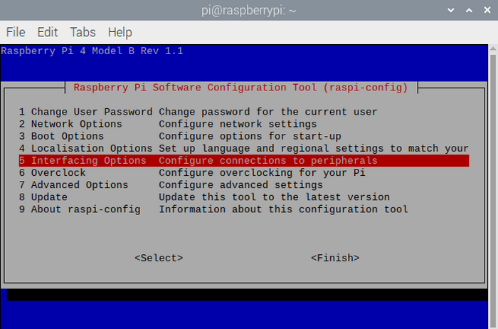


Find more about I2C:

<https://www.nxp.com/docs/en/user-guide/UM10204.pdf>

**Pin description:**

You can find more information,such as the specification of this chip, in the resources link:

<https://fs.keyestudio.com/KS3016>

From the picture below, it is obvious that the PCF8591 converter is equipped with a AOUT pin and 4 analog inputs pins（A0\~A3）


Check the address of the I2C module (PCF8591) connected to the Raspberry Pi, enter the command: i2cdetect -y 1, and then press "Enter".

From below picture, it is known that the I2C address is ：0x48 .


The address for reading pins A0\~A3 is:

A0 = 0x40         \#\#A0 ----\> port address

A1 = 0x41

A2 = 0x42

A3 = 0x43

The address for analog output pin AOUT is: 0x40, which is 64 when hexadecimal is converted to decimal.

**Rotary Potentiometer：**

It can be viewed as an adjustable resistor with the range from 0\~10KΩ.

Therefore when we rotate the potentiometer, we actually change its resistance. We can build a circuit to convert the changes in the resistance to the changes in voltage. Then input the voltage changes to the GPIO analog input port for detection through the signal terminal of the module.

(4)Connection Diagram：

| Red LED Module | RPI GPIO-PCF8591 Shield |      | Rotary Potentiometer | RPI GPIO-PCF8591 Shield |
| :------------: | :---------------------: | ---- | :------------------: | :---------------------: |
|       S        |        S（IO11）        |      |          S           |         S（A0）         |
|       V        |           5V            |      |          V           |           5V            |
|       G        |            G            |      |          G           |            G            |


(5)Run Example Code：

Input the following commands and press "Enter":

cd /home/pi/C_code/lesson24_Potentiometer_LED

gcc Potentiometer_LED.c -o Potentiometer_LED -lwiringPi

sudo ./Potentiometer_LED

(6)Test Results：

After running the program, the terminal prints the analog value of the rotary potentiometer and the brightness of the LED changes with the adjustments of the potentiometer.

Note: Press Ctrl + C on keyboard and exit code running.

(7)Example Code：

```c++
#include <wiringPi.h>
#include <pcf8591.h>  //pcf8591 library
#include <softPwm.h>
#include <stdio.h>

#define Address 0x48  //iic address
#define BASE 64  //DAC write address
#define A0 BASE+0  //A0 analogRead  address
#define A1 BASE+1  //A1 analogRead  address
#define A2 BASE+2 
#define A3 BASE+3

#define ledPin 14 //led pin BCM GPIO 11

int main(void)
{
      unsigned char value;
      wiringPiSetup();
      pcf8591Setup(BASE,Address);   //Initialize the pcf8591
      softPwmCreate(ledPin,0,100);
        
     while(1)
     {
        value=analogRead(A0);    //read the ADC value of channel 0  
        softPwmWrite(ledPin,value*100/255); // Mapping to PWM duty cycle         
        printf("A0:%d\n",value);
        analogWrite(BASE,value);      //write the DAC value
        printf("AOUT:%d\n",value);
        delay(100);
     }
}
```

### Project 25：Photoresistor

(1)Description：

Sensors or modules have found wide applications in daily life. For example, some street lights automatically light up when it is dark and are blocked out when it is bright. But why? Actually it is because of an element called photoresistor which can make changes with the light intensity. And in this project, we will learn how to make this happen.

(2)Components Needed：

|  |  |  |  |  |
| -------------------------------------- | -------------------------------------- | -------------------------------------- | -------------------------------------- | ----------------------------------------------- |
| Raspberry Main Board*1                 | RPI GPIO-PCF8591 Shield*1              | Red LED Module *1                      | Photoresistor Sensor*1                 | F-F DuPont Wires                                |

(3)Knowledge about Component：

**Photoresistor：**

Photoresistor (Photovaristor) is a resistor whose resistance varies according to different incident light strengths. It's made based on the photoelectric effect of semiconductor. If the incident light is intense, its resistance reduces; if the incident light is weak, the resistance increases.

If incident light on a photoresistor exceeds a certain frequency, photons absorbed by the semiconductor give bound electrons enough energy to jump into the conduction band. The resulting free electrons (and their hole partners) conduct electricity, thereby lowering resistance.

(4)Connection Diagram：

| Red LED Module | RPI GPIO-PCF8591 Shield |      | Photoresistor Sensor | RPI GPIO-PCF8591 Shield |
| :------------: | :---------------------: | ---- | :------------------: | :---------------------: |
|       S        |        S（IO5）         |      |          S           |         S（A0）         |
|       V        |           5V            |      |          V           |           5V            |
|       G        |            G            |      |          G           |            G            |


(5)Run Example Code：

Note: in the experiment, I2C communication is used. We need to check the iic address first( enter command：i2cdetect -y 1 and press“Enter”. If failed, check the wiring is correct or not. If correct, you need to enable I2C communication function of Raspberry Pi, project 24 is for your reference.

After enabling the I2C communication，input the following commands and press "Enter":

cd /home/pi/C_code/lesson25_Photo_Sensor

gcc Photo_Sensor.c -o Photo_Sensor -lwiringPi

sudo ./Photo_Sensor

(6)Test Results：

Terminal prints the value tested by photoresistor. LED will lights up if the ambient environment is dim; otherwise, LED will be off.

Note: Press Ctrl + C on keyboard and exit code running.

(7)Example Code：

```c++
#include <wiringPi.h>
#include <pcf8591.h>
#include <stdio.h>

#define Address 0x48
#define BASE 64
#define A0 BASE+0
#define A1 BASE+1
#define A2 BASE+2
#define A3 BASE+3

#define ledPin 21  //led pin BCM GPIO 5

int main(void)
{
     unsigned char value;
     wiringPiSetup();
     pcf8591Setup(BASE,Address);
     pinMode(ledPin,OUTPUT);
        
     while(1)
     {
        value=analogRead(A0);              
        printf("A0:%d\n",value);
        delay(100);
        if(value>100)
          digitalWrite(ledPin,HIGH);
        else
          digitalWrite(ledPin,LOW);
     }
}
```

### Project 26：Sound-activated Light

(1)Description：

You might find the lights automatically light up when you pass them. And they will be off if the surrounding is quiet. Do you know why?

Actually, it is sound sensor that controls them on and off.

(2)Components Needed:

|  |  |  |  |  |
| -------------------------------------- | -------------------------------------- | -------------------------------------- | -------------------------------------- | ----------------------------------------------- |
| Raspberry Main Board*1                 | RPI GPIO-PCF8591 Shield*1              | Red LED Module *1                      | Analog Sound Sensor*1                  | F-F DuPont Wires                                |

(3)Knowledge about Component：

**Sound Sensor：**

A sound sensor is defined as a module that detects sound waves through its intensity and converting it to electrical signals.

The sound sensor has a built-in capacitive electret microphone which is highly sensitive to sound. Sound waves cause the thin film of the electret to vibrate and then the capacitance changes, thus producing the corresponding changed voltage. Since the voltage change is extremely weak, it needs to be amplified. So it is converted into a voltage ranging from 0 to 5V, which is received by data acquisition unit after A/D adapter conversion and then sent to an MCU.

(4)Connection Diagram：

| Red LED Module | RPI GPIO-PCF8591 Shield |      | Analog Sound Sensor | RPI GPIO-PCF8591 Shield |
| :------------: | :---------------------: | ---- | :-----------------: | :---------------------: |
|       S        |        S（IO5）         |      |          S          |         S（A0）         |
|       V        |           5V            |      |          V          |           5V            |
|       G        |            G            |      |          G          |            G            |


(5)Run Example Code：

Note: in the experiment, I2C communication is used. We need to check the iic address first( enter command：i2cdetect -y 1 and press“Enter”. If failed, check the wiring is correct or not. If correct, you need to enable I2C communication function of Raspberry Pi, project 24 is for your reference.

After enabling the I2C communication，input the following commands and press "Enter":

cd /home/pi/C_code/lesson26_Sound_Led

gcc Sound_Led.c -o Sound_Led -lwiringPi

sudo ./Sound_Led

(6)Test Results：

When you clap your hands suddenly, LED lights up and clap again, LED is off.

Note: Press Ctrl + C on keyboard and exit code running.

(7)Example Code：

```c++
#include <wiringPi.h>
#include <pcf8591.h>
#include <stdio.h>

#define Address 0x48
#define BASE 64
#define A0 BASE+0
#define A1 BASE+1
#define A2 BASE+2
#define A3 BASE+3

#define ledPin 21  //led pin  //BCM GPIO 5

int count = 0;
int flag = 0;

int main(void)
{
     unsigned char value;
     wiringPiSetup();
     pcf8591Setup(BASE,Address);
     pinMode(ledPin,OUTPUT);
        
     while(1)
     {
        value=analogRead(A0);  //Read the value of the sound sensor
        printf("A0:%d\n",value);
        delay(100);
        if(value>80)
        {
			count = count + 1;
			flag = count % 2;
		}
		if(flag == 1)
		{
			digitalWrite(ledPin,HIGH);
		}
        else
        {
			digitalWrite(ledPin,LOW);
		}
     }
}
```

### Project 27：I2C LCD1602

(1)Description：

Liquid crystal display can be used to conduct all kind of experiments and make various DIY items. For example, you can make a temperature detection device out of a temperature sensor and a LCD and distance measurement equipment with an ultrasonic module and a LCD. In this project, we will connect a LCD 1602 with Raspberry Pi and use it to show characters and numbers.

(2)Components Needed：

|  |  |  |  |
| -------------------------------------- | -------------------------------------- | -------------------------------------- | ----------------------------------------------- |
| Raspberry Main Board*1                 | RPI GPIO-PCF8591 Shield*1              | I2C LCD1602 *1                         | F-F DuPont Wires                                |

(3)Knowledge about Component：

**LCD1602 LED Display：**

This I2C LCD 1602 could show the characters or numbers in 16 rows and 2 columns

The following is a monochrome LCD1602 display screen and its pin diagram:


The I2C LCD1602 display integrates I2C interface which can be connected with serial input and parallel output pins so as to transmit data to the display.

This allows us to operate the LCD1602 with 4 lines.


The IC chip used in this module is PCF8574T (PCF8574AT) and its default IC address 0x27(0x3F). You can also check the RPI bus on your I2C device address with the command "i2cdetect -y 1".

(4)Connection Diagram：

| I2C LCD1602 Module | RPI GPIO-PCF8591 Shield |
| :----------------: | :---------------------: |
|        GND         |           GND           |
|        VCC         |           5V            |
|        SDA         |           IO2           |
|        SCL         |           IO3           |


(5)Run Example Code：

**Note: in the experiment, I2C communication is used. We need to check the iic address first( enter command：i2cdetect -y 1 and press“Enter”. If failed, check the wiring is correct or not. If correct, you need to enable I2C communication function of Raspberry Pi, project 24 is for your reference.**

After enabling the I2C communication，input the following commands and press "Enter":

cd /home/pi/C_code/lesson27_I2CLCD1602

gcc I2CLCD1602.c -o I2CLCD1602 -lwiringPiDev -lwiringPi

sudo ./I2CLCD1602

(6)Test Results：

After running the program, the LCD 1602 shows the CPU temperature and the system time of your Raspberry Pi.

**<span style="background:#ff0;color:#000">Note: After the program is executed, if you can't see anything on the display or the display is not clear, try to slowly turn the blue knob on the back of the LCD1602 to adjust the contrast until the screen can clearly display the time and temperature.</span>**

Note: Press Ctrl + C on keyboard and exit code running.

(7)Example Code：

```c++
#include <stdlib.h>
#include <stdio.h>
#include <wiringPi.h>
#include <wiringPiI2C.h>
#include <pcf8574.h>
#include <lcd.h>
#include <time.h>

int pcf8574_address = 0x27;        // PCF8574T:0x27, PCF8574AT:0x3F
#define BASE 64         // BASE any number above 64
//Define the output pins of the PCF8574, which are directly connected to the LCD1602 pin.
#define RS      BASE+0
#define RW      BASE+1
#define EN      BASE+2
#define LED     BASE+3
#define D4      BASE+4
#define D5      BASE+5
#define D6      BASE+6
#define D7      BASE+7

int lcdhd;// used to handle LCD
void printCPUTemperature(){// sub function used to print CPU temperature
    FILE *fp;
    char str_temp[15];
    float CPU_temp;
    // CPU temperature data is stored in this directory.
    fp=fopen("/sys/class/thermal/thermal_zone0/temp","r");
    fgets(str_temp,15,fp);      // read file temp
    CPU_temp = atof(str_temp)/1000.0;   // convert to Celsius degrees
    printf("CPU's temperature : %.2f \n",CPU_temp);
    lcdPosition(lcdhd,0,0);     // set the LCD cursor position to (0,0) 
    lcdPrintf(lcdhd,"CPU:%.2fC",CPU_temp);// Display CPU temperature on LCD
    fclose(fp);
}
void printDataTime(){//used to print system time 
    time_t rawtime;
    struct tm *timeinfo;
    time(&rawtime);// get system time
    timeinfo = localtime(&rawtime);//convert to local time
    printf("%s \n",asctime(timeinfo));
    lcdPosition(lcdhd,0,1);// set the LCD cursor position to (0,1) 
    lcdPrintf(lcdhd,"Time:%02d:%02d:%02d",timeinfo->tm_hour,timeinfo->tm_min,timeinfo->tm_sec); //Display system time on LCD
}
int detectI2C(int addr){
    int _fd = wiringPiI2CSetup (addr);   
    if (_fd < 0){    
        printf("Error address : 0x%x \n",addr);
        return 0 ;
    } 
    else{   
        if(wiringPiI2CWrite(_fd,0) < 0){
            printf("Not found device in address 0x%x \n",addr);
            return 0;
        }
        else{
            printf("Found device in address 0x%x \n",addr);
            return 1 ;
        }
    }
}
int main(void){
    int i;

    printf("Program is starting ...\n");

    wiringPiSetup();  
    if(detectI2C(0x27)){
        pcf8574_address = 0x27;
    }else if(detectI2C(0x3F)){
        pcf8574_address = 0x3F;
    }else{
        printf("No correct I2C address found, \n"
        "Please use command 'i2cdetect -y 1' to check the I2C address! \n"
        "Program Exit. \n");
        return -1;
    }
    pcf8574Setup(BASE,pcf8574_address);//initialize PCF8574
    for(i=0;i<8;i++){
        pinMode(BASE+i,OUTPUT);     //set PCF8574 port to output mode
    } 
    digitalWrite(LED,HIGH);     //turn on LCD backlight
    digitalWrite(RW,LOW);       //allow writing to LCD
    lcdhd = lcdInit(2,16,4,RS,EN,D4,D5,D6,D7,0,0,0,0);// initialize LCD and return “handle” used to handle LCD
    if(lcdhd == -1){
        printf("lcdInit failed !");
        return 1;
    }
    while(1){
        printCPUTemperature();//print CPU temperature
        printDataTime();        // print system time
        delay(1000);
    }
    return 0;
} 
```

### Project 28：Water Level Monitor

(1)Description：

In daily life, when there is heavy or even torrential rain, the water level in rivers or reservoirs soars. And when it reaches a certain water level, it is necessary to open the gates to discharge the flood to solve the hidden safety hazards. But how to detect the water level in a river or a reservoir? The answer lies in the water level sensor. In this lesson, we will learn to use this sensor to issue alarms when the water bucket is almost full.

(2)Components Needed:

|  |           |  |
| -------------------------------------- | ----------------------------------------------- | -------------------------------------- |
| Raspberry Main Board*1                 | RPI GPIO-PCF8591 Shield*1                       | Active Buzzer Module *1                |
|  |  |                                        |
| Water Level Sensor*1                   | F-F DuPont Wires                                |                                        |

(3)Knowledge about Component：

**Water Level Sensor：**

Our water sensor is easy- to-use, portable and cost-effective, designed to identify and detect water level and water drop.

This sensor measures the volume of water drop and water quantity through an array of traces of exposed parallel wires.

It could convert water content to analog signals, and output analog value could be used by function of application. It has the features of low consumption as well.

(4)Connection Diagram：

| Active Buzzer Module | RPI GPIO-PCF8591 Shield |      | Water Level Sensor | RPI GPIO-PCF8591 Shield |
| :------------------: | :---------------------: | ---- | :----------------: | :---------------------: |
|          S           |        S（IO18）        |      |         S          |         S（A0）         |
|          V           |           5V            |      |         V          |           5V            |
|          G           |            G            |      |         G          |            G            |


(5)Run Example Code：

Note: in the experiment, I2C communication is used. We need to check the iic address first( enter command：i2cdetect -y 1 and press“Enter”. If failed, check the wiring is correct or not. If correct, you need to enable I2C communication function of Raspberry Pi, project 24 is for your reference.

After enabling the I2C communication，input the following commands and press "Enter":

cd /home/pi/C_code/lesson28_Water_Buzzer

gcc Water_Buzzer.c -o Water_Buzzer -lwiringPi

sudo ./Water_Buzzer

(6)Test Results：

Buzzer makes a sound when water covering the exposed detection part.

Note: Press Ctrl + C on keyboard and exit code running.

(7)Example Code：

```c++
#include <wiringPi.h>
#include <pcf8591.h>
#include <stdio.h>

#define Address 0x48
#define BASE 64
#define A0 BASE+0
#define A1 BASE+1
#define A2 BASE+2
#define A3 BASE+3

#define buzPin 1  //buzzer pin BCM GPIO 18

int main(void)
{
     unsigned char value;
     wiringPiSetup();
     pcf8591Setup(BASE,Address);
     pinMode(buzPin,OUTPUT);
        
     while(1)
     {
        value=analogRead(A0);  //Read the value of the water sensor
        printf("A0:%d\n",value);
        delay(100);
        if(value>30)
        {
       digitalWrite(buzPin,HIGH);
        }
        else
        {
       digitalWrite(buzPin,LOW);
   }
     }
}
```

### Project 29：Flower-watering Device

(1)Description：

The household plants are popular in many communities. But they will die if you forget to water them, how about making an automatic watering device? In this project, we will learn to detect the soil humidity of your plants with soil humidity sensor and Raspberry Pi.

(2)Components Needed：

|  |  |  |  |
| -------------------------------------- | ------------------------------------------------------------ | -------------------------------------- | ----------------------------------------------- |
| Raspberry Main Board*1                 | RPI GPIO-PCF8591 Shield*1                                    | Soil Humidity Sensor *1                | F-F DuPont Wires                                |

(3)Knowledge about Component：

**Soil Humidity Sensor：**

This is a simple soil humidity sensor aims to detect the soil humidity.

If the soil is in lack of water, the analog value output by the sensor will decrease; otherwise, it will increase. If you use this sensor to make an automatic watering device, it can detect whether your botany is thirsty to prevent it from withering when you go out.

Using the sensor with controller makes your plant more comfortable and your garden smarter. The soil humidity sensor module is not as complicated as you might think, and if you need to detect the soil in your project, it will be your best choice.

(4)Connection Diagram：

| Soil Humidity Sensor | RPI GPIO-PCF8591 Shield |
| :------------------: | :---------------------: |
|          S           |         S（A0）         |
|          V           |           5V            |
|          G           |            G            |

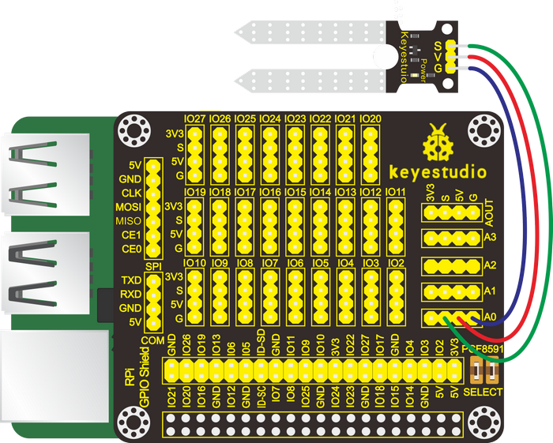

(5)Run Example Code：

Note: in the experiment, I2C communication is used. We need to check the iic address first( enter command：i2cdetect -y 1 and press“Enter”. If failed, check the wiring is correct or not. If correct, you need to enable I2C communication function of Raspberry Pi, project 24 is for your reference.

After enabling the I2C communication，input the following commands and press "Enter":

cd /home/pi/C_code/lesson29_Soil

gcc Soil.c -o Soil -lwiringPi

sudo ./Soil

(6)Test Results：

After running the program, when the soil humidity sensor is inserted into the land, the terminal prints the analog value of the soil humidity.

Note: Press Ctrl + C on keyboard and exit code running.

(7)Example Code：

```c++
#include <wiringPi.h>
#include <pcf8591.h>
#include <stdio.h>

#define Address 0x48  //address  ---> device address
#define BASE 64    //DA converter command
#define A0 BASE+0  //A0  ----> port address
#define A1 BASE+1
#define A2 BASE+2
#define A3 BASE+3

int main(void)
{
     unsigned char value;
     wiringPiSetup();
     pcf8591Setup(BASE,Address);  //which port of the device you want to access
        
     while(1)
     {
        value=analogRead(A0);              
        printf("A0:%d\n",value);
        delay(100);
       }
}
```

### Project 30：Temperature Alarm

(1)Description：

In the frozen winter, farmers tend to heat the greenhouse to make the temperature suitable for vegetables to live so as to prevent them from freezing to death. And a temperature alarm device is required to avoid overheating. In the project, we will learn to make such a device.

(2)Components Needed：

|  |  |  |  |  |
| -------------------------------------- | -------------------------------------- | -------------------------------------- | -------------------------------------- | ----------------------------------------------- |
| Raspberry Main Board*1                 | RPI GPIO-PCF8591 Shield*1              | Active Buzzer Module *1                | LM35 Temperature Sensor*1              | F-F DuPont Wires                                |

(3)Knowledge about Component：

**LM35 Temperature Sensor:**

It is widely used temperature sensor whose output voltage proportional to temperature. It outputs 0°at the beginning since it adopts internal compensation. Its sensitivity is 10mV/℃ and output temperature in the range of 0℃～100℃.

Transfer formula: output 0V when 0°, plus 1° each time, output voltage increases 10mV.

Working Voltage is 4-30V;

Accuracy: ±1℃.

Maximum linear error: ±0.5℃;

Quiescent current: 80uA.

(4)Connection Diagram：

| Active Buzzer Module | RPI GPIO-PCF8591 Shield |      | LM35 Temperature Sensor | RPI GPIO-PCF8591 Shield |
| :------------------: | :---------------------: | ---- | :---------------------: | :---------------------: |
|          S           |        S（IO18）        |      |            S            |         S（A0）         |
|          V           |           5V            |      |            V            |           5V            |
|          G           |            G            |      |            G            |            G            |


(5)Run Example Code：

Note: in the experiment, I2C communication is used. We need to check the iic address first( enter command：i2cdetect -y 1 and press“Enter”. If failed, check the wiring is correct or not. If correct, you need to enable I2C communication function of Raspberry Pi, project 24 is for your reference.

After enabling the I2C communication，input the following commands and press "Enter":

cd /home/pi/C_code/lesson30_LM35

gcc LM35.c -o LM35 -lwiringPi

sudo ./LM35

(6)Test Results：

When the programs, the terminal prints the value and temperature; and when the temperature detected is bigger than 20℃, the buzzer rings; otherwise, it makes no sounds.

Note: Press Ctrl + C on keyboard and exit code running.

(7)Example Code：

The temperature threshold set in the program is 20 and can be adjusted according to your needs.

```c++
#include <wiringPi.h>
#include <pcf8591.h>
#include <stdio.h>

#define Address 0x48
#define BASE 64
#define A0 BASE+0
#define A1 BASE+1
#define A2 BASE+2
#define A3 BASE+3

#define buzPin 1  //buzzer pin BCM GPIO 18

int main(void)
{
     unsigned char value;
     wiringPiSetup();
     pcf8591Setup(BASE,Address);
     pinMode(buzPin,OUTPUT);
        
     while(1)
     {
        value=analogRead(A0);  //Read the value of the LM35 temperture sensor
        printf("Temp:%d\n",value);
        delay(100);
        if(value>20)
        {
       digitalWrite(buzPin,HIGH);
        }
        else
        {
       digitalWrite(buzPin,LOW);
   }
     }
}
```

### Project 31：Steam in the Air

(1)Description：

The world is infused with air and there are many elements in the air, some of which is useful and some of them is harmful to physical health. And in this project, we will learn to detect steam in the air with a steam sensor.

(2)Components Needed：

|  |  |  |  |
| -------------------------------------- | ------------------------------------------------------------ | -------------------------------------- | ----------------------------------------------- |
| Raspberry Main Board*1                 | RPI GPIO-PCF8591 Shield*1                                    | Steam Sensor *1                        | F-F DuPont Wires                                |

(3)Knowledge about Component：

This is a commonly used steam sensor. Its principle is to detect the amount of water by bare printed parallel lines on the circuit board. The more the water is, the more wires will be connected. As the conductive contact area increases, the output voltage will gradually rise. It can detect water vapor in the air as well. The steam sensor can be used as a rain water detector and level switch.
When the humidity on the sensor surface surges, the output voltage will increase.

(4)Connection Diagram：

| Steam Sensor | RPI GPIO-PCF8591 Shield |
| :----------: | :---------------------: |
|      S       |         S（A0）         |
|      V       |           5V            |
|      G       |            G            |


(5)Run Example Code：

Note: in the experiment, I2C communication is used. We need to check the iic address first( enter command：i2cdetect -y 1 and press“Enter”. If failed, check the wiring is correct or not. If correct, you need to enable I2C communication function of Raspberry Pi, project 24 is for your reference.

After enabling the I2C communication，input the following commands and press "Enter":

cd /home/pi/C_code/lesson31_Water_Vapor

gcc Water_Vapor.c -o Water_Vapor -lwiringPi

sudo ./Water_Vapor

(6)Test Results：

After running the program, the terminal displays the steam amount detected by the sensor.

Note: Press Ctrl + C on keyboard and exit code running.

(7)Example Code：

```c++
#include <wiringPi.h>
#include <pcf8591.h>
#include <stdio.h>

#define Address 0x48
#define BASE 64
#define A0 BASE+0
#define A1 BASE+1
#define A2 BASE+2
#define A3 BASE+3

int main(void)
{
     unsigned char value;
     wiringPiSetup();
     pcf8591Setup(BASE,Address);
        
     while(1)
     {
        value=analogRead(A0);  //Read the value of the water_vapor sensor
        printf("water vapor value:%d\n",value);  //print data
        delay(100);
     }
}
```

### Project 32：MQ-2 Gas Leakage Alarm

(1)Description：

Some families have access to gas, which is composed of CO, CO2, N2, H2 and CH4. CO is one of toxic gases. People will be in danger if absorbing too much CO. However, we could tackle with this problem over a gas leakage alarm.

Gas MQ-2 leakage alarm detects the presence of a combustible or toxic gas and react by displaying a reading, setting off an audible or visual alarm.

(2)Components Needed：

|  |  |  |  |  |
| -------------------------------------- | -------------------------------------- | -------------------------------------- | -------------------------------------- | ----------------------------------------------- |
| Raspberry Main Board*1                 | RPI GPIO-PCF8591 Shield*1              | Active Buzzer Module *1                | MQ-2Gas  Sensor*1                      | F-F DuPont Wires                                |

(3)Knowledge about Component：

This gas sensor - MQ-2 adapts a gas-sensitive material called tin dioxide (SnO2) which is of low conductivity in clean air. Therefore, when combustible gases are detected in the air, it becomes more conductive. And the analog value increases with the increase of the concentration of flammable gases.

Meanwhile, it has high sensitivity to natural gas, liquefied petroleum gas and other smoke, especially to alkanes smoke.

In final analysis, this gas sensor can find application in a wide range with low cost. For example, it can be applied to gas leak detection devices in homes and factories.

**Note：**

（1）The sensitivity of the alcohol sensor can be adjusted by rotating the potentiometer on it.

Turning the knob clockwise, the threshold value increases while turning it counterclockwise, the threshold value decreases.


(2)The sensor may not be able to output stable and accurate data immediately, and it needs to be warmed up for about 1 minute to collect stable data.

(3)Connection Diagram：

| Active Buzzer Module | RPI GPIO-PCF8591 Shield |      | MQ-2Gas Sensor | RPI GPIO-PCF8591 Shield |
| :------------------: | :---------------------: | ---- | :------------: | :---------------------: |
|          S           |        S（IO18）        |      |       S        |         S（A0）         |
|          V           |           5V            |      |       V        |           5V            |
|          G           |            G            |      |       G        |            G            |


(5)Run Example Code：

Note: in the experiment, I2C communication is used. We need to check the iic address first( enter command：i2cdetect -y 1 and press“Enter”. If failed, check the wiring is correct or not. If correct, you need to enable I2C communication function of Raspberry Pi, project 24 is for your reference.

After enabling the I2C communication，input the following commands and press "Enter":

cd /home/pi/C_code/lesson32_Gas_MQ_2

gcc Gas_MQ_2.c -o Gas_MQ_2 -lwiringPi

sudo ./Gas_MQ_2

(6)Test Results：

After running the program, the terminal shows the analog gas value detected by the MQ-2 gas sensor. And when the analog value of noxious gases is bigger than 60 the buzzer issues alarms.

Note: Press Ctrl + C on keyboard and exit code running.

(7)Example Code：

```c++
#include <stdio.h>
#include <stdlib.h>
#include <string.h>
#include <wiringPi.h>
#include <pcf8591.h>


#define Address 0x48
#define BASE 64
#define A0 BASE+0
#define A1 BASE+1
#define A2 BASE+2
#define A3 BASE+3

#define buzPin 1   //buzzer pin  BCM GPIO 18

int main(void)
{
        unsigned char dat;
	wiringPiSetup();
        pcf8591Setup(BASE,Address);            
	if (wiringPiSetup() == -1){
	exit(1);
	}
	{
            pinMode(buzPin,OUTPUT);
	}
	while(1){
	    
	    dat=analogRead(A0); 
	    if(dat>80)
	        digitalWrite(buzPin,HIGH);
	    else
	        digitalWrite(buzPin,LOW);
         printf("MQ-2:%d\n",dat);
	    delay(100);
	}
   return 0;
}
```

### Project 33：Alcohol Tester

(1)Description：

The alcohol tester is an instrument that can be used to detect the content of alcohol left in bodies. It can assist traffic policemen to determine whether a driver drives after consuming alcohol or not or how much alcohol left in his/her body so as to prevent major traffic accidents. It can also be used in other occasions to detect the alcohol content in exhaled breath to avoid personal
injuries, deaths and major property losses. For example, it can be applied to high-risk positions prohibiting work after drinking. In this lesson, we will simulate an alcohol tester.

(2)Components Needed：

|  |  |  |  |  |
| -------------------------------------- | -------------------------------------- | -------------------------------------- | -------------------------------------- | ----------------------------------------------- |
| Raspberry Main Board*1                 | RPI GPIO-PCF8591 Shield*1              | Active Buzzer Module *1                | MQ- 3 Alcoho Sensor*1                  | F-F DuPont Wires                                |

(3)Knowledge of Component：

**MQ-3 Alcohol Sensor：**

This analog gas sensor - MQ3 adapts a gas-sensitive material called tin dioxide(SnO2) which is of low conductivity in clean air. Therefore, when there is alcohol vapor detected, its conductivity increases with the increase of the alcohol vapor concentration and it outputs signals (digital and analog signals). The higher the alcohol concentration it senses, the greater the analog value the
terminal outputs.

**Note: the sensitivity of the alcohol sensor can be adjusted by rotating the potentiometer on it.**


**Please note that the sensor may not be able to output stable and accurate data immediately, and it needs to be warmed up for about 1 minute to collect stable data.**

(4)Connection Diagram：

| Active Buzzer Module | RPI GPIO-PCF8591 Shield |      | MQ-3Alcohol Sensor | RPI GPIO-PCF8591 Shield |
| :------------------: | :---------------------: | ---- | :----------------: | :---------------------: |
|          S           |        S（IO18）        |      |         S          |         S（A0）         |
|          V           |           5V            |      |         V          |           5V            |
|          G           |            G            |      |         G          |            G            |

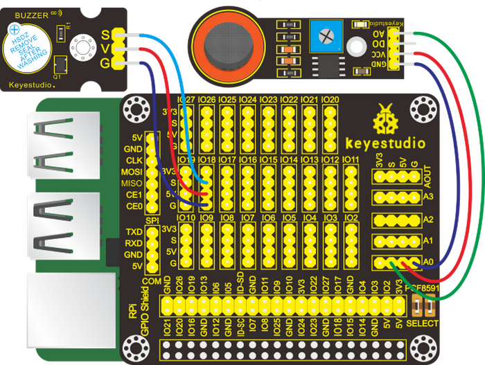

(5)Run Example Code：

Note: in the experiment, I2C communication is used. We need to check the iic address first( enter command：i2cdetect -y 1 and press“Enter”. If failed, check the wiring is correct or not. If correct, you need to enable I2C communication function of Raspberry Pi, project 24 is for your reference.

After enabling the I2C communication，input the following commands and press "Enter":

cd /home/pi/C_code/lesson33_Alcohol_MQ_3

gcc Alcohol_MQ_3.c -o Alcohol_MQ_3 -lwiringPi

sudo ./Alcohol_MQ_3

(6)Test Results：

After running the program, the terminal displays the analog alcohol value in the air detected by the MQ-3 alcohol sensor. And when the analog value is bigger that 80, the buzzer make a sound; otherwise, it reminds silent.

Note: Press Ctrl + C on keyboard and exit code running.

(7)Example Code：

```c++
#include <stdio.h>
#include <stdlib.h>
#include <string.h>
#include <wiringPi.h>
#include <pcf8591.h>


#define Address 0x48
#define BASE 64
#define A0 BASE+0
#define A1 BASE+1
#define A2 BASE+2
#define A3 BASE+3

#define buzPin 1   //buzzer pin  BCM GPIO 18

int main(void)
{
        unsigned char dat;
	wiringPiSetup();
        pcf8591Setup(BASE,Address);            
	if (wiringPiSetup() == -1){
	exit(1);
	}
	{
            pinMode(buzPin,OUTPUT);
	}
	while(1){
	    
	    dat=analogRead(A0); 
	    if(dat>80)
	        digitalWrite(buzPin,HIGH);
	    else
	        digitalWrite(buzPin,LOW);
         printf("MQ-3:%d\n",dat);
	    delay(100);
	}
   return 0;
}
```

### Project 34：Joystick Module

(1)Description：

Many a people play games with gamepad. But do you know who it work?

Let’s learn about it.

(2)Components Needed：

|  |  |  |  |
| -------------------------------------- | ------------------------------------------------------------ | -------------------------------------- | ----------------------------------------------- |
| Raspberry Main Board*1                 | RPI GPIO-PCF8591 Shield*1                                    | Joystick Module*1                      | F-F DuPont Wires                                |

(3)Knowledge about Component：

**Joystick Module：**

This is a joystick very similar to the ‘analog’ joysticks on PS2 (PlayStation 2) controllers. It is a self-centering spring loaded joystick, meaning when you release the joystick it will center itself. It also contains a comfortable cup-type knob/cap which gives the feel of a thumb-stick.

It has three signal pins which are connected GND, VCC and signal end（B, X, Y). The X pin is **X-axis** (left to right), the Y pin is **Y-axis** (front and back) and signal B end is Z-axis(usually used as digital port and pushbutton).

VCC is connected to V/VCC（3.3/5V）of MCU, GND to G/GND of MCU and the voltage is around 1.65V/2.5V in initial status.

X axis gives readout of the joystick in the horizontal direction (X-coordinate) i.e. how far left and right the joystick is pushed.

(4)Connection Diagram：

| Joystick Module | RPI GPIO-PCF8591 Shield |
| :-------------: | :---------------------: |
|        Y        |         S（A1）         |
|        X        |         S（A0）         |
|        B        |         S(IO26)         |
|        V        |           5V            |
|        G        |            G            |

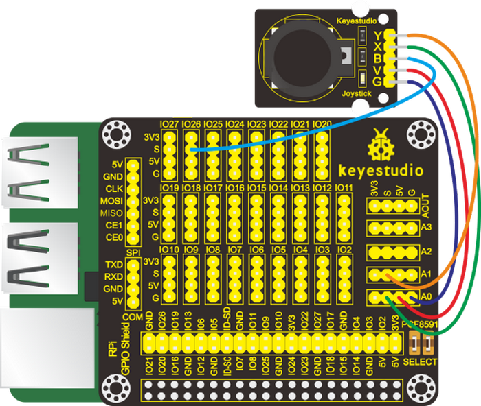

(5)Run Example Code：

Note: in the experiment, I2C communication is used. We need to check the iic address first( enter command：i2cdetect -y 1 and press“Enter”. If failed, check the wiring is correct or not. If correct, you need to enable I2C communication function of Raspberry Pi, project 24 is for your reference.

After enabling the I2C communication，input the following commands and press "Enter":

cd /home/pi/C_code/lesson34_Joystick

gcc Joystick.c -o Joystick -lwiringPi

sudo ./Joystick

(6)Test Results：

Rotate Joystick , terminal will show the responding data change and press it,“The key is pressed”is displayed in the terminal.

Note: Press Ctrl + C on keyboard and exit code running.

(7)Example Code：

```c++
#include <wiringPi.h>
#include <pcf8591.h>
#include <stdio.h>

#define Address 0x48
#define BASE 64
#define A0 BASE+0
#define A1 BASE+1
#define A2 BASE+2
#define A3 BASE+3

#define btnPin 25 //GPIO 26

int main(void)
{
   unsigned char x_val;
   unsigned char y_val;
   unsigned char z_val;
   wiringPiSetup();
   pcf8591Setup(BASE,Address);
   pinMode(25,INPUT);
        
   while(1)
   {
      x_val=analogRead(A0);  //read x
      y_val=analogRead(A1);  //read y
      z_val=digitalRead(25); //read z, button
      printf(" x:%d  y:%d  z:%d\n", x_val,y_val,z_val);
      if(z_val==1)
      printf("The key is presed!\n");
      delay(100);
   }
}
```

### Project 35：Ultrasonic Sensor

(1)Description：

An ultrasonic sensor is an electronic device that measures the distance of a target object by emitting ultrasonic sound waves, and converts the reflected sound into an electrical signal.

(2)Components Needed：

|  |  |  |  |
| -------------------------------------- | ------------------------------------------------------------ | -------------------------------------- | ----------------------------------------------- |
| Raspberry Main Board*1                 | RPI GPIO-PCF8591 Shield*1                                    | Ultrasonic Module*1                    | F-F DuPont Wires                                |

(3)Knowledge about Component：

The ultrasonic module will emit the ultrasonic waves after trigger signal. When the ultrasonic waves encounter the object and are reflected back, the module outputs an echo signal, so it can determine the distance of object from the time difference between trigger signal and echo signal.

The t is the time that emitting signal meets obstacle and returns.

and the propagation speed of sound in the air is about 343m/s, therefore, distance = speed \* time, because the ultrasonic wave emits and comes back, which is 2 times of distance, so it needs to be divided by 2, the distance measured by ultrasonic wave = (speed \* time)/2

Use method and timing chart of ultrasonic module:

1.  Setting the delay time of Trig pin of SR04 to 10μs at least, which can trigger it to detect distance.

2.  2\. After triggering, the module will automatically send eight 40KHz ultrasonic pulses and detect whether there is a signal return. This step will be completed automatically by the module.

3.  If the signal returns, the Echo pin will output a high level, and the duration of the high level is the time from the transmission of the ultrasonic wave to the return.


(4)Connection Diagram：

| Ultrasonic Module | RPI GPIO-PCF8591 Shield |
| :---------------: | :---------------------: |
|        Vcc        |           5V            |
|       Trig        |         S(IO23)         |
|       Echo        |         S(IO24)         |
|        Gnd        |           GND           |


(5)Run Example Code：

Input the following commands and press "Enter":

cd /home/pi/C_code/lesson35_Ultrasonic

gcc Ultrasonic.c -o Ultrasonic -lwiringPi

sudo ./Ultrasonic

(6)Test Results：

Terminal prints the detected distance, unit is cm.

Note: Press Ctrl + C on keyboard and exit code running.

(7)Example Code：

```c++
#include <wiringPi.h>
#include <stdio.h>
#include <sys/time.h>   //Import the time system header file

//define the pin
#define Trig    4   //BCM GPIO 23
#define Echo    5   //BCM GPIO 24

//set pin mode
void ultraInit(void)
{
	pinMode(Echo, INPUT);
	pinMode(Trig, OUTPUT);
}

//Write programs based on sequence diagrams
float disMeasure(void)
{
	struct timeval tv1;  //Create the Timeval structure tv1
	struct timeval tv2;  //Create the Timeval structure tv2
	long start, stop;
	float dis;

	digitalWrite(Trig, LOW);
	delayMicroseconds(2);

	digitalWrite(Trig, HIGH);
	delayMicroseconds(10);      	
    digitalWrite(Trig, LOW);
	
	while(!(digitalRead(Echo) == 1));  //Wait for the low level received by the Echo pin to pass
	gettimeofday(&tv1, NULL);   //function gettimeofday, The time it took the system to get here

	while(!(digitalRead(Echo) == 0));  //Wait for the high level received by the Echo pin to pass
	gettimeofday(&tv2, NULL);   //function gettimeofday, The time it took the system to get here
	    
    //Tv1.tv_sec is the seconds obtained, tv1.TV_USec is the subtlety obtained
    //Calculate the first time
	start = tv1.tv_sec * 1000000 + tv1.tv_usec;
	 
	//Calculate the second time
	stop  = tv2.tv_sec * 1000000 + tv2.tv_usec;
    
    //stop - start , the time difference is the high level time acquired by the echo pin
    //34000cm/s, speed of sound
    //Calculate the distance measured(cm)
	dis = (float)(stop - start) / 1000000 * 34000 / 2;  

	return dis;
}

int main(void)
{
	float dis;

	if(wiringPiSetup() == -1){ //when initialize wiring failed,print messageto screen
		printf("setup wiringPi failed !");
		return 1; 
	}

	ultraInit();
	
	while(1){
		dis = disMeasure();
		printf("distance = %0.2f cm\n",dis);
		delay(100);
	}

	return 0;
}
```

 link：<https://pubs.opengroup.org/onlinepubs/9699919799/basedefs/sys_time.h.html>

### Project 36： Light Intensity Detection

(1)Description：

This project is a little bit similar to the one involved the photoresistor sensor. But this time we will use a TEMT6000 ambient light sensor which has better sensitivity. Now, let’s learn how to use this sensor to detect light intensity with Raspberry Pi.

(2)Components Needed：

|  |  |  |  |
| -------------------------------------- | ------------------------------------------------------------ | -------------------------------------- | ----------------------------------------------- |
| Raspberry Main Board*1                 | RPI GPIO-PCF8591 Shield*1                                    | TEMT6000 Ambient Light Sensor*1        | F-F DuPont Wires                                |

(3)Knowledge about Component：

**TEMT6000 Ambient Light Sensor：**

This module is mainly composed of a highly sensitive visible photocell (NPN type) triode, which can magnify the captured tiny light illumination changes by about 100 times, and is easily recognized by the microcontroller for AD conversion.

And the light intensity is directly proportional to current flowing through. Therefore, it is easy to figure out the light intensity as long as its voltage is known.

Its response to visible light illumination is similar to that of the human eye, so that can detect the intensity of ambient light.

(4)Connection Diagram：

| TEMT6000 Ambient Light Sensor | RPI GPIO-PCF8591 Shield |
| :---------------------------: | :---------------------: |
|               S               |          S(A0)          |
|               V               |           5V            |
|               G               |            G            |


(5)Run Example Code：

Note: in the experiment, I2C communication is used. We need to check the iic address first( enter command：i2cdetect -y 1 and press“Enter”. If failed, check the wiring is correct or not. If correct, you need to enable I2C communication function of Raspberry Pi, project 24 is for your reference.

After enabling the I2C communication，input the following commands and press "Enter":

cd /home/pi/C_code/lesson36_TEMT6000_Ambient_Light

gcc TEMT6000_Ambient_Light.c -o TEMT6000_Ambient_Light -lwiringPi

sudo ./TEMT6000_Ambient_Light

(6)Test Results：

After running the program, the terminal displays the light intensity value detected by the sensor; and the stronger the light, the bigger the analog value.

Note: Press Ctrl + C on keyboard and exit code running.

(7)Example Code：

```c++
#include <wiringPi.h>
#include <pcf8591.h>
#include <stdio.h>

#define Address 0x48
#define BASE 64
#define A0 BASE+0
#define A1 BASE+1
#define A2 BASE+2
#define A3 BASE+3


int main(void)
{
     unsigned char value;
     wiringPiSetup();
     pcf8591Setup(BASE,Address);
        
     while(1)
     {
        value=analogRead(A0);  //Read the value of the TEMT6000 Ambient Light sensor
        printf("Ambient Light:%d\n",value);  //print data
        delay(100);
     }
}
```

### Project 37：Pressure Measurement

(1)Description：

In previous projects, we have learned how to use different sensors to obtain external information about temperature, light, sound ,gas and others. Now, let’s move to detect pressure with a thin-film pressure sensor and Raspberry Pi.

(2)Components Needed:

|  |  |  |  |
| -------------------------------------- | ------------------------------------------------------------ | -------------------------------------- | ----------------------------------------------- |
| Raspberry Main Board*1                 | RPI GPIO-PCF8591 Shield*1                                    | Thin-film Pressure Sensor*1            | F-F DuPont Wires                                |

(3)Connection Diagram：

| Thin-film Pressure Sensor | RPI GPIO-PCF8591 Shield |
| :-----------------------: | :---------------------: |
|             S             |          S(A0)          |
|             V             |           5V            |
|             G             |            G            |


(4)Knowledge about Component

**Thin-film Pressure Sensor：**

This sensor adopts the flexible Nano pressure-sensitive material with an ultra-thin film pad. It has the functions of water-proof and pressure detection.

When the sensor detects the external pressure, the resistance of sensor will make a change. So, we can design a circuit to convert the pressure signal that senses pressure changes into the corresponding electric signal outputs.

In this way, we can know the conditions of pressure changes by detecting the signal changes.

(5)Run Example Code：

Note: in the experiment, I2C communication is used. We need to check the iic address first( enter command：i2cdetect -y 1 and press“Enter”. If failed, check the wiring is correct or not. If correct, you need to enable I2C communication function of Raspberry Pi, project 24 is for your reference.

After enabling the I2C communication，input the following commands and press "Enter":

cd /home/pi/C_code/lesson37_Pressure_Transducer

gcc Pressure_Transducer.c -o Pressure_Transducer -lwiringPi

sudo ./Pressure_Transducer

(6)Test Results：

After running the program, the terminal prints the value of the external pressure detected by the thin-film pressure sensor and the value increases with the increase of the pressure detected and reduces with the decrease of the pressure.

Note: Press Ctrl + C on keyboard and exit code running.

(7)Example Code：

```c++
#include <wiringPi.h>
#include <pcf8591.h>
#include <stdio.h>

#define Address 0x48
#define BASE 64
#define A0 BASE+0
#define A1 BASE+1
#define A2 BASE+2
#define A3 BASE+3


int main(void)
{
     unsigned char value;
     wiringPiSetup();
     pcf8591Setup(BASE,Address);
        
     while(1)
     {
        value=analogRead(A0);  //Read the value of the pressure sensor
        printf("pressure value:%d\n",value);  //print data
        delay(100);
     }
}     
```

### Project 38：Temperature Detection

(1)Description：

Thermistor is a kind of resistor whose resistance varies with temperature. We can use this characteristics to make thermometers.

(2)Components Needed：

|  |  |  |  |
| -------------------------------------- | ------------------------------------------------------------ | -------------------------------------- | ----------------------------------------------- |
| Raspberry Main Board*1                 | RPI GPIO-PCF8591 Shield*1                                    | Analog Temperature Sensor*1            | F-F DuPont Wires                                |

(3)Knowledge about Component：

Analog Temperature Sensor：

The main part of this sensor is a thermistor which is quite sensitive to temperature. When it senses the changes of temperature, it makes changes in its resistance. This function of it can be used to detect temperature. Therefore, it has found applications in gardening, home alarm systems and other devices.

①The NTC-MF52AT thermistor of 10KΩ (P1) S and resistor R1 of 4.7K Ω are connected in series. The resistance value of the thermistor alters with temperature changes.


②Calculation of NTC thermistor:

**The calculation formula of the forNTC thermistor is:**

**Rt = R\*EXP[B\*(1/T1-1/T2)]**

Among them, T1 and T2 refer to degrees, which is the temperature in Kelvin;

Rt is the resistance of the thermistor at temperature T1;

R is the nominal resistance of the thermistor at normal temperature T2, and the resistance of the 10K thermistor at 25°C is 10KΩ (that is, R=10K); T2 = (273.15\+ 25);

EXP[n] represents en ( e to the nth power );

The value of B is an important parameter of thermistor and B=3950.

We can use the value measured by the ADC converter to get the resistance value of the thermistor, and then use the formula to get the temperature value. Therefore, the temperature formula can be derived as **T1=1/(ln(Rt/R)/B+1/T2)**, where ln can be converted to log, that is, **T1=1/(log(Rt/R)/B+1 /T2)**.

The corresponding Celsius temperature is t=T1-273.15, and the deviation is ±0.5.

(4)Connection Diagram：

| Analog Temperature Sensor | RPI GPIO-PCF8591 Shield |
| :-----------------------: | :---------------------: |
|             S             |          S(A0)          |
|             V             |           5V            |
|             G             |            G            |


(5)Run Example Code：

Note: in the experiment, I2C communication is used. We need to check the iic address first( enter command：i2cdetect -y 1 and press“Enter”. If failed, check the wiring is correct or not. If correct, you need to enable I2C communication function of Raspberry Pi, project 24 is for your reference.

After enabling the I2C communication，input the following commands and press "Enter":

cd /home/pi/C_code/lesson38_Analog_Temperature

gcc Analog_Temperature.c -o Analog_Temperature -lwiringPi -lm

sudo ./Analog_Temperature

(6)Test Results：

After running the program, the terminal prints the ADC value of the analog temperature sensor, voltage and temperature.

Note: Press Ctrl + C on keyboard and exit code running.

(7)Example Code：

```c++
#include <wiringPi.h>
#include <stdio.h>
#include <pcf8591.h>
#include <math.h>

#define Address 0x48
#define BASE 64
#define A0 BASE+0
#define A1 BASE+1
#define A2 BASE+2
#define A3 BASE+3
 
int main(void){
    wiringPiSetup();
    pcf8591Setup(BASE,Address);
    
    while(1){
        int value = analogRead(A0);  //read analog value A0 pin    
        float voltage = (float)value / 255.0 * 5.0;    // calculate voltage   
        float Rt = 4.7 * (5.0 / voltage) - 4.7 ;   //calculate resistance value of thermistor, 5.0 * (R / (Rt + R)) = voltage,>>>Rt = R * (5.0 / voltage) - R
        float tempK = 1/(1/(273.15 + 25) + log(Rt/4.7)/3950.0);  //calculate temperature (Kelvin)
        float tempC = tempK - 273.15;        //calculate temperature (Celsius)
        printf("ADC value : %d  ,\tVoltage : %.2fV, \tTemperature : %.2fC\n",value,voltage,tempC);
        delay(100);
    }
    return(0);
}   
```

### Project 39: Ultraviolet Light Detection

(1)Description：

Ultraviolet light is a kind of physical optics. The main source of ultraviolet light in nature is the sun. Most of the ultraviolet rays emitted by the sun are absorbed by the ozone in the atmosphere, and a very small part will be irradiated on the earth. We can use an ultraviolet sensor to detect the amount of ultraviolet rays in the sun.

(2)Components Needed：

|  |  |  |  |
| -------------------------------------- | ------------------------------------------------------------ | -------------------------------------- | ----------------------------------------------- |
| Raspberry Main Board*1                 | RPI GPIO-PCF8591 Shield*1                                    | GUVA-S12SD Ultraviolet Sensor*1        | F-F DuPont Wires                                |

(3)Knowledge about Component:

**GUVA-S12SD Ultraviolet Sensor：**

It is used for ultraviolet light detection. For example, it can be applied to detect the UV index of some smart wearable devices including watches, smart phones and others and of some outdoor equipment. It also can find applications in detecting the intensity of ultraviolet light and serve as an ultraviolet flame detector when disinfecting things.

The output current of the GUVA-S12SD ultraviolet sensor is proportional to the light intensity, and the product output has a very high consistency. The sensor has a specific spectral response. It mainly for the measurement of ultraviolet rays in the sun and the intensity of UVA lamps, and is particularly suitable for UVI detection.

(4)Connection Diagram：

| GUVA-S12SD Ultraviolet Sensor | RPI GPIO-PCF8591 Shield |
| :---------------------------: | :---------------------: |
|               S               |          S(A0)          |
|               V               |           5V            |
|               G               |            G            |


(5)Run Example Code：

Note: in the experiment, I2C communication is used. We need to check the iic address first( enter command：i2cdetect -y 1 and press“Enter”. If failed, check the wiring is correct or not. If correct, you need to enable I2C communication function of Raspberry Pi, project 24 is for your reference.

After enabling the I2C communication，input the following commands and press "Enter":

cd /home/pi/C_code/lesson39_Ultraviolet_Ray

gcc Ultraviolet_Ray.c -o Ultraviolet_Ray -lwiringPi

sudo ./Ultraviolet_Ray

(5)Test Results：

After running the program, pointing an ultraviolet pen (we don't provide it) emitting ultraviolet rays at a sensor or putting it under the sun, the terminal prints the ultraviolet intensity value.

Note: Press Ctrl + C on keyboard and exit code running.

(7)Example Code：

```c++
#include <wiringPi.h>
#include <pcf8591.h>
#include <stdio.h>

#define Address 0x48  //address  ---> device address
#define BASE 64    //DA converter command
#define A0 BASE+0  //A0  ----> port address
#define A1 BASE+1
#define A2 BASE+2
#define A3 BASE+3


int main(void)
{
     unsigned char value;
     wiringPiSetup();
     pcf8591Setup(BASE,Address);  //which port of the device you want to access
        
     while(1)
     {
        value=analogRead(A0);              
        printf("ultraviolet intensity:%d\n",value);
        delay(100);
       }
}
```

