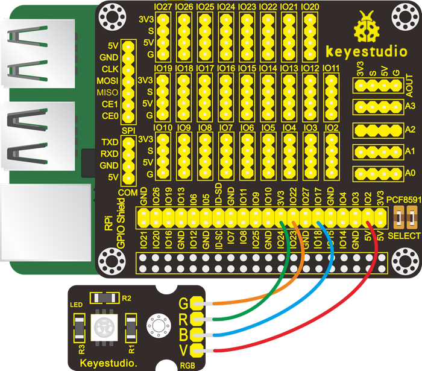
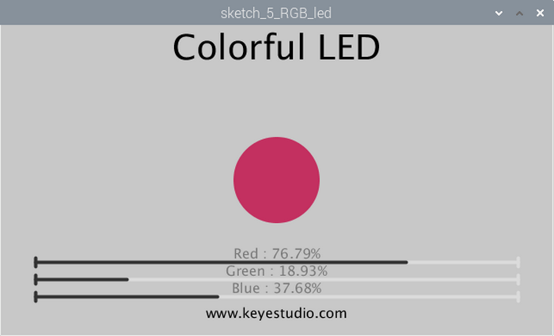
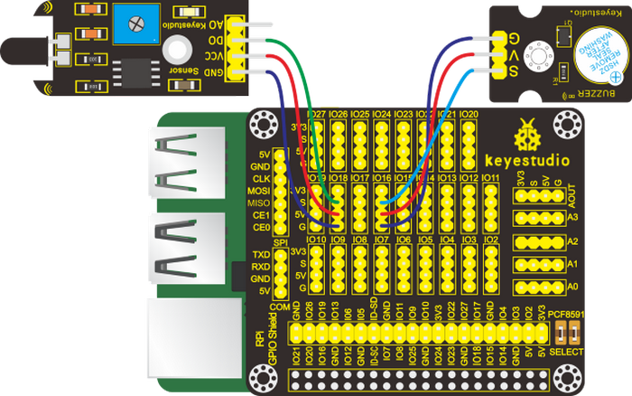
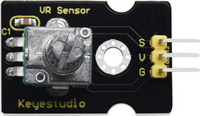
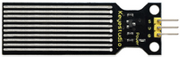

# **Processing JAVA Tutorial**

We recommend you to learn the Python and C language tutorials about this kit firstly. And we have demonstrated how to install Raspberry Pi OS, fix IP address and conduct remote login.

## 1.Preparations

### (1)Install processing IDE

1.Processing Website：<https://pi.processing.org/get-started/>

2\. Download processing IDE installation package:

<https://github.com/processing/processing/releases/download/processing-0269-3.5.3/processing-3.5.3-linux-armv6hf.tgz>

You could download zip file to the download folder of Raspberry Pi. Equally, you could save it into Downloads folder in the windows system, as shown below:


Unzip installation package and click it and select Extract Here


Then right-click to unzip folder and choose Open in Terminal;


Input installation command: sudo ./install.sh and press“Enter”;


After the download, a sketchbook folder generates in the pi folder, which is default route of saving code;


<p style="color:red">(Note: if no sketchbook folder shows in the pi folder, click menu→Programming→icon of Processing IDE.Open processing IDE.)</p>

Then click Programming→Processing IDE

Input processing in terminal to open processing IDE, as shown below:


Its interface is shown below:


### (2)Use Processing IDE

Enter the code in the editor

```java
ellipse(50, 50 , 60, 100);
```


This code refers to“drawing an oval with a center 50 pixels from left to bottom, 50 pixels from top to bottom, width 60 and height 100 pixels."

Click the "Run" button (the triangle button in the toolbar) .


You will view an oval if all content is correct, as shown below:


Click to stop or close, the program will stop running.

A notification will appear if the input code is wrong. Don’t worry about it. Check the code immediately. numbers are separated with a comma and enclosed in parentheses and each line should end with a semicolon. The wrong code is as follows:


You could set up language mode and others in below page. Except language, others are all default settings.


### (3)Copy Example Code to Raspberry Pi

Copy the Processing-Code.zip to sketchbook folder and unzip it, as shown below:


## 2.Projects

<p style="color:red;">**Note: G, - and GND marked on sensors and modules are so-called negative, which are connected to GND of GPIO extension board or “-” of breadboard; V、+、VCC are known as positive, which are interfaced 3V3 or 5V on extension board and“+”on breadboard**</p>

### Project 1：Print Hello World

**(1)Run Example Code：**

Input the following command and press“Enter”. Then Processing IDE will boot, click“RUN”:

processing
/home/pi/sketchbook/Processing_Code/sketch_1_hello_world/sketch_1_hello_world.pde

Another method for your reference as below:

Click  to find out the route：

/home/pi/sketchbook/Processing_Code/sketch_1_hello_world，then right-click sketch_1_hello_world.pde to select Processing IDE.


**(2)Test Results：**

Input“hello world”in the control window and hello world！”appears in graphical display window, as shown below:


**(3)Example Code：**

```java
void setup() {  //execute only once when the program starts running
  size(480, 200); //set window size
  textSize(48);  //set the font size
  frameRate(1);  //To set the refresh rate, set the number of flushes per second for the draw () function
}
void draw() { //every frame is called once
  background(255); //full screen filled with solid color
  fill(1); //set the fill color of the words
  text("hello world!", 75, 120); //draw text, the lower left corner of the text coordinates are (75,120)
  println("hello world!"); //Output in the console window
}
```

### Project 2：LED Blinks

**(1)Description：**

Let’s start from a rather basic and simple experiment----LED Blinks

**(2)Components Needed:**

|  |  |  |  |
| ------------------------------------------------------------ | ------------------------------------------------------------ | ------------------------------------------------------------ | ------------------------------------------------------------ |
| Raspberry Main Board\*1                                      | RPI GPIO-PCF8591 Shield\*1                                   | White LED Module \*1                                         | F-F DuPont Wires                                             |

**(3) Knowledge about Component :**

**The white LED module:**

It is a commonly used LED module. It is a F5 LED with white appearance and white light display. During experiments, when the GND and VCC on the module are powered up and the signal end S is at high level ,the white LED is on while when the S is at low level, the LED is off.

This module is compatible with various microcontrollers, including the Arduino series.

(4)Connection Diagram：

| White LED Module | RPI GPIO-PCF8591 Shield |
|------------------|-------------------------|
| S                | S（IO18）               |
| V                | 5V                      |
| G                | G                       |


**(5)Working Principle**

According to the diagram above we can find out that the positive pole(V) is connected to 5V, negative pole(G) to GND and signal terminal(S) to the pin of GPIO18. When GPIO18 outputs high level, LED is on; when it outputs low level, LED is off.

**(6)Run Example Code：**

Input the following command, press“Enter”and click“RUN”on Processing IDE:

processing
/home/pi/sketchbook/Processing_Code/sketch_2_LED_Blinking/sketch_2_LED_Blinking.pde

**(7)Test Results：**

LED starts blinking and the background of display window varies with the state of LED, as shown below:


**(8)Example Code：**

```java
import processing.io.*;

int ledPin = 18;    //define ledPin
boolean ledState = false;    //define ledState

void setup() {
  size(100, 100);   //Set the size of the graphics display box to 100*100 pixels
  frameRate(1);        //set frame rate
  GPIO.pinMode(ledPin, GPIO.OUTPUT);    //set the ledPin to output mode  
}

void draw() {
  ledState = !ledState;  //Turn back the LED light
  if (ledState) {
    GPIO.digitalWrite(ledPin, GPIO.HIGH);    //led on 
    background(255, 0, 0); //set the fill color of led on
  } else {
    GPIO.digitalWrite(ledPin, GPIO.LOW);    //led off
    background(102); //set the fill color of led off
  }
}
```

The function of the above code is included in Processing Software. You could look through detailed information and reference by clicking“Help”→“Reference”, as shown below:


Then the following page shows;


Equally, you could navigate the official website：<http://processing.org/reference>

### Project 3：Mouse-controlled LED

**(1)Description：**

In this program, we will control the status of LED by mouse. The components, connection and schematic diagrams are same as the lesson 2.

**(2)Working Principle:**

Left-click the display window, LED is on; right-click the display window, LED is off.

**(3) Run Example Code：**

Input the following command, press“Enter”and click“RUN”on Processing IDE:

processing
/home/pi/sketchbook/Processing_Code/sketch_3_mouse_led/sketch_3_mouse_led.pde

**(4)Test Results：**

After running example code, LED is off and display window is in gray color. Left-click the gray area, LED is on and window turns into red; right-click display window, LED is off and its background color is gray-black as shown below:


**(5)Example Code：**

```java
import processing.io.*;

int ledPin = 18;    //define ledPin

void setup()
{
  size(100, 100);
  GPIO.pinMode(ledPin, GPIO.OUTPUT);
}

void draw() {
  if (mousePressed && (mouseButton == LEFT)) {
    background(255, 0, 0); //set the fill color of led on
    GPIO.digitalWrite(ledPin, GPIO.HIGH);  //led on
  } 
  if (mousePressed && (mouseButton == RIGHT)) {
    background(102);   //set the fill color of led off
    GPIO.digitalWrite(ledPin, GPIO.LOW);   //led off
  }
}
```


### Project 4：Breathing LED

**(1)Description：**

A“breathing LED” is a phenomenon where an LED's brightness smoothly changes from dark to bright and back to dark, continuing to do so and giving the illusion of an LED“breathing.” This phenomenon is similar to a lung breathing in and out. So how to control LED’s brightness? We need to take advantage of PWM.

**(2)Components Needed：**

|  |  |  |  |
| ------------------------------------------------------------ | ------------------------------------------------------------ | ------------------------------------------------------------ | ------------------------------------------------------------ |
| Raspberry Main Board\*1                                      | RPI GPIO-PCF8591 Shield\*1                                   | Red LED Module\*1                                            | F-F DuPont Wires                                             |

**(3)Working Principle**

We use the PWM output of GPIO, PWM outputs analog signals and output value is 0\~100 which is equivalent to output voltage 0\~3.3V from GPIO port.

According to Ohm's law: U/R = I, the resistance is 220Ω, and the value of voltage U changes, so does the value of current I, which can control the brightness of the LED lamp.

PWM (Pulse Width Modulation) is the control of the analog circuit through the digital output of microcomputer and a method that makes digital coding on analog signal levels.

It sends square waves with certain frequency through digital pins, that is, high level and low level output alternately for a period of time. Total time of each group high and low level is fixed, which is called cycle.

The time of high level output is pulse width whose percentage is called Duty Cycle. The longer that high level lasts, the larger the duty cycle of analog signals is, and the corresponding voltage as well.

Below chart is pulse width 50%, then the output voltage is 3.3 \* 50% = 1.65V，and the brightness of LED is medium.


**(4)Connection Diagram：**

| Red LED Module | RPI GPIO-PCF8591 Shield |
|----------------|-------------------------|
| S              | S（IO18）               |
| V              | 5V                      |
| G              | G                       |


**(5)Run Example Code：**

Input the following the command and press“Enter”, open Processing IDE and click“RUN”

processing
/home/pi/sketchbook/Processing_Code/sketch_4_Breathing_LED/sketch_4_Breathing_LED.pde

**(6)Test Results ：**

LED gradually brightens, and the color of red dot in the display window gets darker as well. Progress bar can adjust the LED’s brightness, as shown below:


**(7)Example Code：**

Except main program code, there is a“SOFTPWM”custom page in processing software, as shown below:


The code of the main program:

```java
import processing.io.*;

int ledPin = 18;    //led Pin
int borderSize = 40;  //
float t = 0.0;      //progress percent
float tStep = 0.004;    // speed
SOFTPWM p = new SOFTPWM(ledPin, 10, 100);    //Create a PWM pin,initialize the duty cycle and period
void setup() {
  size(640, 360);  //display window size
  strokeWeight(4);  //stroke Weight
}

void draw() {
  // Show static value when mouse is pressed, animate otherwise
  if (mousePressed) {
    //Gets the value of the X-axis coordinate when the mouse is pressed, 
    //within the (borderSize, width-bordersize) range
    int a = constrain(mouseX, borderSize, width - borderSize);
    t = map(a, borderSize, width - borderSize, 0.0, 1.0); //Gets the value after the mapping
  } else {
    t += tStep;  //The value of the variable T increases automatically
    if (t > 1.0) t = 0.0;
  }
  p.softPwmWrite((int)(t*100)); //wirte the duty cycle according to t
  background(255);  //A white background
  titleAndSiteInfo();  //title and Site infomation
  
  //The brightness of the red circle varies with the value of T
  fill(255, 255-t*255, 255-t*255);
  //The center of the display box is a circle with a diameter of 100px
  ellipse(width/2, height/2, 100, 100);
  
  pushMatrix();
  translate(borderSize, height - 45);  //Set the new origin of coordinates
  int barLength = width - 2*borderSize;  //Define the length of the line
  
  barBgStyle();  //progressbar bg
  line(0, 0, barLength, 0);  //A horizontal line
  //Draw a 10px vertical line at the end of the horizontal line
  line(barLength, -5, barLength, 5);  
  barStyle();  //progressbar 
  //Draw a 10px vertical line at the beginning of the horizontal line
  line(0, -5, 0, 5); 
  //Draw the length of the black line according to the value of the variable t
  line(0, 0, t*barLength, 0);

  barLabelStyle();    //progressbar label
  text("progress : "+nf(t*100,2,2),barLength/2,-25);
  popMatrix();
}

void titleAndSiteInfo() {
  fill(0);
  textAlign(CENTER);    //set the text centered
  textSize(40);        //set text size
  text("Breathing Light", width / 2, 40);    //title
  textSize(16);
  text("www.keyestudio.com", width / 2, height - 20);    //site
}
void barBgStyle() {
  stroke(220);
  noFill();
}

void barStyle() {
  stroke(50);
  noFill();
}

void barLabelStyle() {
  noStroke();
  fill(120);
}
```

(8)Reference：

| class SOFTPWM                                                  |                                                                                                                                                                                                 |
|----------------------------------------------------------------|-------------------------------------------------------------------------------------------------------------------------------------------------------------------------------------------------|
| public SOFTPWM**(**int iPin**,** int dc**,** int pwmRange**)** | Construct function，used to create PWM pin，set pwmRange and initial duty cycle The time of minimum duty cycle of pwmRange is 0.1ms pwmRange=100 means than PWM duty cycle is 0.1ms\*100=10ms。 |
| public void softPwmWrite**(**int value**)**                    | Set PMW Duty Cycle                                                                                                                                                                              |
| public void softPwmStop**()**                                  | Stop outputting PWM                                                                                                                                                                             |

### Project 5：RGB

**(1)Description：**

In this chapter, we will demonstrate how RGB lights show different colors via programming.

**(2)Components Needed：**

|  |  |  |  |
| ------------------------------------------------------------ | ------------------------------------------------------------ | ------------------------------------------------------------ | ------------------------------------------------------------ |
| Raspberry Main Board\*1                                      | RPI GPIO-PCF8591 Shield\*1                                   | RGB Module\*1                                                | F-F DuPont Wires                                             |

**(3)Knowledge about Component:**

**RGB Module：**

The RGB module integrates with three LEDs in red, green and blue respectively. These three LEDs also share the same anode. The combinations of these three colors can form almost all other colors visible to human eyes. Thus, it has found wide applications in terms of colors.

Red, green and blue are three primary colors. They could produce all kinds of visible lights when mixing them up. Computer screen, single pixel mobile phone screen, neon light work under this principle.


Theoretically, if we use three 8-bit PWM (Pulse Width Modulation) signals to control a RGB LED, we can create 28 \* 28 \* 28 = 16777216 (about 16 million) different combinations.

Now, let’s make a RGB LED display all kinds of colors.

**(4)Connection Diagram：**

| RGB Module | RPI GPIO-PCF8591 Shield |
|------------|-------------------------|
| R          | IO24                    |
| G          | IO23                    |
| B          | IO18                    |
| V          | 5V                      |



**(5)Run Example Code：**

Input the following command, press“Enter”and click“RUN”on Processing IDE:

processing
/home/pi/sketchbook/Processing_Code/sketch_5_RGB_led/sketch_5_RGB_led.pde

**(6)Test Results：**

After running the program, RGB LED is off, the window displays the round dot in black and the progress bars for red, green and blue are 0%.

The round dot will change colors when dragging the progress bar to set PWM duty cycle for each color channel.

The color of RGB is as same as that of the round dot.




**(7) Example Code：**

This project contains a lot of code files, the core code is contained in the file sketch_5_RGB_led.pde.

Other files are customized. As shown below:


**Code:**

```java
import processing.io.*;

int bluePin = 18;    //blue Pin
int greenPin = 23;  //green Pin
int redPin = 24;    //red Pin
int borderSize = 40;  //picture border size
//Create a PWM pin,initialize the duty cycle and period
SOFTPWM pRed = new SOFTPWM(redPin, 100, 100);    
SOFTPWM pGreen = new SOFTPWM(greenPin, 100, 100);
SOFTPWM pBlue = new SOFTPWM(bluePin, 100, 100);
//instantiate three ProgressBar Object
ProgressBar rBar, gBar, bBar;
boolean rMouse = false, gMouse = false, bMouse = false;
void setup() {
  size(640, 360);  //display window size
  strokeWeight(4);  //stroke Weight
  //define the ProgressBar length
  int barLength = width - 2*borderSize;
  //Create ProgressBar Object
  rBar = new ProgressBar(borderSize, height - 85, barLength);
  gBar = new ProgressBar(borderSize, height - 65, barLength);
  bBar = new ProgressBar(borderSize, height - 45, barLength);
  //Set ProgressBar's title
  rBar.setTitle("Red");gBar.setTitle("Green");bBar.setTitle("Blue");
}

void draw() {
  background(200);  //A white background
  titleAndSiteInfo();  //title and Site infomation

  fill(rBar.progress*255, gBar.progress*255, bBar.progress*255);  //cycle color
  ellipse(width/2, height/2, 100, 100);  //show cycle

  rBar.create();  //Show progressBar
  gBar.create();
  bBar.create();
}

void mousePressed() {
  if ( (mouseY< rBar.y+5) && (mouseY>rBar.y-5) ) {
    rMouse = true;
  } else if ( (mouseY< gBar.y+5) && (mouseY>gBar.y-5) ) {
    gMouse = true;
  } else if ( (mouseY< bBar.y+5) && (mouseY>bBar.y-5) ) {
    bMouse = true;
  }
}
void mouseReleased() {
  rMouse = false;
  bMouse = false;
  gMouse = false;
}
void mouseDragged() {
  int a = constrain(mouseX, borderSize, width - borderSize);
  float t = map(a, borderSize, width - borderSize, 0.0, 1.0);
  if (rMouse) {
    pRed.softPwmWrite((int)(100-t*100)); //wirte the duty cycle according to t
    rBar.setProgress(t);
  } else if (gMouse) {
    pGreen.softPwmWrite((int)(100-t*100)); //wirte the duty cycle according to t
    gBar.setProgress(t);
  } else if (bMouse) {
    pBlue.softPwmWrite((int)(100-t*100)); //wirte the duty cycle according to t
    bBar.setProgress(t);
  }
}

void titleAndSiteInfo() {
  fill(0);
  textAlign(CENTER);    //set the text centered
  textSize(40);        //set text size
  text("Colorful LED", width / 2, 40);    //title
  textSize(16);
  text("www.keyestudio.com", width / 2, height - 20);    //site
}
```

**(8)Reference：**

| class ProgressBar（used to create progress bar）                    |                                                                                               |
|---------------------------------------------------------------------|-----------------------------------------------------------------------------------------------|
| public ProgressBar**(**int ix**,** int iy**,** int barlen**)**      | Constructed function, used to create ProgressBar, coordinates X, Y of ProgressBar and length  |
| public void setTitle**(**String str**)**                            | Used to set the name of progress bar and display it in the middle of progress bar             |
| public void setProgress**(**float pgress**)**                       | Used to set the process of progress bar parameter：0\<pgress\<1.0.                            |
| public void create**() &** public void create**(**float pgress**)** | Used to draw the progress bar                                                                 |

### Project 6：Active Buzzer

**(1)Description：**

In this project, we will control a active buzzer via a mousse.

**(2)Components Needed：**

|  |  |  |  |
| ------------------------------------------------------------ | ------------------------------------------------------------ | ------------------------------------------------------------ | ------------------------------------------------------------ |
| Raspberry Main Board\*1                                      | RPI GPIO-PCF8591 Shield\*1                                   | Active Buzzer Module\*1                                      | F-F DuPont Wires                                             |

**(3)Knowledge about Component:**

**Active Buzzer Module：**The active buzzer is equipped with an internal oscillator, which makes it possible to automatically generate a tone as long as current flows through. It is very easy and convenient. But it also has its shortcoming that the fixed frequency means it can only makes a monotone.

**(4)Connection Diagram：**

| Active Buzzer Module | RPI GPIO-PCF8591 Shield |
|----------------------|-------------------------|
| S                    | S（IO16）               |
| V                    | 5V                      |
| G                    | G                       |


**(5)Run Example Code：**

Input the following command, press“Enter”and click“RUN”on Processing IDE:

processing
/home/pi/sketchbook/Processing_Code/sketch_6_active_buzzer/sketch_6_active_buzzer.pde

**(6)Test Results：**

Click any area of the display window, active buzzer emits sound and the icon on display window below varies with the status of active buzzer. When it stops the icon disappears.


**(7)Example Code：**

```java
import processing.io.*;

int buzzerPin = 16;
boolean buzzerState = false;
void setup() {
  size(640, 360);
  GPIO.pinMode(buzzerPin, GPIO.OUTPUT);
}

void draw() {
  background(255);
  titleAndSiteInfo();    //title and site infomation
  drawBuzzer();       //buzzer img
  if (buzzerState) {
    GPIO.digitalWrite(buzzerPin, GPIO.HIGH);  // buzzer on
    drawArc();      //Sounds waves img
  } else {
    GPIO.digitalWrite(buzzerPin, GPIO.LOW);  // buzzer off
  }
}

void mouseClicked() { //if the mouse Clicked
  buzzerState = !buzzerState;  //Change the buzzer State
}
void drawBuzzer() {
  strokeWeight(1);
  fill(0);
  ellipse(width/2, height/2, 50, 50);  
  fill(255);
  ellipse(width/2, height/2, 10, 10);
}
void drawArc() {
  noFill();
  strokeWeight(8);
  for (int i=0; i<3; i++) {
    arc(width/2, height/2, 100*(1+i), 100*(1+i), -PI/4, PI/4, OPEN);
  }
}
void titleAndSiteInfo() {
  fill(0);
  textAlign(CENTER);    //set the text centered
  textSize(40);        //set text size
  text("Active Buzzer", width / 2, 40);    //title
  textSize(16);
  text("www.keyestudio.com", width / 2, height - 20);    //site
}
```


### Project 7：Button-controlled LED

**(1)Description：**

Usually a complete open loop control is made of external information input, controller and actuator.

The external information is input into controller which can analyze the input data and send to control signals to make actuator to react.


A button-controlled LED is decided by an open loop control. Next, we will make a desk lamp with a button, an LED and RPi. LED is on when button is pressed, on the contrary, it will be off.

**(2)Components Needed：**

|  |  |  |  |  |
| ------------------------------------------------------------ | ------------------------------------------------------------ | ------------------------------------------------------------ | ------------------------------------------------------------ | ------------------------------------------------------------ |
| Raspberry Main Board\*1                                      | RPI GPIO-PCF8591 Shield\*1                                   | Red LED Module\*1                                            | Push Button Sensor\*1                                        | F-F DuPont Wires                                             |

**(3)Connection Diagram：**

| Red LED Module | RPI GPIO-PCF8591 Shield |   | Push Button Sensor | RPI GPIO-PCF8591 Shield |
|----------------|-------------------------|---|--------------------|-------------------------|
| S              | S（IO16）               |   | S                  | S（IO18）               |
| V              | 5V                      |   | V                  | 5V                      |
| G              | G                       |   | G                  | G                       |


**(4)Eliminate Button Shaking**

The LED status won’t jump into new state immediately when button is pressed. There will be a short continuous shaking before into new status, which is similar with release status.


Therefore, there will be many pressing and releasing actions. The shaking will misleads the high speed movement of MCU, causing wrong judgement. That requires us to judge the button’ status frequently. And only when its status is stable can we be sure that the button is pressed.

**(5)Run Test Code：**

Input the following command, press“Enter”and click“RUN”on Processing IDE:

processing
/home/pi/sketchbook/Processing_Code/sketch_7_button_led/sketch_7_button_led.pde

**(6)Test Results：**

After running example code, the display window is in dark gray. Press button, LED is on and window turns into red color; Press button again, LED is off and its background color is dark gray color, as shown below:


**(7)Example Code：**

```java
import processing.io.*;

int ledPin = 16; //define ledPin
int btnPin = 18; //define btnPin
int count = 0;
int flag = 0;
int ledState = 0;

void setup() {
  size(100, 100);
  GPIO.pinMode(btnPin, GPIO.INPUT_PULLUP);
  GPIO.pinMode(ledPin, GPIO.OUTPUT);
}

void draw() {
  
  if (GPIO.digitalRead(btnPin) == GPIO.LOW) { // button is pressed
    delay(10);
    flag = 1;
    if(flag == 1)
    {
      delay(10);
      if (GPIO.digitalRead(btnPin) == GPIO.HIGH)
      {
        count = count + 1;
        println(count);
        flag = 0;
      }
    }
  }
  ledState = count % 2;
  if(ledState == 1)
  {
    GPIO.digitalWrite(ledPin, GPIO.HIGH);  //led on
    background(255, 0, 0);
  }
  else
  {
    GPIO.digitalWrite(ledPin, GPIO.LOW);  //led off
    background(102);
  }
}
```


### Project 8：PIR Motion Sensor

**(1)Description：**

Lamps only light up when people passes by installed in some places, which are conductive to energy and cost saving. Have you ever thought about the principle behind these lamps? It is because of PIR motion sensors. In this lesson, we will learn about PIR motion sensor.

**(2)Components Needed：**

|  |  |  |  |  |
| ------------------------------------------------------------ | ------------------------------------------------------------ | ------------------------------------------------------------ | ------------------------------------------------------------ | ------------------------------------------------------------ |
| Raspberry Main Board\*1                                      | RPI GPIO-PCF8591 Shield\*1                                   | Red LED Module\*1                                            | PIR Motion Sensor\*1                                         | F-F DuPont Wires                                             |

**(3)Knowledge about Component：**

**PIR Motion Sensor：**

The principle of human infrared sensor is that when certain crystals, such as lithium tantalate and triglyceride sulfate, are heated, the two ends of the crystal will generate an equal number of charges, with opposite signs, which can be converted into voltage output by an amplifier.

Human body will emit IR ray, although weak but can be detected. This sensor outputs 1 (high level ) when human being is detected; otherwise, it outputs 0 (low level).

Note: Nothing but moving person can be detected, with the detection distance up to 3m.

**(4)Connection Diagram：**

| Red LED Module | RPI GPIO-PCF8591 Shield |   | PIR Motion Sensor | RPI GPIO-PCF8591 Shield |
|----------------|-------------------------|---|-------------------|-------------------------|
| S              | S（IO5）                |   | S                 | S（IO18）               |
| V              | 5V                      |   | V                 | 5V                      |
| G              | G                       |   | G                 | G                       |


**(5)Run Example Code：**

Input the following command, press “Enter”and click“RUN”on Processing IDE:

processing
/home/pi/sketchbook/Processing_Code/sketch_8_PIR_led/sketch_8_PIR_led.pde

**(6)Test Results：**

If PIR motion sensor doesn’t detect moving person, LED will be off and display window will show black dot and“Nobody”; on the contrary, LED will be on, and window will show red dot and “Somebody”, as shown below:


**(7)Example Code：**

```java
import processing.io.*;

final int sensorPin = 18;  //connect to sensor pin
final int ledPin = 5;    //connect to led pin
void setup() {
  size(640,360);    //window size
  GPIO.pinMode(sensorPin, GPIO.INPUT); 
  GPIO.pinMode(ledPin, GPIO.OUTPUT);
}

void draw() {
  background(255);
  titleAndSiteInfo();
  //if read sensor for high level
  if (GPIO.digitalRead(sensorPin) == GPIO.HIGH) {
    GPIO.digitalWrite(ledPin, GPIO.HIGH);  //led on
    fill(255,0,0);    //fill in red
    textAlign(CENTER);    //set the text centered
    textSize(40);        //set text size
    text("Somebody", width / 2, 275);    //title
  } else {
    GPIO.digitalWrite(ledPin, GPIO.LOW);  //led off
    fill(100);        //fill in white
    textAlign(CENTER);    //set the text centered
    textSize(40);        //set text size
    text("Nobody", width / 2, 275);    //title
  }
  ellipse(width/2,height/2.5,height/3,height/3);
}

void titleAndSiteInfo() {
  fill(0);
  textAlign(CENTER);    //set the text centered
  textSize(45);        //set text size
  text("PIR LED", width / 2, 40);    //title
  textSize(16);
  text("www.keyestudio.com", width / 2, height - 20);    //site
}
```


### Project 9：Fire Alarm

**(1)Description：**

A flame detector is a sensor designed to detect and respond to the presence of flames or fire, allowing flame detection.

**(2)Components Needed：**

|  |  |  |  |  |
| ------------------------------------------------------------ | ------------------------------------------------------------ | ------------------------------------------------------------ | ------------------------------------------------------------ | ------------------------------------------------------------ |
| Raspberry Main Board\*1                                      | RPI GPIO-PCF8591 Shield\*1                                   | Active Buzzer Module\*1                                      | Flame Sensor\*1                                              | F-F DuPont Wires                                             |

**(3)Knowledge about Component：**

**Flame Sensor：**

Flame sensor is made based on the principle that infrared ray is highly sensitive to flame. It has an infrared receiving tube specially designed to detect fire, and then convert the flame brightness to fluctuating level signal. The signals are then input into the central processor and be dealt with accordingly.

Flame sensor is used to detect fire source with wavelength in 760nm～1100nm, detection angle is 60°. When its IR waves length is close to 940nm, and its sensitivity is the highest.

Notice that keep flame sensor away from fire source to defend its damage for its working temperature is between -25°-85°

Note: a potentiometer is built in the sensor so its sensitivity can be adjusted by rotating it.


**(4)Connection Diagram：**

| Active Buzzer Module | RPI GPIO-PCF8591 Shield |   | Flame Sensor | RPI GPIO-PCF8591 Shield |
|----------------------|-------------------------|---|--------------|-------------------------|
| S                    | S（IO16）               |   | D0           | S（IO18）               |
| V                    | 5V                      |   | VCC          | 5V                      |
| G                    | G                       |   | GND          | G                       |



**(5)Run Example Code：**

Input the following command, press“Enter”and click“RUN”on Processing IDE:

processing
/home/pi/sketchbook/Processing_Code/sketch_9_flame_buzzer/sketch_9_flame_buzzer.pde

 **(6)Test Results：**

Active buzzer will emit sound and window display will show arc lines and“Fire”as follows, when flame is detected; otherwise, active buzzer won’t emit sound, arc lines and“Fire”will disappear.


**(7)Example Code：**

```java
import processing.io.*;

int flamePin = 18;  //connect to flame pin
int buzzerPin = 16;    //connect to buzzer pin
boolean buzzerState = false;
void setup() {
  size(640,360);    //window size
  GPIO.pinMode(flamePin, GPIO.INPUT); 
  GPIO.pinMode(buzzerPin, GPIO.OUTPUT);
}

void draw() {
  background(255);
  titleAndSiteInfo();  //title and site infomation
  drawBuzzer();       //buzzer img
  //if read sensor for high level
  if (GPIO.digitalRead(flamePin) == GPIO.LOW) {
    GPIO.digitalWrite(buzzerPin, GPIO.HIGH);  //buzzer on 
    drawArc();      //Sounds waves img
    fill(0);
    textAlign(CENTER);    //set the text centered
    textSize(40);        //set text size
    text("Fire", width / 3, 250);    //title
  } else {
    GPIO.digitalWrite(buzzerPin, GPIO.LOW);  //buzzer off  
  } 
}

void drawBuzzer() {
  strokeWeight(1);
  fill(0);
  ellipse(width/2, height/2, 50, 50);  
  fill(255);
  ellipse(width/2, height/2, 10, 10);
}
void drawArc() {
  noFill();
  strokeWeight(8);
  for (int i=0; i<3; i++) {
    arc(width/2, height/2, 100*(1+i), 100*(1+i), -PI/4, PI/4, OPEN);
  }
}
void titleAndSiteInfo() {
  fill(0);
  textAlign(CENTER);    //set the text centered
  textSize(40);        //set text size
  text("Fire Alarm", width / 2, 40);    //title
  textSize(16);
  text("www.keyestudio.com", width / 2, height - 20);    //site
}
```


### Project 10： Collision Alarm

**(1)Description：**

We can use the collision sensor to detect whether crash happens. When the metal plate above the push button switch of the sensor is knocked, it outputs low level signals; and when the button is open, it remind in high level. In this project, collision sensor will be applied to control the active buzzer.

**(2)Components Needed：**

|  |  |  |  |  |
| ------------------------------------------------------------ | ------------------------------------------------------------ | ------------------------------------------------------------ | ------------------------------------------------------------ | ------------------------------------------------------------ |
| Raspberry Main Board\*1                                      | RPI GPIO-PCF8591 Shield\*1                                   | Active Buzzer Module\*1                                      | Collision Sensor\*1                                          | F-F DuPont Wires                                             |

**(3)Knowledge about Component：**

**Collision Sensor:**

It is a widely used collision sensor that has a push button switch covered by a mental plate. When the plate is pushed, the button is pressed, the sensor outputs low level and the LED on it lights; or it outputs high level and the LED reminds off.

This sensor is often used as a limit switch in a 3D printer.

**(4)Connection Diagram：**

| Active Buzzer Module | RPI GPIO-PCF8591 Shield |   | Collision Senso | RPI GPIO-PCF8591 Shield |
|----------------------|-------------------------|---|-----------------|-------------------------|
| S                    | S（IO16）               |   | S               | S（IO18）               |
| V                    | 5V                      |   | V               | 5V                      |
| G                    | G                       |   | G               | G                       |


**(5)Run Example Code：**

Input the following command, press“Enter”and click“RUN”on Processing IDE:

processing
/home/pi/sketchbook/Processing_Code/sketch_10_crash_buzzer/sketch_10_crash_buzzer.pde

**(6)Test Results：**

After running the program, when the metal plate of the push button switch is pressed, the buzzer makes sound and the display window shows the arc-sharped pattern and sentence“The switch shrapnel is depressed”; it keeps silent and the arc-sharped pattern and sentence“The switch shrapnel is depressed”disappear as shown below.


**(7)Example Code：**

```java
import processing.io.*;

int crashPin = 18;  //connect to crash pin
int buzzerPin = 16;    //connect to buzzer pin
boolean buzzerState = false;
void setup() {
  size(640,360);    //window size
  GPIO.pinMode(crashPin, GPIO.INPUT); 
  GPIO.pinMode(buzzerPin, GPIO.OUTPUT);
}

void draw() {
  background(255);
  titleAndSiteInfo();  //title and site infomation
  drawBuzzer();       //buzzer img
  //if read sensor for high level
  if (GPIO.digitalRead(crashPin) == GPIO.LOW) {
    GPIO.digitalWrite(buzzerPin, GPIO.HIGH);  //buzzer on 
    drawArc();      //Sounds waves img
    fill(0);
    textAlign(CENTER);    //set the text centered
    textSize(20);        //set text size
    text("The switch shrapnel is depressed", width / 4, 250);    //title
  } else {
    GPIO.digitalWrite(buzzerPin, GPIO.LOW);  //buzzer off  
  } 
}

void drawBuzzer() {
  strokeWeight(1);
  fill(0);
  ellipse(width/2, height/2, 50, 50);  
  fill(255);
  ellipse(width/2, height/2, 10, 10);
}
void drawArc() {
  noFill();
  strokeWeight(8);
  for (int i=0; i<3; i++) {
    arc(width/2, height/2, 100*(1+i), 100*(1+i), -PI/4, PI/4, OPEN);
  }
}
void titleAndSiteInfo() {
  fill(0);
  textAlign(CENTER);    //set the text centered
  textSize(40);        //set text size
  text("Collision Warning", width / 2, 40);    //title
  textSize(16);
  text("www.keyestudio.com", width / 2, height - 20);    //site
}
```


### Project 11： Line-tracking Sensor

**(1)Description：**

You may have seen that in an experiment a smart car moved along a black line and it didn’t overstep this boundary. How did it make it? The credit goes to a line-tracking sensor. And in this project, we intend to learn about the line-tracking sensor.

**(2)Components Needed：**

|  |  |  |  |  |
| ------------------------------------------------------------ | ------------------------------------------------------------ | ------------------------------------------------------------ | ------------------------------------------------------------ | ------------------------------------------------------------ |
| Raspberry Main Board\*1                                      | RPI GPIO-PCF8591 Shield\*1                                   | Red LED Module\*1                                            | Line-tracking Sensor\*1                                      | F-F DuPont Wires                                             |

**(3)Knowledge about Component：**

**Line-tracking Sensor：**

It is an infrared sensor in nature which can detect white and black objects. The working principle of the TCRT5000 pair tube on the sensor is based on the different reflectivity of infrared to colors so as to convert this different strengths of reflected signals to electric signals. When the sensor detects black objects, it is in high level while when it sensors white items it is in low level. And the detection altitude is from 0 to 3cm. You can rotate the potentiometer in a bid to adjust the sensitivity of the line-tracking sensor.


**(4)Connection Diagram：**

| Red LED Module | RPI GPIO-PCF8591 Shield |   | Line-tracking Sensor | RPI GPIO-PCF8591 Shield |
|----------------|-------------------------|---|----------------------|-------------------------|
| S              | S（IO27）               |   | S                    | S（IO18）               |
| V              | 5V                      |   | V                    | 5V                      |
| G              | G                       |   | G                    | G                       |


**(5)Run Example Code：**

Input the following command, press“Enter”and click“RUN”on Processing IDEprocessing /home/pi/sketchbook/Processing_Code/sketch_11_tracking/sketch_11_tracking.pde

**(6)Test Results：**

After running the program, when the line-tracking sensor detects blacks obstacles or senses nothing,the LED reminds off the pattern in the display representing the LED is in black and the phrase “Black object”appears; while when it detects white items, the LED is on, the pattern on the window gets red and the phrase “White object” displays as shown below:


**(7)Example Code：**

```java
import processing.io.*;

final int trackingPin = 18;  //connect to tracking pin
final int ledPin = 27;    //connect to led pin
void setup() {
  size(640,360);    //window size
  GPIO.pinMode(trackingPin, GPIO.INPUT); 
  GPIO.pinMode(ledPin, GPIO.OUTPUT);
}

void draw() {
  background(255);
  titleAndSiteInfo();
  //if read sensor for high level
  if (GPIO.digitalRead(trackingPin) == GPIO.LOW) {
    GPIO.digitalWrite(ledPin, GPIO.HIGH);  //led on
    fill(255,0,0);    //fill in red
    textAlign(CENTER);    //set the text centered
    textSize(40);        //set text size
    text("White object", width / 2, 275);    //title
  } else {
    GPIO.digitalWrite(ledPin, GPIO.LOW);  //led off
    fill(100);        //fill in white
    textAlign(CENTER);    //set the text centered
    textSize(40);        //set text size
    text("Black object", width / 2, 275);    //title
  }
  ellipse(width/2,height/2.5,height/3,height/3);
}

void titleAndSiteInfo() {
  fill(0);
  textAlign(CENTER);    //set the text centered
  textSize(45);        //set text size
  text("Tracking", width / 2, 40);    //title
  textSize(16);
  text("www.keyestudio.com", width / 2, height - 20);    //site
}
```


### Project 12： Magnetic Detection

**(1)Description：**

What is the best way to detect a magnet? Use another magnet? Yeah , it can but it is not sensitive enough. You still need to feel it by yourselves.

Perhaps you can try a hall magnetic sensor which features high sensitivity, quick response, nice temperature performance, and high reliability.

In this project, we will try to turn a LED on and off through a hall magnetic sensor.

**(2)Components Needed：**

|  |  |  |  |  |
| ------------------------------------------------------------ | ------------------------------------------------------------ | ------------------------------------------------------------ | ------------------------------------------------------------ | ------------------------------------------------------------ |
| Raspberry Main Board\*1                                      | RPI GPIO-PCF8591 Shield\*1                                   | Red LED Module\*1                                            | Hall Magnetic Sensor\*1                                      | F-F DuPont Wires                                             |

**(3)Knowledge about Component:**

**Hall Magnetic Sensor：**

The main component built in the sensor is A3144E, which is an electronic magnetic device and an active one. It uses magnetic field and Hall effects to achieve the purpose of non-contact control. Since the Hall element itself is a chip in nature, its working life is theoretically unlimited. The sensor can be used to detect magnetic fields and output digital signals. It can sense magnetic
materials within a detection range of about 3cm. Note that it can only detect the presence of a magnetic field nearby, but not the strength of the magnetic field.

**(4)Connection Diagram：**

| Red LED Module | RPI GPIO-PCF8591 Shield |   | Hall Magnetic Sensor | RPI GPIO-PCF8591 Shield |
|----------------|-------------------------|---|----------------------|-------------------------|
| S              | S（IO5）                |   | S                    | S（IO18）               |
| V              | 5V                      |   | V                    | 5V                      |
| G              | G                       |   | G                    | G                       |


**(5)Run Example Code：**

Input the following command, press“Enter”and click“RUN”on Processing IDE:

processing
/home/pi/sketchbook/Processing_Code/sketch_12_Hall_magnetic/sketch_12_Hall_magnetic.pde

**(6)Test Results：**

After running the program and placing a magnetic ball around the Hall magnetic sensor, when the sensor detects magnetic field nearby, the window shows “magnetic” and the LED lights up; otherwise, it displays“nonmagnetic”and the LED stays dark.


**(7)Example Code：**

```java
import processing.io.*;

final int hallPin = 18;  //connect to hall pin
final int ledPin = 5;    //connect to led pin
void setup() {
  size(640,360);    //window size
  GPIO.pinMode(hallPin, GPIO.INPUT); 
  GPIO.pinMode(ledPin, GPIO.OUTPUT);
}

void draw() {
  background(255);
  titleAndSiteInfo();
  //if read sensor for high level
  if (GPIO.digitalRead(hallPin) == GPIO.LOW) {
    GPIO.digitalWrite(ledPin, GPIO.HIGH);  //led on
    fill(255,0,0);    //fill in red
    textAlign(CENTER);    //set the text centered
    textSize(40);        //set text size
    text("magnetic", width / 2, 275);    //title
  } else {
    GPIO.digitalWrite(ledPin, GPIO.LOW);  //led off
    fill(100);        //fill in white
    textAlign(CENTER);    //set the text centered
    textSize(40);        //set text size
    text("nonmagnetic", width / 2, 275);    //title
  }
  ellipse(width/2,height/2.5,height/3,height/3);
}

void titleAndSiteInfo() {
  fill(0);
  textAlign(CENTER);    //set the text centered
  textSize(45);        //set text size
  text("Tracking", width / 2, 40);    //title
  textSize(16);
  text("www.keyestudio.com", width / 2, height - 20);    //site
}
```

**Project 13： Touch-sensitive Alarm**

**(1)Description：**

Touch-sensitive alarm is very commonplace in daily life, especially found in home anti-theft and car anti-theft systems. When someone touches the alarming mental material, the device alarms to warn people. And it is of high sensitivity and high reliability evidenced by issuing alarm the moment it is touched.

**(2)Components Needed：**

|  |  |  |  |  |
| ------------------------------------------------------------ | ------------------------------------------------------------ | ------------------------------------------------------------ | ------------------------------------------------------------ | ------------------------------------------------------------ |
| Raspberry Main Board\*1                                      | RPI GPIO-PCF8591 Shield\*1                                   | Active Buzzer Module\*1                                      | Capacitive Touch Module\*1                                   | F-F DuPont Wires                                             |

**(3)Knowledge about Component:**

**Capacitive Touch Module：**

It mainly uses touch detection IC and can be found in many electronic devices. It uses the most popular capacitive sensing technology, just like the smart buttons on your phone. The touching area of this small sensor can feel the touch of humans and metals by responding with high or low level. It can still detect the touch though covered by a piece of paper and cloth. The sensitivity reduces with the increase of items between the touch-sensitive area and the object performing the touch.

The touch detection IC is designed to replace the traditional button with a variable area key, featuring low power consumption and wide operating voltage.

When the module is powered up, it needs a stabilization time of about 0.5 sec. During this time period, do not touch the keypad. At this time, all functions are disabled, and self-calibration is always performed. No touching the key, the recalibration period is about 4.0sec.

**(4)Connection Diagram：**

| Active Buzzer Module | RPI GPIO-PCF8591 Shield |   | Capacitive Touch Sensor  | RPI GPIO-PCF8591 Shield |
|----------------------|-------------------------|---|--------------------------|-------------------------|
| S                    | S（IO27）               |   | S                        | S（IO18）               |
| V                    | 5V                      |   | V                        | 5V                      |
| G                    | G                       |   | G                        | G                       |


**(5)Run Example Code：**

Input the following command, press“Enter”and click“RUN”on Processing IDE:

processing
/home/pi/sketchbook/Processing_Code/sketch_13_touch_alarm/sketch_13_touch_alarm.pde

**(6)Test Results：**

After running the program, when the sensing area on the capacitive touch sensor is touched, the window shows arc-shaped pattern and “Touch” and the buzzer makes sounds; otherwise, shows no arc-shaped pattern and “Touch” and the buzzer is in
silence.


**(7)Example Code：**

```java
import processing.io.*;

int touchPin = 18;  //connect to touch pin
int buzzerPin = 27;    //connect to buzzer pin
boolean buzzerState = false;
void setup() {
  size(640,360);    //window size
  GPIO.pinMode(touchPin, GPIO.INPUT); 
  GPIO.pinMode(buzzerPin, GPIO.OUTPUT);
}

void draw() {
  background(255);
  titleAndSiteInfo();  //title and site infomation
  drawBuzzer();       //buzzer img
  //if read sensor for high level
  if (GPIO.digitalRead(touchPin) == GPIO.HIGH) {
    GPIO.digitalWrite(buzzerPin, GPIO.HIGH);  //buzzer on
    drawArc();      //Sounds waves img
    fill(0);
    textAlign(CENTER);    //set the text centered
    textSize(40);        //set text size
    text("Touch", width / 3, 250);    //title
  } else {
    GPIO.digitalWrite(buzzerPin, GPIO.LOW);  //buzzer off 
  } 
}

void drawBuzzer() {
  strokeWeight(1);
  fill(0);
  ellipse(width/2, height/2, 50, 50);  
  fill(255);
  ellipse(width/2, height/2, 10, 10);
}
void drawArc() {
  noFill();
  strokeWeight(8);
  for (int i=0; i<3; i++) {
    arc(width/2, height/2, 100*(1+i), 100*(1+i), -PI/4, PI/4, OPEN);
  }
}
void titleAndSiteInfo() {
  fill(0);
  textAlign(CENTER);    //set the text centered
  textSize(40);        //set text size
  text("Touch Sensing Alarm", width / 2, 40);    //title
  textSize(16);
  text("www.keyestudio.com", width / 2, height - 20);    //site
}
```


### Project 14： Rotary Potentiometer

**(1)Description：**

In this project, we intend to use the PCF8591 A/D converter chip behind RPI GPIO-PCF8591 shield to reas the voltage value of the potentiometer and makes the display window shows it.

**(2)Components Needed：**

|  |  |  |  |
| ------------------------------------------------------------ | ------------------------------------------------------------ | ------------------------------------------------------------ | ------------------------------------------------------------ |
| Raspberry Main Board\*1                                      | RPI GPIO-PCF8591 Shield\*1                                   | Rotary Potentiometer\*1                                      | F-F DuPont Wires                                             |

**(3)Knowledge about Components：**

**PCF8591 A/D converter chip:**

It is installed behind the RPI GPIO-PCF8591 shield with voltage resolution of 5V/255 ≈ 0.01961.

Since the Raspberry Pi itself does not have AD/DA function, an expansion board with this function is required when it is connected to external analog sensors. And here we use PCF8591 A/D converter with I2C communication.

Enable the I2C communication function of the Raspberry Pi as follows: Raspberry Pi does not enable the I2C function by default. Enter sudo raspi-config in the terminal to enter the Raspberry Pi configuration interface.


 Enable the I2C function of Raspberry Pi as follows:


Find more about I2C:

<https://www.nxp.com/docs/en/user-guide/UM10204.pdf>

**Pin description:**

You can find more information,such as the specification of this chip, in the resources link:

<https://fs.keyestudio.com/KS3016>

From the picture below, it is obvious that the PCF8591 converter is equipped with a AOUT pin and 4 analog inputs pins（A0\~A3）


Check the address of the I2C module (PCF8591) connected to the Raspberry Pi, enter the command: i2cdetect -y 1, and then press Enter.

From below picture, it is known that the I2C address is ：0x48 .


The address for reading pins A0\~A3 is:

A0 = 0x40 \#\#A0 ----\> port address

A1 = 0x41

A2 = 0x42

A3 = 0x43

The address for analog output pin AOUT is: 0x40, which is 64 when hexadecimal is converted to decimal.

**Rotary Potentiometer：**

It can be viewed as an adjustable resistor with the range from 0\~10KΩ.

Therefore when we rotate the potentiometer, we actually change its resistance. We can build a circuit to convert the changes in the resistance to the changes in voltage. Then input the voltage changes to the GPIO analog input port for detection through the signal terminal of the module.

**(4)Connection Diagram：**

| Rotary Potentiometer | RPI GPIO-PCF8591 Shield |
|----------------------|-------------------------|
| S                    | S（A0）                 |
| V                    | 5V                      |
| G                    | G                       |


**(5)Run Example Code：**

Input the following command, press“Enter”and click“RUN”on Processing IDE:

processing
/home/pi/sketchbook/Processing_Code/sketch_14_potentiometer/sketch_14_potentiometer.pde

**(6)Test Results：**

Window shows voltage value and ADC value. You could change the output voltage by rotating the potentiometer, as shown below


**(7)Example Code：**

This program includes many code files, the core code is included in sketch_14_potentiometer.pde file, others are customized, as shown below:


**Code:**

```java
import processing.io.*;
//Create a object of class ADCDevice
ADCDevice adc = new ADCDevice();
void setup() {
  size(640, 360);
  if (adc.detectI2C(0x48)) {
    adc = new PCF8591(0x48);
  }else {
    println("Not found ADC Module!");
    System.exit(-1);
  }
}
void draw() {
  int adcValue = adc.analogRead(0);    //Read the ADC value of channel 0
  float volt = adcValue*5.0/255.0;    //calculate the voltage
  background(255);
  titleAndSiteInfo();

  fill(0);
  textAlign(CENTER);    //set the text centered
  textSize(30);
  text("ADC: "+nf(adcValue, 3, 0), width / 2, height/2+50);
  textSize(40);        //set text size
  text("Voltage: "+nf(volt, 0, 2)+"V", width / 2, height/2);    //
}
void titleAndSiteInfo() {
  fill(0);
  textAlign(CENTER);    //set the text centered
  textSize(40);        //set text size
  text("ADC", width / 2, 40);    //title
  textSize(16);
  text("www.keyestudio.com", width / 2, height - 20);    //site
}
```

**(8)Reference：**

| **class ADCDevice**（This is a base class which means all ADC module class is its subclass . And it provides two basic member functions.） |                                                                                                                                                     |
|--------------------------------------------------------------------------------------------------------------------------------------------|-----------------------------------------------------------------------------------------------------------------------------------------------------|
| public int analogRead**(**int chn**)**                                                                                                     | This is a uniform function name. Different chips have different implementation methods. Therefore, specific methods are implemented in subclasses.  |
| public boolean detectI2C**(**int addr**)**                                                                                                 | Used to check the I2C device with address If it exists, return true，otherwise, return false                                                        |
| **class PCF8591 extends ADCDevice** (This is a custom class used to operate ADC and DAC of PCF8591)                                        |                                                                                                                                                     |
| public PCF8591**(**int addr**)**                                                                                                           | Constructed function，used to create PCF8591class， Parameter is the device address of I2C PCF8591                                                  |
| public int analogRead**(**int chn**)**                                                                                                     | Used to read ADC value of one channel of PCF8591 Parameter CHN implies channel number 0,1,2,3                                                       |
| public byte**[ ]** analogRead**( )**                                                                                                       | Read the value of ADC on all channels on PCF8591                                                                                                    |
| public void analogWrite**(**int data**)**                                                                                                  | Input DAC value to PCF8591                                                                                                                          |

### Project 15： Photoresistor

**(1)Description：**

Photoresistor (Photovaristor) is a resistor whose resistance varies according to different incident light strength. It's made based on the photoelectric effect of semiconductor. In this lesson, let’s explain how it works.

**(2)Components Needed：**

|  |  |  |  |  |
| ------------------------------------------------------------ | ------------------------------------------------------------ | ------------------------------------------------------------ | ------------------------------------------------------------ | ------------------------------------------------------------ |
| Raspberry Main Board\*1                                      | RPI GPIO-PCF8591 Shield\*1                                   | Red LED Module\*1                                            | Photoresistor Sensor\*1                                      | F-F DuPont Wires                                             |

**(3)Knowledge about Component：**

**Photoresistor：**

Photoresistor (Photovaristor) is a resistor whose resistance varies according to different incident light strengths. It's made based on the photoelectric effect of semiconductor. If the incident light is intense, its resistance reduces; if the incident light is weak, the resistance increases.

If incident light on a photoresistor exceeds a certain frequency, photons absorbed by the semiconductor give bound electrons enough energy to jump into the conduction band. The resulting free electrons (and their hole partners) conduct electricity, thereby lowering resistance.

**(4)Connection Diagram：**

| Red LED Module | RPI GPIO-PCF8591 Shield |   | Photoresistor Sensor | RPI GPIO-PCF8591 Shield |
|----------------|-------------------------|---|----------------------|-------------------------|
| S              | S（IO5）                |   | S                    | S（A0）                 |
| V              | 5V                      |   | V                    | 5V                      |
| G              | G                       |   | G                    | G                       |


**(5)Run Example Code：**

Note: in the experiment, I2C communication is used. We need to check the iic address first( enter command：i2cdetect -y 1 and press“Enter”. If failed, check the wiring is correct or not. If correct, you need to enable I2C communication function of Raspberry Pi, project 14 is for your reference.

After enabling the I2C communication, input the following command, press“Enter”and click“RUN”on Processing IDE:

processing
/home/pi/sketchbook/Processing_Code/sketch_15_photo_resistor/sketch_15_photo_resistor.pde

**(6)Test Results：**

Display window will show the voltage value, ADC value and LED icon. You could change voltage value and its brightness by changing the light intensity of photoresistor,as shown below:


**(7)Example Code：**

This program includes many code files, the core code is included in sketch_15_photo_resistor.pde file, others are customized, as shown below:


**Code:**

```java
import processing.io.*;

int ledPin = 5;    //led
//Create a object of class ADCDevice
ADCDevice adc = new ADCDevice();
SOFTPWM p = new SOFTPWM(ledPin, 0, 100);
void setup() {
  size(640, 360);
  if (adc.detectI2C(0x48)) {
    adc = new PCF8591(0x48);
  } else {
    println("Not found ADC Module!");
    System.exit(-1);
  }
}
void draw() {
  int adcValue = adc.analogRead(0);    //Read the ADC value of channel 0
  float volt = adcValue*5.0/255.0;    //calculate the voltage
  float dt = adcValue/255.0;
  p.softPwmWrite((int)(dt*100));  //output the pwm
  background(255);
  titleAndSiteInfo();

  fill(255, 255-dt*255, 255-dt*255);  //cycle
  noStroke();  //no border
  ellipse(width/2, height/2, 100, 100);

  fill(0);
  textAlign(CENTER);    //set the text centered
  textSize(30);
  text("ADC: "+nf(adcValue, 3, 0), width / 2, height/2+130);
  text("Voltage: "+nf(volt, 0, 2)+"V", width / 2, height/2+100);    
}
void titleAndSiteInfo() {
  fill(0);
  textAlign(CENTER);    //set the text centered
  textSize(40);        //set text size
  text("SoftLight", width / 2, 40);    //title
  textSize(16);
  text("www.keyestudio.com", width / 2, height - 20);    //site
}
```


### Project 16： Water Level Monitor

**(1)Description：**

In daily life, when there is heavy or even torrential rain, the water level in rivers or reservoirs soars. And when it reaches a certain water level, it is necessary to open the gates to discharge the flood to solve the hidden safety hazards. But how to detect the water level in a river or a reservoir? The answer lies in the water level sensor. In this lesson, we will learn to use this sensor to issue alarms when the water bucket is almost full.

**(2)Components Needed:**

|  |  |  |  |  |
| ------------------------------------------------------------ | ------------------------------------------------------------ | ------------------------------------------------------------ | ------------------------------------------------------------ | ------------------------------------------------------------ |
| Raspberry Main Board\*1                                      | RPI GPIO-PCF8591 Shield\*1                                   | Active Buzzer Module\*1                                      | Water Level Sensor\*1                                        | F-F DuPont Wires                                             |

**(3)Knowledge about Component：**

**Water Level Sensor：**

Our water sensor is easy- to-use, portable and cost-effective, designed to identify and detect water level and water drop.

This sensor measures the volume of water drop and water quantity through an array of traces of exposed parallel wires.

It could convert water content to analog signals, and output analog value could be used by function of application. It has the features of low consumption as well.

**(4)Connection Diagram：**

| Active Buzzer Module | RPI GPIO-PCF8591 Shield |   | Water Level Sensor | RPI GPIO-PCF8591 Shield |
|----------------------|-------------------------|---|--------------------|-------------------------|
| S                    | S（IO18）               |   | S                  | S（A0）                 |
| V                    | 5V                      |   | V                  | 5V                      |
| G                    | G                       |   | G                  | G                       |


**(5)Run Example Code：**

Note: in the experiment, I2C communication is used. We need to check the iic address first( enter command：i2cdetect -y 1 and press“Enter”. If failed, check the wiring is correct or not. If correct, you need to enable I2C communication function of Raspberry Pi, project 14 is for your reference.

After enabling the I2C communication, input the following command, press“Enter”and click“RUN”on Processing IDE:

processing
/home/pi/sketchbook/Processing_Code/sketch_16_water_buzzer/sketch_16_water_buzzer.pde

**(6)Test Results：**

The window will show the voltage value, ADC value and buzzer icon after executing code.

The voltage value and ADC value vary with the depth of water level sensor in the water. Buzzer will emit , arc lines next to buzzer icon will be shown and“The water is full”appear, when the water level reaches the certain value. A shown below:


**(7)Example Code：**

This program includes a few code files, the core code is in the sketch_16_water_buzzer.pde other files consist of some customized ones, as shown below:


**Code:**

```java
import processing.io.*;

int buzzerPin = 18;    //connect to buzzer pin
boolean buzzerState = false;
//Create a object of class ADCDevice
ADCDevice adc = new ADCDevice();
void setup() {
  size(640, 360);
  GPIO.pinMode(buzzerPin, GPIO.OUTPUT);
  if (adc.detectI2C(0x48)) {
    adc = new PCF8591(0x48);
  } else if (adc.detectI2C(0x4b)) {
    adc = new ADS7830(0x4b);
  } else {
    println("Not found ADC Module!");
    System.exit(-1);
  }
}
void draw() {
  int adcValue = adc.analogRead(0);    //Read the ADC value of channel 0
  float volt = adcValue*5.0/255.0;    //calculate the voltage
  background(255);
  titleAndSiteInfo();
  
    fill(0);
    textAlign(LEFT);    //set the text lefted
    textSize(30);
    text("ADC: "+nf(adcValue, 3, 0), width / 28, height/1.5+70);
    textSize(30);        //set text size
    text("Voltage: "+nf(volt, 0, 2)+"V", width / 28, height/1.30); 
    drawBuzzer();       //buzzer img
    if (adcValue > 150) {
    GPIO.digitalWrite(buzzerPin, GPIO.HIGH);  //buzzer on
    drawArc();      //Sounds waves img
    fill(0);
    textAlign(LEFT);    //set the text lefted
    textSize(30);
    text("The water is full", width / 28, height/3+70);
  } else {
    GPIO.digitalWrite(buzzerPin, GPIO.LOW);  //buzzer off  
  } 
}
void drawBuzzer() {
  strokeWeight(1);
  fill(0);
  ellipse(width/1.5, height/2, 50, 50);  
  fill(255);
  ellipse(width/1.5, height/2, 10, 10);
}
void drawArc() {
  noFill();
  strokeWeight(8);
  for (int i=0; i<3; i++) {
    arc(width/1.5, height/2, 100*(1+i), 100*(1+i), -PI/4, PI/4, OPEN);
  }
}
void titleAndSiteInfo() {
  fill(0);
  textAlign(CENTER);    //set the text centered
  textSize(40);        //set text size
  text("Water Level Monitoring Alarm", width / 2, 40);    //title
  textSize(16);
  text("www.keyestudio.com", width / 2, height - 20);    //site
}
```


### Project 17： Flower-watering Device

**(1)Description：**

The household plants are popular in many communities. But they will die if you forget to water them, how about making an automatic watering device? In this project, we will learn to detect the soil humidity of your plants with soil humidity sensor and Raspberry Pi.

**(2)Components Needed：**

|  |  |  |  |
| ------------------------------------------------------------ | ------------------------------------------------------------ | ------------------------------------------------------------ | ------------------------------------------------------------ |
| Raspberry Main Board\*1                                      | RPI GPIO-PCF8591 Shield\*1                                   | Soil Humidity Sensor\*1                                      | F-F DuPont Wires                                             |

**(3)Knowledge about Component：**

**Soil Humidity Sensor：**

This is a simple soil humidity sensor aims to detect the soil humidity. If the soil is in lack of water, the analog value output by the sensor will decrease; otherwise, it will increase. If you use this sensor to make an automatic watering device, it can detect whether your botany is thirsty to prevent it from withering when you go out.

**(4)Connection Diagram：**

| Soil Humidity Sensor | RPI GPIO-PCF8591 Shield |
|----------------------|-------------------------|
| S                    | S（A0）                 |
| V                    | 5V                      |
| G                    | G                       |


**(5)Run Example Code：**

Note: in the experiment, I2C communication is used. We need to check the iic address first( enter command：i2cdetect -y 1 and press“Enter”. If failed, check the wiring is correct or not. If correct, you need to enable I2C communication function of Raspberry Pi, project 14 is for your reference.

After enabling the I2C communication, input the following command, press“Enter”and click“RUN”on Processing IDE:

processing /home/pi/sketchbook/Processing_Code/sketch_17_soil/sketch_17_soil.pde

**(6)Test Results：**

After running the program, when the soil humidity sensor is inserted into the land, the display window shows the analog value of the soil humidity and the value of ADC. The voltage value changes with the humidity of the land.


**(7)Example Code：**

This program includes a few code files, the core code is in the sketch_17_soil.pde and other files consist of some customized ones, as shown below:


**Code:**

```java
import processing.io.*;
//Create a object of class ADCDevice
ADCDevice adc = new ADCDevice();
void setup() {
  size(640, 360);
  if (adc.detectI2C(0x48)) {
    adc = new PCF8591(0x48);
  }else {
    println("Not found ADC Module!");
    System.exit(-1);
  }
}
void draw() {
  int adcValue = adc.analogRead(0);    //Read the ADC value of channel 0
  float volt = adcValue*5.0/255.0;    //calculate the voltage
  background(255);
  titleAndSiteInfo();

  fill(0);
  textAlign(CENTER);    //set the text centered
  textSize(30);
  text("ADC: "+nf(adcValue, 3, 0), width / 2, height/2+50);
  textSize(40);        //set text size
  text("Voltage: "+nf(volt, 0, 2)+"V", width / 2, height/2);    //
}
void titleAndSiteInfo() {
  fill(0);
  textAlign(CENTER);    //set the text centered
  textSize(40);        //set text size
  text("ADC", width / 2, 40);    //title
  textSize(16);
  text("www.keyestudio.com", width / 2, height - 20);    //site
}
```

### Project 18：Joystick

**(1)Description：**

Many a people play games with gamepad. But do you know who it work?

Let’s learn about it.

**(2)Components Needed：**

|  |  |  |  |
| ------------------------------------------------------------ | ------------------------------------------------------------ | ------------------------------------------------------------ | ------------------------------------------------------------ |
| Raspberry Main Board\*1                                      | RPI GPIO-PCF8591 Shield\*1                                   | Joystick Module\*1                                           | F-F DuPont Wires                                             |

**(3)Knowledge about Component：**

**Joystick Module：**

This is a joystick very similar to the ‘analog’ joysticks on PS2 (PlayStation 2) controllers. It is a self-centering spring loaded joystick, meaning when you release the joystick it will center itself. It also contains a comfortable cup-type knob/cap which gives the feel of a thumb-stick.

It has three signal pins which are connected GND, VCC and signal end（B, X, Y). The X pin is **X-axis** (left to right), the Y pin is **Y-axis** (front and back) and signal B end is Z-axis(usually used as digital port and pushbutton)

VCC is connected to V/VCC（3.3/5V）of MCU, GND to G/GND of MCU and the voltage is around 1.65V/2.5V in initial status

X axis gives readout of the joystick in the horizontal direction (X-coordinate) i.e. how far left and right the joystick is pushed.

Y axis gives readout of the joystick in the vertical direction (Y-coordinate) i.e. how far up and down the joystick is pushed.

Z axis is the output from the pushbutton. It’s normally open, meaning the digital readout from the SW pin will be HIGH. When the button is pushed, it will connect to GND, giving output LOW.

**(4)Connection Diagram：**

| Joystick Module | RPI GPIO-PCF8591 Shield |
|-----------------|-------------------------|
| Y               | S(A0)                   |
| X               | S(A1)                   |
| B               | S(A2)                   |
| V               | 5V                      |
| G               | G                       |


**(5)Run Example Code：**

Note: in the experiment, I2C communication is used. We need to check the iic address first( enter command：i2cdetect -y 1 and press“Enter”. If failed, check the wiring is correct or not. If correct, you need to enable I2C communication function of Raspberry Pi, project 14 is for your reference.

After enabling the I2C communication, input the following command, press“Enter”and click“RUN”on Processing IDE:

processing
/home/pi/sketchbook/Processing_Code/sketch_18_joystick/sketch_18_joystick.pde

**(6)Test Results：**

This window shows the position of joystick and values of X, Y and Z axis, as shown below:


The color of circle will change if button (Z axis/B)is pressed.


**(7)Example Code：**

A few code files are included, as shown below:


**Code:**

```java
import processing.io.*;
//Create a object of class ADCDevice
ADCDevice adc = new ADCDevice();
int cx, cy, cd, cr;    //define the center point,side length & half.

void setup() {
  size(640, 360);
  if (adc.detectI2C(0x48)) {
    adc = new PCF8591(0x48);
  } else if (adc.detectI2C(0x4b)) {
    adc = new ADS7830(0x4b);
  } else {
    println("Not found ADC Module!");
    System.exit(-1);
  }
  cx = width/2;    //center of the display window
  cy = height/2;    //
  cd = (int)(height/1.5);
  cr = cd /2;
}
void draw() {
  int x=0, y=0, z=0;
  x = adc.analogRead(1);  //read the ADC of joystick
  y = adc.analogRead(0);  //
  z = adc.analogRead(2);
  background(102);
  titleAndSiteInfo();
  fill(0);
  textSize(20);
  textAlign(LEFT, TOP);
  text("X:"+x+"\nY:"+y+"\nZ:"+z, 10, 10);

  fill(255);    //wall color
  rect(cx-cr, cy-cr, cd, cd);    
  fill(constrain(z, 255, 0));    //joysitck color  
  ellipse(map(x, 0, 255, cx-cr, cx+cr), map(y, 0, 255, cy-cr, cy+cr), 50, 50);
}
void titleAndSiteInfo() {
  fill(0);
  textAlign(CENTER);    //set the text centered
  textSize(40);        //set text size
  text("Joystick", width / 2, 40);    //title
  textSize(16);
  text("www.keyestudio.com", width / 2, height - 20);    //site
}
```


