# **Python Tutorial**

Raspberry Pi and electronic components are controlled via Python.

## 1. Install Raspberry Pi OS System：

### 1.1Hardware Tool：

-   Raspberry Pi 4B/3B/2B

-   Above 8G TFT SD Card

-   Card Reader

-   Computer and other parts

### 1.2Software Tool

**Windows System：**

#### (1) Install putty:

Download Putty:<https://www.chiark.greenend.org.uk/~sgtatham/putty/>


After downloading the driver file，double-click it and tap“Next”.


Click“Next”.


Select“Install Putty files”and click“Install”.


After a few seconds, click“Finish”.

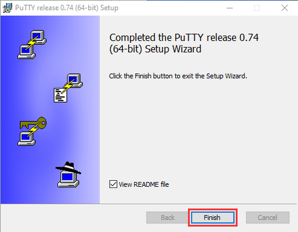

#### **(2) SSH Remote Login software -WinSCP**

Download WinSCP: <https://winscp.net/eng/download.php>

After the download, clickand .


Click“Accept”.


Follow the below steps to finish the installation.


#### **(3) SD Card Formatter**

Format TFT card tool

Download SD Card Formatter ：

<http://www.canadiancontent.net/tech/download/SD_Card_Formatter.html>


Unzip the SDCardFormatterv5_WinEN package, double-click to run it.


Click“Next”and choose, then tap“Next” .


Click“Next”and“Install”.


After a few seconds, click“Finish”.


#### (4) **Burn Win32DiskImager**

Download Link：<https://sourceforge.net/projects/win32diskimager/>


After the download, double-click and tap“Run”.


Select  and tap“Next”.


Click“Browse...”and find out the folder where the Win32DiskImager is located, tap“Next”.


Tick, click“Next”and“Install”.


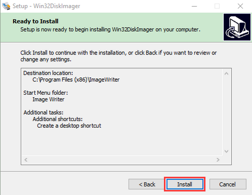

After a few seconds, click“Finish”.

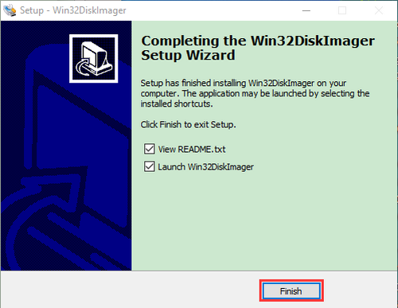

The installation is finished.
<br>
<br>
#### **(5) Scan to search ip address software tool---WNetWatcher**

Download Link：<http://www.nirsoft.net/utils/wnetwatcher.zip>

#### **(6) Raspberry Pi Imager**

Download Address：

<https://www.raspberrypi.org/downloads/raspberry-pi-os/>

(recommend downloading the version with desktop and commonly used software)

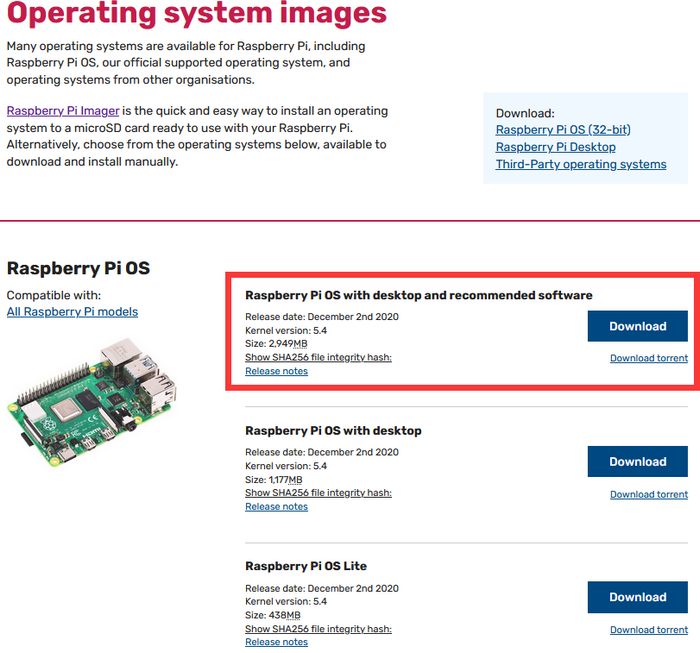

## 2.Install Raspberry Pi OS on Raspberry Pi 4B

Insert TFT RAM card to card reader, then interface card reader to USB port of computer.


Format TFT RAM card with SD Card Formatter software, as shown below:


#### (1) Burn System

Burn the Raspberry Pi OS system to TFT card using Win32DiskImager software


Don’t eject card reader after burning mirror system, build a file named SSH, then delete <span style="color: rgb(255, 76, 65);">.txt</span> .

The SSH login function can be activated by copying SSH file to boot category, as shown below.


Eject Card Reader

#### (2)Log in system
(<span style="color: rgb(255, 76, 65);">Raspberry and PC should be in the same local area network.</span>) 

1.Insert TFT memory card into Raspberry Pi, connect internet cable and plug in power. If you have screen and HDMI cable of Raspberry Pi, you could view Raspberry Pi OS activating. If not, you can enter the desktop of Raspberry Pi via SSH remote login software---WinSCP and xrdp.


2.Use the WNetWatcher software to find the IP address of the Raspberry Pi.


If there is no IP address as shown in the figure above, follow the following steps to set it.


Once the setup is complete, record the IP and MAC addresses of the Raspberry PI. As shown in the red box below, the MAC address of the Raspberry PI is <span style="color: rgb(255, 76, 65);">b8:27:eb:17:16:01</span>, and the ip address is <span style="color: rgb(255, 76, 65);">192.168.0.57</span>. 


If you do not know the mac address and the ip address of the Raspberry PI, then unplug the network cable of the Raspberry PI first, open the **WNetWatcher** query, and the detection times will be displayed on the right side of the interface. Connect the Raspberry PI cable and query it once using WNetWatcher, and the Raspberry PI address is detected one less time than the other addresses. Then write down the ip and mac addresses.

#### (3) Remote Login

**Enter default user name, password and host name on WinSCP to log in.**

**The same network only receives one Raspberry Pi**.


#### (4) Check ip and mac address


Click to open terminal input the password：<span style="color: rgb(255, 76, 65);">raspberry</span>, and press“**Enter**”on keyboard.


Logging in successfully, open the terminal, input <span style="color: rgb(255, 76, 65);">ip a</span> and tap“**Enter**”to check ip and mac address.


#### (5) Fix ip address of Raspberry Pi

Ip address is changeable, therefore, we need to make ip address fixed for convenient use.

**Follow the below steps：**

Switch to root user

If without root user’s password

①Set root passward

Input passwordin the terminal：<span style="color: rgb(255, 76, 65);">sudo passwd root</span> to set password

②Switch to root user

Input <span style="color: rgb(255, 76, 65);">su root</span>

③ Fix the configuration file of ip address

Firstly change ip address of the following configuration file.

（<span style="color: rgb(255, 76, 65);">\#New ip address：address 192.168.0.57</span>）

Copy the above new address to terminal and press“Enter”.

Configuration File：

```c
echo -e '

auto eth0

iface eth0 inet static

\#Change IP address

address 192.168.0.57

netmask 255.255.255.0

gateway 192.168.1.1

network 192.168.1.0

broadcast 192.168.1.255

dns-domain 119.29.29.29

dns-nameservers 119.29.29.29

metric 0

mtu 1492

'\>/etc/network/interfaces.d/eth0
```

As shown below:


④Reboot the system and activate the configuration file

Input the restart command in the terminal: <span style="color: rgb(255, 76, 65);">sudo reboot</span>

You could log in via fixed ip afterwards.

⑤Check IP and insure ip address fixed well


#### (6) Log in Desktop on Raspberry Pi Wirelessly

In fact, we can log in desktop on Raspberry Pi Wirelessly even without screen and HDMI cable.

VNC and Xrdp are commonly used to log in desktop of Raspberry Pi wirelessly.

**Install Xrdp Service in the terminal**

Installation commands:

Switch to Root User: <span style="color: rgb(255, 76, 65);">su root</span>

Install ：<span style="color: rgb(255, 76, 65);">apt-get install xrdp</span>

Enter <span style="color: rgb(255, 76, 65);">y</span> and press “**Enter**”

As shown below:


#### (7) Open the remote desktop connection on Windows

Press **WIN+R** on keyboard and enter <span style="color: rgb(255, 76, 65);">mstsc.exe</span> .

As shown below：


Input ip address of Raspberry Pi, as shown below.

Click“**Connect**”and tap“**Connect**”.

<span style="color: rgb(255, 76, 65);">192.168.0.57</span> is ip address we use, you could change into yours ip address.


Click“Yes”.


Input user name: <span style="color: rgb(255, 76, 65);">pi</span>, default password: <span style="color: rgb(255, 76, 65);">raspberry</span>, as shown below:


Click“OK”or“Enter”, you will view the desktop of Raspberry Pi OS, as shown below:


Now, we finish the basic configuration of Raspberry Pi OS.

## 3. Preparations for Python

Python is a programming language that lets you work more quickly and integrate
your systems more effectively.

Python is an interpreted, high-level and general-purpose programming language. Python's design philosophy emphasizes code readability with its notable use of significant whitespace. Its language constructs and object-oriented approach aim to help programmers write clear, logical code for small and large-scale projects.

Next to pick up Python to control 40 pin of Raspberry Pi.

### 3.1Hardware：

#### **Raspberry Pi 4B：**

|                     **Raspberry Pi 4B**                      |                  **Raspberry Pi 4B Model**                   |
| :----------------------------------------------------------: | :----------------------------------------------------------: |
|  |  |

#### **Hardware Interfaces：**

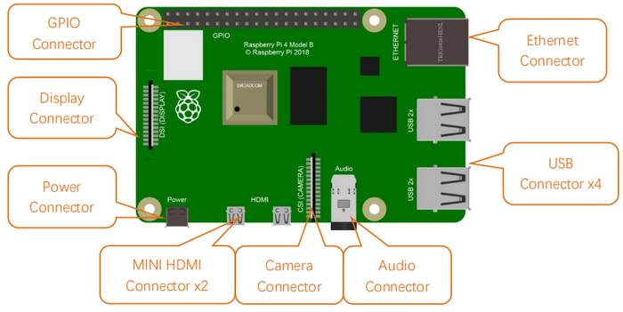

#### **40-Pin GPIO Header Description：**

GPIO pins are divided into BCM GPIO number, physics number and WiringPi GPIO number.

We usually use WiringPi GPIO when using C language and BCM GPIO and physics number are used to Python, as shown below;

In these lessons, we use Python, so BCM GPIO number is adopted.


<span style="color: rgb(255, 76, 65);">Note:</span> pin(3.3V) on the left hand is square, but other pins are round. Turn Raspberry Pi over, there is a square GPIO on the back.(you could tell from pin(3.3V).


<span style="color: rgb(255, 76, 65);">Note: </span>the largest current of each pin on Raspberry Pi 4B is 16mA and the aggregate current of all pins is not less than 51mA.

#### **RPI GPIO-PCF8591 Shield：**

This shield extend 40 pins of Raspberry Pi, which can connect a number of sensors and modules.


The Raspberry Pie doesn’t have an AD / DA function. If it has to be interfaced with a shield with AD / DA function when connected to an analog sensor. The RPI GPIO-PCF8591 shield has a PCF8591 chip which can be applied to 4-channel AD and 1-channel DA of I2C port.

The connection methods of Raspberry Pi and RPI GPIO-PCF8591 shield are shown below:

①Fix them with screws, nuts and copper pillars


②Without screws, nuts and copper pillars


### 3.2Copy Example Code Folder to Raspberry Pi：

Place the <span style="color: rgb(255, 76, 65);">pythonCode_A.zip</span> folder to the pi folder of Raspberry Pi. And extract the example code from <span style="color: rgb(255, 76, 65);">pythonCode_A</span> folder, as shown below:


Double-click the <span style="color: rgb(255, 76, 65);">pythonCode_A</span> folder to look through compiled files, as shown below:


Set the default editor of file with .py

Right-click“Open with...”


Click <span style="color: rgb(255, 76, 65);">Programming</span> to select <span style="color: rgb(255, 76, 65);">Geany Programmer’s Editor</span>.


Then, we can directly double-click **Geany Programmer’s Editor** to open <span style="color: rgb(255, 76, 65);">.py</span> files.

**Run \_HelloWorld.py file to print“Hello World”**

One is to double-click 1_HelloWorld.py and tap to compile code and check grammar errors. After successful compilation, tap  to run the code. At same time, terminal appears and prints“hello world”


The other way is to open terminal directly, input the following commands and press“Enter”to print“hello world！”

cd pythonCode_A

python 1_HelloWorld.py


## 4. Projects：

**<span style="color: rgb(255, 76, 65);">Note:</span> G, - and GND marked on sensors and modules are so-called negative, which are connected to GND or G of GPIO board or; V and VCC are known as positive, which are interfaced with 3V3 or 5V on GPIO-PCF8591 shield.**

### Project 1：Python3 Shell

Use Windows remote desktop connection to enter the page of Raspberry Pi, then open its terminal.


Input python3 in the terminal and press“Enter”to enter the python3 shell’s editing interface, then enter print(“hello,world!”) and press“Enter”. The“hello,world!” will be output.


You may find function print() is used to print data.

You can print data with other type, like Mathematical formula:

print(1+5)

Variable a = 2 b = 5

print(a\*b)

As shown below:


Input **exit()** to exit python3 shell.


### Project 2：LED Blinks

#### 1. Description：

Let’s start from a rather basic and simple experiment----LED Blinks.

#### 2. Components：

|  |   |  |  |
| ------------------------ | ------------------------- | ------------------------ | ------------------------ |
| Raspberry Pi*1           | RPI GPIO-PCF8591 Shield*1 | White LED Module*1       | F-F DuPont Wires         |

#### 3. Component Description：

**The white LED module**  is a commonly used LED module. It is a F5 LED with  white appearance and white light display. During experiments, when the G and V on the module are powered up and the signal end S is at high level ,the white LED is on while when the S is at low level, the LED is off.

Modules are compatible with a variety of microcontroller control boards, such as Arduino microcontrollers and white LED module. 

#### 4. Schematic Diagram：

| White LED Module | RPI GPIO-PCF8591 Shield |
| :--------------: | :---------------------: |
|        S         |        S（IO18）        |
|        V         |           5V            |
|        G         |            G            |


#### 5. The principle to control the LED：

According to the connection diagram, the positive (V) of the white LED module is connected to 5V, the negative polar (g) is interfaced with the GND, and the signal terminal (S) is connected to the GPIO18 pin. When the GPIO18 pin outputs high levels, the LED light will be on. When the GPIO18 outputs low levels, the LED lamp is off.

#### 6. Run Example Code：

Input the following commands in the terminal and press“Enter”:

cd /home/pi/pythonCode_A

python 2_Led_Blink.py

#### 7. Test Results：

LED is flashing and the terminal is printing


<span style="color: rgb(255, 76, 65);">Note:</span> Press Ctrl + C on keyboard to exit code running

#### 8. Example Code：

```python
import RPi.GPIO as GPIO
import time

ledPin = 18  #define led pin

GPIO.setmode(GPIO.BCM)        # use BCM numbers
GPIO.setup(ledPin,GPIO.OUT)   #set the ledPin OUTPUT mode
GPIO.output(ledPin,GPIO.LOW)  # make ledPin output LOW level

while True:    #loop
    GPIO.output(ledPin,GPIO.HIGH)  #turn on led
    print("turned on the led")  #Print in the terminal
    time.sleep(1)              #wait for 1 second
    GPIO.output(ledPin,GPIO.LOW)   #turn off led
    print("turned off the led")
    time.sleep(1)

GPIO.cleanup()    #release all GPIO
```

#### 9. Explanation：

| CODE                    | EXPLANATION                                                  |
| ----------------------- | ------------------------------------------------------------ |
| While                   | While is the loop statement of python, when the condition is true, the program will be executed always be executed. |
| import RPi.GPIO as GPIO | Import RPi.GPIO library, which can be used to control the digital output of Raspberry Pi and PWM output. GPIO.setmode(GPIO.BCM) <br />There are many definitions about pins of Raspberry Pi, on this condition, we definite pin as BCM digital pin. <br />More resource： <https://sourceforge.net/p/raspberry-gpio-python/wiki/Examples/> |
| import time             | Import time library, time.sleep(1) means waiting for a second, <br />more resource： <https://sourceforge.net/p/raspberry-gpio-python/wiki/Examples/> |

### Project 3: SOS Light

#### 1. Description：

S.O.S is a Morse code distress signal, used internationally, that was originally established for maritime use. We will present it with flashing LED.

#### 2. Components:

|  |     |  |  |
| ---------------------- | ------------------------- | ---------------------- | ---------------------- |
| Raspberry Main Board*1 | RPI GPIO-PCF8591 Shield*1 | White LED Module *1    | F-F DuPont Wires       |

#### 3. Schematic Diagram：

| White LED Module | RPI GPIO-PCF8591 Shield |
| :--------------: | :---------------------: |
|        S         |        S（IO18）        |
|        V         |           5V            |
|        G         |            G            |


#### 4. Run Example Code：

Input the following commands in the terminal and press“Enter”:

cd /home/pi/pythonCode_A

python 3_LED_SOS.py

#### 5. Test Results：

LED flashes for three times at once then flashes three times slowly, alternately.

And terminal prints ... \_ \_ \_ ..., as shown below:


<span style="color: rgb(255, 76, 65);">Note:</span> Press Ctrl + C on keyboard to exit code running

#### 6. Example Code:

```python
import RPi.GPIO as GPIO
import time

ledPin = 18  #define led pin
i1 = 0
i2 = 0
i3 = 0

GPIO.setmode(GPIO.BCM)        # use BCM numbers
GPIO.setup(ledPin,GPIO.OUT)   #set the ledPin OUTPUT mode
GPIO.output(ledPin,GPIO.LOW)  # make ledPin output LOW level

while True:    #loop
    while(i1<3):
        GPIO.output(ledPin,GPIO.HIGH)  #turn on led
        time.sleep(0.1)              #wait for 1 second
        GPIO.output(ledPin,GPIO.LOW)   #turn off led
        time.sleep(0.1)
        print(".")
        i1 += 1
    
    while(i2<3):
        GPIO.output(ledPin,GPIO.HIGH)  #turn on led
        time.sleep(1)              #wait for 1 second
        GPIO.output(ledPin,GPIO.LOW)   #turn off led
        time.sleep(1)
        print("_")
        i2 += 1
    
    while(i3<3):
        GPIO.output(ledPin,GPIO.HIGH)  #turn on led
        time.sleep(0.1)              #wait for 1 second
        GPIO.output(ledPin,GPIO.LOW)   #turn off led
        time.sleep(0.1)
        print(".")
        i3 += 1
    time.sleep(3)
    i1 = 0
    i2 = 0
    i3 = 0
    

GPIO.cleanup()    #release all GPIO
```


### Project 4: Breathing LED

#### 1. Description：

A“breathing LED”is a phenomenon where an LED's brightness smoothly changes from dark to bright and back to dark, continuing to do so and giving the illusion of an LED“breathing.”This phenomenon is similar to a lung breathing in and out. So how to control LED’s brightness? We need to take advantage of PWM.

#### 2. Components：

|  |     |  |  |
| ---------------------- | ------------------------- | ---------------------- | ---------------------- |
| Raspberry Pi*1         | RPI GPIO-PCF8591 Shield*1 | Red LED Module*1       | F-F DuPont Wires       |

#### 3. Working Principle：

We use the PWM output of GPIO, PWM outputs analog signals and output value is 0~100 which is equivalent to output voltage 0~3.3V from GPIO port.

According to Ohm's law: U/R = I, the resistance is 220Ω, and the value of voltage U changes, so does the value of current I, which can control the brightness of the LED lamp.

PWM (Pulse Width Modulation) is the control of the analog circuit through the digital output of microcomputer and a method that making digital coding on analog signal levels.

It sends square waves with certain frequency through digital pins, that is, high level and low level are output alternately for a period of time. Total time of each group high and low level is fixed, which is called cycle. 

The time of high level output is pulse width whose percentage is called Duty Cycle. The longer that high level lasts, the larger the duty cycle of analog signals is, the corresponding voltage as well.

Below chart is pulse width 50%, then the output voltage is 3.3 * 50% = 1.65V，the brightness of LED is medium.

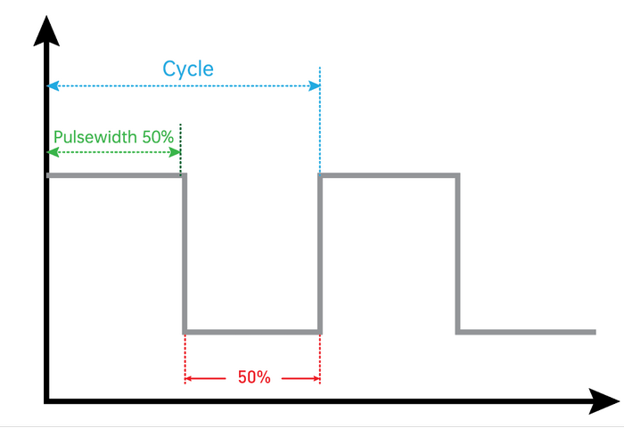

#### 4.Schematic Diagram：

| Red LED Module | RPI GPIO-PCF8591 Shield |
| :------------: | :---------------------: |
|       S        |        S（IO18）        |
|       V        |           5V            |
|       G        |            G            |

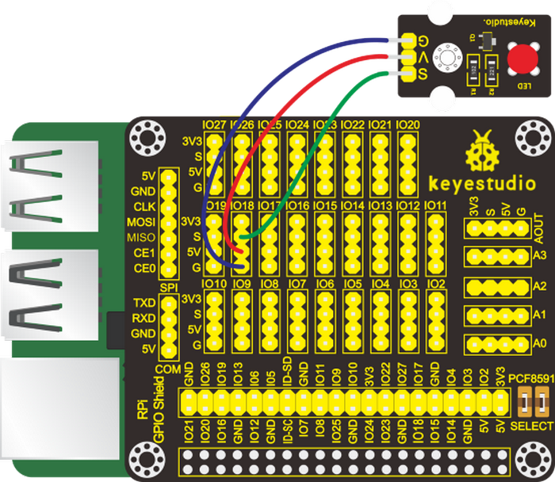

#### 5. Run Example Code：

Input the following commands in the terminal and press“Enter”:

cd /home/pi/pythonCode_A

python 4_Led_Breath.py

#### 6. Test Results：

LED gradually brightens then darkens.

<span style="color: rgb(255, 76, 65);">Note:</span> Press Ctrl + C on keyboard to exit code running

#### 7. Example Code

```python
import RPi.GPIO as GPIO
import time

ledPin = 18  #define led pin

GPIO.setmode(GPIO.BCM)  # use BCM numbers
GPIO.setup(ledPin,GPIO.OUT) #set the ledPin OUTPUT mode
GPIO.output(ledPin,GPIO.LOW)  # make ledPin output LOW level
pwm = GPIO.PWM(18,100)  #create a PWM instance
pwm.start(0)   #start PWM

def brighten():  #define function
    for i in range(0,100,+1):
        pwm.ChangeDutyCycle(i)  #change the frequency,To lighten gradually
        time.sleep(0.01)
        
def darken(): 
    for i in range(100,0,-1):
        pwm.ChangeDutyCycle(i) #To darken gradually
        time.sleep(0.01)
    
while True:     #loop
    brighten()  #call function
    darken()

pwm.stop()  #stop PWM

GPIO.cleanup()    #release all GPIO
```


### Project 5: Traffic Lights

#### 1. Description：

In this lesson, we will learn how to control multiple LED lights and simulate the operation of traffic lights.

Traffic lights are signaling devices positioned at road intersections, pedestrian crossings, and other locations to control flows of traffic.

Green light on: Allows traffic to proceed in the direction denoted, if it is safe to do so and there is room on the other side of the intersection.

Red light: Prohibits any traffic from proceeding. A flashing red indication requires traffic to stop and then proceed when safe (equivalent to a stop sign).

Amber light (also known as 'orange light' or 'yellow light'):

Warns that the signal is about to change to red, with some jurisdictions requiring drivers to stop if it is safe to do so, and others allowing drivers to go through the intersection if safe to do so.

#### 2. Components：

|  |    |  |  |
| ---------------------- | ------------------------- | ----------------------- | ----------------------- |
| Raspberry Pi*1         | RPI GPIO-PCF8591 Shield*1 | Traffic Light Module*1  | F-F DuPont Wires        |

#### 3. Schematic Diagram：

| Traffic Light Module | RPI GPIO-PCF8591 Shield |
| :------------------: | :---------------------: |
|          R           |          IO18           |
|          Y           |          IO23           |
|          G           |          IO24           |
|         GND          |           GND           |


#### 4. Run Example Code：

Input the following commands in the terminal and press“Enter”:

cd /home/pi/pythonCode_A

python 5_traffic_light.py

#### 5. Test Results：

Red light is on 5s and off, yellow light flashes 3s and off, green light is lit for 5s and off, in loop way.

<span style="color: rgb(255, 76, 65);">Note:</span> Press Ctrl + C on keyboard to exit code running.

#### 6. Example Code：

```python
import RPi.GPIO as GPIO
from time import sleep

#LED pin
R = 18
Y = 23
G = 24

GPIO.setmode(GPIO.BCM)  # use BCM numbers
GPIO.setup(R,GPIO.OUT)  #set the ledPin OUTPUT mode
GPIO.setup(Y,GPIO.OUT)
GPIO.setup(G,GPIO.OUT)

GPIO.output(R,GPIO.LOW)
GPIO.output(Y,GPIO.LOW)
GPIO.output(G,GPIO.LOW)

while True:
    GPIO.output(R,GPIO.HIGH)
    sleep(5)
    GPIO.output(R,GPIO.LOW)
    
    GPIO.output(Y,GPIO.HIGH) #turn on yellow_led
    sleep(0.5)
    GPIO.output(Y,GPIO.LOW) #turn off yellow_led
    sleep(0.5)
    GPIO.output(Y,GPIO.HIGH)
    sleep(0.5)
    GPIO.output(Y,GPIO.LOW) 
    sleep(0.5)
    GPIO.output(Y,GPIO.HIGH) 
    sleep(0.5)
    GPIO.output(Y,GPIO.LOW) 
    sleep(0.5)
    
    GPIO.output(G,GPIO.HIGH)  #turn on green_led
    sleep(5)     #delay 5s
    GPIO.output(G,GPIO.LOW)   #turn off green_led
    
    
GPIO.cleanup()   #release all GPIO
```


### Project 6：Illuminating Lamp

#### 1. Description：

Lights are everywhere in our life. In this chapter, we use a 3W LED module with high brightness. What's more, we apply it into smart robots.

#### 2. Components：

|  |    |  |  |
| ----------------------- | ------------------------- | ----------------------- | ----------------------- |
| Raspberry Pi*1          | RPI GPIO-PCF8591 Shield*1 | 3W LED Module*1         | F-F DuPont Wires        |

#### 3. Schematic Diagram：

| 3W LED Module | RPI GPIO-PCF8591 Shield |
| :-----------: | :---------------------: |
|       S       |        S（IO18）        |
|       V       |           5V            |
|       G       |            G            |


#### 4. Run Example Code：

Input the following commands in the terminal and press“Enter”:

cd /home/pi/pythonCode_A

python 6_3W_Led.py

#### 5. Test Results：

Upload the code, then this 3w LED is on.

<span style="color: rgb(255, 76, 65);">Note:</span> Press Ctrl + C on keyboard to exit code running

#### 6. Example Code：

```python
import RPi.GPIO as GPIO
import time

ledPin = 18  #define led pin

GPIO.setmode(GPIO.BCM)        # use BCM numbers
GPIO.setup(ledPin,GPIO.OUT)   #set the ledPin OUTPUT mode
GPIO.output(ledPin,GPIO.LOW)  # make ledPin output LOW level

while True:    #loop
    GPIO.output(ledPin,GPIO.HIGH)  #turn on led
    print("turned on the led")  #Print in the terminal

GPIO.cleanup()    #release all GPIO
```


### Project 7：RGB Light

#### 1. Description：

In this chapter, we will demonstrate how RGB lights show different colors via programming.

#### 2. Components：

|  |    |  |  |
| ----------------------- | ------------------------- | ----------------------- | ----------------------- |
| Raspberry Pi*1          | RPI GPIO-PCF8591 Shield*1 | RGB Module*1            | F-F Dupont Wires        |

#### 3. Component Knowledge：

**Working Principle：**

The RGB module integrates with three LEDs in red, green and blue respectively. These three LEDs also share the same anode. The combinations of these three colors can form almost all other colors visible to human eyes. Thus, it has found wide applications in terms of colors.


Red, green and blue are three primary colors. They could produce all kinds of visible lights when mixing them up. Computer screen, single pixel mobile phone screen, neon light work under this principle.

Next, we will make a RGB LED display all kinds of colors.

#### 4. Schematic Diagram：

| RGB Module | RPI GPIO-PCF8591 Shield |
| :--------: | :---------------------: |
|     R      |          IO24           |
|     G      |          IO23           |
|     B      |          IO18           |
|     V      |           5V            |


#### 5. Run Example Code：

Input the following commands in the terminal and press“Enter”:

cd /home/pi/pythonCode_A

python 7_RGB_led.py

#### 6. Test Results：

RGB light shows colors randomly.

<span style="color: rgb(255, 76, 65);">Note:</span> Press Ctrl + C on keyboard to exit code running.

#### 7. Example Code：

```python
import RPi.GPIO as GPIO
from time import sleep
import random

#define RGB pin
pin_R = 24
pin_G = 23
pin_B = 18
GPIO.setmode(GPIO.BCM)  # use BCM numbers
#set the RGB Pin OUTPUT mode
GPIO.setup(pin_R,GPIO.OUT)
GPIO.setup(pin_G,GPIO.OUT)
GPIO.setup(pin_B,GPIO.OUT)

# makeRGB Pin output LOW level
GPIO.output(pin_R,GPIO.LOW)
GPIO.output(pin_G,GPIO.LOW)
GPIO.output(pin_B,GPIO.LOW)

#set pwm frequence to 1000hz
pwm_R = GPIO.PWM(pin_R,100)
pwm_G = GPIO.PWM(pin_G,100)
pwm_B = GPIO.PWM(pin_B,100)
#set inital duty cycle to 0
pwm_R.start(0)
pwm_G.start(0)
pwm_B.start(0)

#function. receive the value to display different colors
def setColor(val_R,val_G,val_B):
    pwm_R.ChangeDutyCycle(val_R)
    pwm_G.ChangeDutyCycle(val_G)
    pwm_B.ChangeDutyCycle(val_B)

while True:
    # get a random in 0~100
    R = random.randint(0,100)
    G = random.randint(0,100)
    B = random.randint(0,100)
    setColor(R,G,B)  #set the color value
    print('Red=%d, Green = %d, Blue = %d' %(R, G, B))
    sleep(0.2)
    
#stop pwm
pwm_R.stop()
pwm_G.stop()
pwm_B.stop()

GPIO.cleanup()  #release all GPIO
```


### Project 8：Doorbell

#### 1. Description：

Doorbells have made our daily life more convenient. When a guest arrives, we will get this information when he/she rings the bell. In this project, we will learn to make a doorbell by ourselves.

#### 2. Components：
|   |  |   |  |   |
| :--: | :--: | :--: | :--: | :--: |
|  Raspberry Pi*1                         | RPI GPIO-PCF8591 Shield*1              | Active Buzzer*1  | Push Button Sensor*1    | F-F DuPont Wires |

#### 3. Components Knowledge:

**Active buzzer：**

An active buzzer will generate a tone using an internal oscillator, so all that is needed is a DC voltage. A passive buzzer requires an AC signal to make a sound. It is like an electromagnetic speaker, where a changing input signal produces the sound, rather than producing a tone automatically.

As a type of electronic buzzer with integrated structure, buzzers, which are supplied by DC power, are widely used in computers, printers, photocopiers, alarms, electronic toys, automotive electronic devices, telephones, timers and other electronic products for voice devices. Buzzers can be categorized as active and passive ones (see the following picture). Turn the pins of two buzzers face up, and the one with a green circuit board is a passive buzzer, while the other enclosed with a black tape is an active one.

Button switch: it can control circuit. Before pressed, the current can’t pass from one end to the other end. Both ends are like two mountains. There is a river in between. We can't cross this mountain to another mountain. When pressed, my internal metal piece is connecting the two sides to let the current pass, just like building a bridge to connect the two mountains.

Inner structure: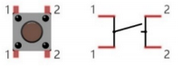.

1 and 1 , 2 and 2 are connected , however, 1 and 2 are disconnected when the button is not pressed; 1 and 2 are connected when pressing the button.

#### 4. Schematic Diagram：

| Active Buzzer | RPI GPIO-PCF8591 Shield |      | Push Button Sensor | RPI GPIO-PCF8591 Shield |
| :-----------: | :---------------------: | ---- | :----------------: | :---------------------: |
|       S       |        S（IO16）        |      |         S          |        S（IO18）        |
|       V       |           5V            |      |         V          |           5V            |
|       G       |            G            |      |         G          |            G            |


#### 5. Run Example Code：

Input the following commands in the terminal and press“Enter”:

cd /home/pi/pythonCode_A

python 8_active_buzzer.py

#### 6. Test Results：

The buzzer will emit sounds and terminal will print 0 if the button is pressed; otherwise, buzzer will keep quiet and terminal will output 1.

<span style="color: rgb(255, 76, 65);">Note:</span> Press Ctrl + C on keyboard to exit code running.

#### 7. Example Code：

```python
import RPi.GPIO as GPIO
from time import sleep

#active buzzer pin
buzPin = 16
#button pin
btnPin = 18

GPIO.setmode(GPIO.BCM) # use BCM numbers
GPIO.setup(buzPin,GPIO.OUT)  #set buzPin OUTPUT mode
GPIO.setup(btnPin,GPIO.IN,GPIO.PUD_UP)  # set btnPin INPUT mode and btnPin to PULL UP

while True:
    val = GPIO.input(btnPin)
    print(val)
    if(val == 0):  #Judge whether the button is pressed
        GPIO.output(buzPin,GPIO.HIGH)  #Buzzer ring
    else:
        GPIO.output(buzPin,GPIO.LOW)   #buzzer off
        
GPIO.cleanup() # Release all GPIO
```


### Project 9: Passive Buzzer

#### 1. Description：

We will conduct an interesting experiment-----control passive buzzer to compose a song.

#### 2. Components：

|  |    |  |  |
| ----------------------- | ------------------------- | ----------------------- | ----------------------- |
| Raspberry Pi*1          | RPI GPIO-PCF8591 Shield*1 | Passive Buzzer*1        | F-F DuPont Wires        |

#### 3. Component Knowledge

**Passive buzzer**：


Passive buzzer is a type of electronic buzzer with integrated structure.

Buzzers can be categorized as active and passive ones (see the following picture).

An active buzzer has a built-in oscillating source, so it will make sounds when electrified. But a passive buzzer does not have such source, so it will not tweet if DC signals are used; instead, you need to use square waves whose frequency is between 2K and 5K to drive it. The active buzzer is often more expensive than the passive one because of multiple built-in oscillating circuits.

Turn the pins of two buzzers face up, and the one with a green circuit board is a passive buzzer, while the other enclosed with a black tape is an active one, as shown：

Passive buzzer provides alternating current to sound coils to make electronic magnet and permanent magnet attraction or repulsion so as to push vibration film to emit sound, according to electromagnetic induction. 

Only certain frequency with high and low levels can make passive buzzer emit sound, since DC current only makes vibration film vibrated continuously rather than producing sound.

#### 4. Schematic Diagram：

| Passive Buzzer | RPI GPIO-PCF8591 Shield |
| :------------: | :---------------------: |
|       S        |        S（IO18）        |
|       V        |           5V            |
|       G        |            G            |


#### 5. Run Example Code1：

Input the following commands in the terminal and press“Enter”:

cd /home/pi/pythonCode_A

python 9.1_passive_buzzer.py

#### 6. Test Results1：

Passive emits“tick ,tick”sounds.

<span style="color: rgb(255, 76, 65);">Note:</span> Press Ctrl + C on keyboard to exit code running.

#### 7. Example Code1：

```python
#!/usr/bin/env python
# -*- coding: utf-8 -*-

import time
import RPi.GPIO as GPIO

buzPin = 18
i1 = 0
i2 = 0
GPIO.setmode(GPIO.BCM)
GPIO.setup(buzPin, GPIO.OUT)

try:
    while 1:  #loop
        while(i1<50):
            GPIO.output(buzPin,GPIO.HIGH)
            time.sleep(0.001)              #wait for 1 ms
            GPIO.output(buzPin,GPIO.LOW)
            time.sleep(0.001)
            i1 = i1 + 1
        time.sleep(0.3)
        while(i2<50):
            GPIO.output(buzPin,GPIO.HIGH)
            time.sleep(0.001)              #wait for 1 ms
            GPIO.output(buzPin,GPIO.LOW)
            time.sleep(0.001)
            i2 = i2 + 1
        time.sleep(1)
        i1 = 0
        i2 = 0
except KeyboardInterrupt:
    pass
p.stop()  #stop pwm
GPIO.cleanup() #release all GPIO
```

#### 8. Run Example Code 2：

Input the following commands in the terminal and press“Enter”:

cd /home/pi/pythonCode_A

python 9.2_passive_buzzer.py

#### 9. Test Results 2：

Passive buzzer plays a“Happy Birthday”song.

<span style="color: rgb(255, 76, 65);">Note:</span> Press Ctrl + C on keyboard to exit code running.

#### 10. Example Code2：

```python
# -*- coding: utf-8 -*-
import RPi.GPIO as GPIO
import time

Buzzer = 18  # set the Pin

# Happy birthday
Do = 262  
Re = 294  
Mi = 330  
Fa = 349  
Sol = 392  
La = 440  
Si = 494  
Do_h = 523  
Re_h = 587  
Mi_h = 659  
Fa_h = 698  
Sol_h = 784  
La_h = 880  
Si_h = 988

# The tune
song_1 = [ 
    Sol,Sol,La,Sol,Do_h,Si,
    Sol,Sol,La,Sol,Re_h,Do_h,
    Sol,Sol,Sol_h,Mi_h,Do_h,Si,La,
    Fa_h,Fa_h,Mi_h,Do_h,Re_h,Do_h
]
# delay
beat_1 = [
    0.5,0.5,1,1,1,1+1,
    0.5,0.5,1,1,1,1+1,
    0.5,0.5,1,1,1,1,1,
    0.5,0.5,1,1,1,1+1,
]

def setup():
    GPIO.setmode(GPIO.BCM)       # Numbers GPIOs by physical location
    GPIO.setup(Buzzer, GPIO.OUT)    # Set pins' mode is output
    global Buzz                     # Assign a global variable to replace GPIO.PWM 
    Buzz = GPIO.PWM(Buzzer, 440)    # 440 is initial frequency.
    Buzz.start(50)                  # Start Buzzer pin with 50% duty ration

def loop():
    while True:
        print('\n    Playing song 3...')
        for i in range(0, len(song_1)):     # Play song 1
            Buzz.ChangeFrequency(song_1[i]) # Change the frequency along the song note
            time.sleep(beat_1[i] * 0.5)     # delay a note for beat * 0.5s

def destory():
    Buzz.stop()                 # Stop the buzzer
    GPIO.output(Buzzer, 1)      # Set Buzzer pin to High
    GPIO.cleanup()              # Release resource

if __name__ == '__main__':      # Program start from here
    setup()
    try:
        loop()
    except KeyboardInterrupt:   # When 'Ctrl+C' is pressed, the child program destroy() will be  executed.
        destory()
```


### Project 10：Button-controlled LED

#### 1. Description：

Usually, a complete open loop control is made of external information input. Controller and actuator.

The external information is input into controller which can analyze the input data and send to control signals to make actuator to react.


A button-controlled LED is decided by an open loop control. Next, we will make a desk lamp with a button, an LED and RPi. LED is on when button is pressed, on the contrary, it will be off.

#### 2. Components：

|  |    |  |  |  |
| ----------------------- | ------------------------- | ----------------------- | ----------------------- | ----------------------- |
| Raspberry Pi*1          | RPI GPIO-PCF8591 Shield*1 | Red LED Module*1        | Push Button Sensor*1    | F-F DuPont Wires        |

#### 3. Schematic Diagram：

| Red LED Module | RPI GPIO-PCF8591 Shield |      | Push Button Sensor | RPI GPIO-PCF8591 Shield |
| :------------: | :---------------------: | ---- | :----------------: | :---------------------: |
|       S        |        S（IO16）        |      |         S          |        S（IO18）        |
|       V        |           5V            |      |         V          |           5V            |
|       G        |            G            |      |         G          |            G            |


#### 4. Eliminate Button Shaking

The LED status won’t jump into new state immediately when button is pressed. There will be a short continuous shaking before into new status, which is similar with release status.


Therefore, there will be many a presses and release actions. The shaking will misleads the high speed movement of MCU, causing wrong judgement. That requires that we need to judge the button’ status frequently.

The button means being pressed when its status is stable.

#### 5. Run Example Code：

Input the following commands in the terminal and press“Enter”:

cd /home/pi/pythonCode_A

python 10_button_led.py

#### 6. Test Results：

Press the button, LED turns on, then press it again, LED is off.

<span style="color: rgb(255, 76, 65);">Note:</span> Press Ctrl + C on keyboard to exit code running.

#### 7. Example Code：

```python
import RPi.GPIO as GPIO
from time import sleep

LED = 16  #set ledPin
button = 18 #set buttonPin
val = 0 #Button variables
count = 0 #Record the number of button presses
flag = 0 #Odd even variable
GPIO.setmode(GPIO.BCM)  # use BCM numbers

GPIO.setup(LED,GPIO.OUT)   #set the ledPin OUTPUT mode
GPIO.setup(button,GPIO.IN,GPIO.PUD_UP) #set the buttonPin INPUT mode and buttonPin to PULL UP

while True:
    val = GPIO.input(button)  #Receive button value
    #print("button = %d"%(val))
    if(val == 0):   #if button is pressed
        sleep(0.01) #Eliminate button jitter
        val = GPIO.input(button)  #Receive button value
        if(val == 1):  #Loosen the button
            count = count + 1  #Count the number of clicks on the button
            print("count = %d" %count)
    
    flag = count % 2  #Remainder 2 ,Even is 0, odd is 1
    if(flag == 1):
        GPIO.output(LED,GPIO.HIGH)  #turn on led
    else:
        GPIO.output(LED,GPIO.LOW)  #turn off led
        
GPIO.cleanup() #release all GPIO
```


### Project 11：PIR Motion Sensor

#### 1. Description：

In this lesson, we will learn about PIR motion sensor.

#### 2. Components：

|  |    |  |  |  |
| ----------------------- | ------------------------- | ----------------------- | ----------------------- | ----------------------- |
| Raspberry Pi*1          | RPI GPIO-PCF8591 Shield*1 | Red LED Module*1        | PIR Motion Sensor*1     | F-F DuPont Wires        |

#### 3. Component Knowledge

**PIR Motion Sensor：**

The principle of human infrared sensor is that when certain crystals, such as lithium tantalite and triglyceride sulfate, are heated, the two ends of the crystal will generate an equal number of charges, with opposite signs, which can be converted into voltage output by an amplifier.

Human body will emit IR ray, although weak but can be detected. Sensor will output high level(1) when human being is detected by sensor, otherwise, it will output low level(o).

<span style="color: rgb(255, 76, 65);">Note:</span> Nothing but moving person can be detected, with the detection distance is up to 3m.

#### 4. Schematic Diagram：

| Red LED Module | RPI GPIO-PCF8591 Shield |      | PIR Motion Sensor | RPI GPIO-PCF8591 Shield |
| :------------: | :---------------------: | ---- | :---------------: | :---------------------: |
|       S        |        S（IO5）         |      |         S         |        S（IO18）        |
|       V        |           5V            |      |         V         |           5V            |
|       G        |            G            |      |         G         |            G            |


#### 5. Run Example Code：

Input the following commands in the terminal and press“Enter”:

cd /home/pi/pythonCode_A

python 11_PIR_led.py

#### 6. Test Results：

LED will turn on and terminal will print **somebody** if the PIR motion sensor detects people; if not, LED will be off and terminal will print **nobody.**

<span style="color: rgb(255, 76, 65);">Note:</span> Press Ctrl + C on keyboard to exit code running.

#### 7. Example Code：

```python
import RPi.GPIO as GPIO
import time

GPIO.setmode(GPIO.BCM)
GPIO.setwarnings(False)

ledPin = 5  #set led pin
pirPin = 18  #set PYE-IR pin
GPIO.setup(ledPin,GPIO.OUT)
GPIO.setup(pirPin,GPIO.IN)
 
while True:                     ##loop 
    if GPIO.input(pirPin):    #When someone is detected
        GPIO.output(ledPin,GPIO.HIGH)  #turn on the led
        print("somebody")
    else:
        GPIO.output(ledPin,GPIO.LOW)  #turn off led
        print("nobody")
    
GPIO.cleanup()
```


### Project 12：Fire Alarm

#### 1. Description：

A flame detector is a sensor designed to detect and respond to the presence of a flame or fire, allowing flame detection.

#### 2. Components：

|  |  |  |  |  |
| -------------------------------------- | -------------------------------------- | -------------------------------------- | -------------------------------------- | -------------------------------------- |
| Raspberry Pi*1                         | RPI GPIO-PCF8591 Shield*1              | Active Buzzer*1                        | Flame Sensor*1                         | F-F DuPont Wires                       |

#### 3. Component Knowledge

**Flame Sensor：**

Flame sensor is made based on the principle that infrared ray is highly sensitive to flame. It has an infrared receiving tube specially designed to detect fire, and then convert the flame brightness to fluctuating level signal. The signals are then input into the central processor and be dealt with accordingly.

Flame sensor is used to detect fire source with wavelength in 760nm～1100nm, detection angle is 60°. When its IR waves length is close to 940nm, and its sensitivity is highest.

Notice that keep flame sensor away from fire source to defend its damage for its working temperature is between -25°-85°

<span style="color: rgb(255, 76, 65);">Note:</span> You can rotate the potentiometer on the module to adjust module’s sensitivity 


#### 4. Schematic Diagram：

| Active Buzzer | RPI GPIO-PCF8591 Shield |      | Flame Sensor | RPI GPIO-PCF8591 Shield |
| :-----------: | :---------------------: | ---- | :----------: | :---------------------: |
|       S       |        S（IO16）        |      |      D0      |        S（IO18）        |
|       V       |           5V            |      |     VCC      |           5V            |
|       G       |            G            |      |     GND      |            G            |


#### 5. Run Example Code：

Input the following commands in the terminal and press“Enter”:

cd /home/pi/pythonCode_A

python 12_flame_buzzer.py

#### 6. Test Results：

When the flame is detected, the buzzer will make a sound and the terminal will print low level 0, LED1 will be on; otherwise, no sound will be emitted, the terminal will print high level 1 and LED1 will be off.

Buzzer will alarm when detecting fire; otherwise, it will stop emitting sound.

<span style="color: rgb(255, 76, 65);">Note:</span> Press Ctrl + C on keyboard to exit code running.

#### 7. Example Code：

```python
import RPi.GPIO as GPIO
from time import sleep

#define buzzer pin
buzPin = 16
#define flame Pin
flamePin = 18

val = 0  #

GPIO.setmode(GPIO.BCM) #use BCM numbers
GPIO.setup(buzPin,GPIO.OUT)  #set the buzPin OUTPUT
GPIO.setup(flamePin,GPIO.IN,GPIO.PUD_UP) #set the flamePin INPUT

while True:
    val = GPIO.input(flamePin) #Receives the value of the flame sensor
    print("val = %d" %val)
    if (val == 0):  #When flame is detected
        GPIO.output(buzPin,GPIO.HIGH)  #Buzzer turn on
    else:
        GPIO.output(buzPin,GPIO.LOW)   #buzzer turn off
        
GPIO.cleanup() # Release all GPIO
```


### Project 13：Electronic Hourglass

#### 1. Description：

An hourglass (or sand glass, sand timer, sand clock or egg timer) is a device used to measure the passage of time. It comprises two glass bulbs connected vertically by a narrow neck that allows a regulated flow of a substance (historically sand) from the upper bulb to the lower one. 

Typically the upper and lower bulbs are symmetric so that the hourglass will measure the same duration regardless of orientation. The specific duration of time a given hourglass measures is determined by factors including the quantity and coarseness of the particulate matter, the bulb size, and the neck width.

#### 2. Components：

|  |    |  | 
| ----------------------- | ------------------------- | ----------------------- |
| Raspberry Pi*1          | RPI GPIO-PCF8591 Shield*1 | Tilt Sensor*1           |   
|  |    |  |      
| White LED Module*1      | F-F DuPont Wires          | Red LED Module*1        |      

#### 3. Component Knowledge

**Ball Tilt Sensor**：

Tilt sensors (tilt ball switch) allow you to detect orientation or inclination. They are small, inexpensive, low-power and easy-to-use. If used properly, they will not wear out. 

The tilt-switch twig is the equivalent of a button, and is used as a digital input. Inside the tilt switch is a ball that make contact with the pins when the case is upright. Tilt the case over and the balls don't touch, thus not making a connection. When the switch is level it is open, and when tilted, the switch closes.

It can be used for orientation detection, alarm device or others. 

Here is the principle of tilt sensor to illustrate how it works:


#### 4. Schematic Diagram：

|    Red LED Module    |   RPI GPIO-PCF8591 Shield   |      | Tilt Sensor | RPI GPIO-PCF8591 Shield |
| :------------------: | :-------------------------: | ---- | :---------: | :---------------------: |
|          S           |          S（IO27）          |      |      S      |        S（IO18）        |
|          V           |             5V              |      |      V      |           5V            |
|          G           |              G              |      |      G      |           GND           |
|                      |                             |      |             |                         |
| **White LED Module** | **RPI GPIO-PCF8591 Shield** |      |             |                         |
|          S           |          S（IO17）          |      |             |                         |
|          V           |             5V              |      |             |                         |
|          G           |              G              |      |             |                         |


#### 5. Run Example Code：

Input the following commands in the terminal and press“Enter”:

cd /home/pi/pythonCode_A

python 13_ball_Tilt.py

#### 6. Test Results：

Led1 will brighten gradually and led2 will gradually darken when the two pins of  the tilt sensor tilt; otherwise, when this sensor is tilt to another side or placed horizontally, led1 will get dim and led2 will get bright.

<span style="color: rgb(255, 76, 65);">
Note:</span> Press Ctrl + C on keyboard to exit code running.

#### 7. Example Code：

```python
import RPi.GPIO as GPIO
from time import sleep

#define led pin
led1Pin = 17
led2Pin = 27
#define Ball Tilt Sensor Pin
tiltPin = 18

GPIO.setmode(GPIO.BCM) #use BCM unmbers
GPIO.setup(led1Pin,GPIO.OUT)  #set the ledPin OUTPUT mode
GPIO.setup(led2Pin,GPIO.OUT)
GPIO.output(led1Pin,GPIO.HIGH)  # make ledPin output HIGH level
GPIO.output(led2Pin,GPIO.LOW)  # make ledPin output LOW level
GPIO.setup(tiltPin,GPIO.IN,GPIO.PUD_UP)
pwm1 = GPIO.PWM(led1Pin,1000)  #create a pwm1 instance
pwm1.start(0)  #start pwm1
pwm2 = GPIO.PWM(led2Pin,1000)  #create a pwm2 instance
pwm2.start(0)  #start pwm2
val1 = 50
val2 = 50

while True:
    if not GPIO.input(tiltPin):
        val1 = val1 + 1
        val2 = val2 - 1
        if (val1 >= 100):  #Limit PWM value to no more than 100
            val1 = 100
        if (val2 < 0):    #Limit PWM value not less than 0
            val2 = 0
        print("led1 = %1.0f" %(val1))
        pwm1.ChangeDutyCycle(val1)  #change the frequency
        pwm2.ChangeDutyCycle(val2)
        sleep(0.1)
    else:
        val1 = val1 - 1
        val2 = val2 + 1
        if (val1 < 0):
            val1 = 0
        if (val2 >= 100):
            val2 = 100
        print("led2 = %1.0f" %(val2))
        pwm1.ChangeDutyCycle(val1)
        pwm2.ChangeDutyCycle(val2)
        sleep(0.1)
        
pwm1.stop()  #stop pwm1

GPIO.cleanup()    #release all GPIO
```


### Project 14：Collision Alarm

#### 1. Description：

We use collision sensors to detect if there is a collision. When the object hits the metal switch of the sensor, the sensor will output a low level signal. When the metal switch is not touched, it will keep a high level. In this project, the cooling of the collision sensor will be used to control the buzzer.

#### 2. Components：

|  |  |  |  |  |
| -------------------------------------- | -------------------------------------- | -------------------------------------- | -------------------------------------- | -------------------------------------- |
| Raspberry Pi*1                         | RPI GPIO-PCF8591 Shield*1              | Active Buzzer*1                        | Collision Sensor*1                     | F-F DuPont Wires                       |

#### 3. Component Knowledge

This is a common collision sensor, which mainly uses a tact switch. When the tact switch is touched by an object and the sensor signal is low, and the LED will be on; otherwise, the sensor signal is high level, and the LED will be off.

#### 4. Schematic Diagram：

| Active Buzzer | RPI GPIO-PCF8591 Shield |      | Collision Sensor | RPI GPIO-PCF8591 Shield |
| :-----------: | :---------------------: | ---- | :--------------: | :---------------------: |
|       S       |        S（IO16）        |      |        S         |        S（IO18）        |
|       V       |           5V            |      |        V         |           5V            |
|       G       |            G            |      |        G         |            G            |


#### 5. Run Example Code：

Input the following commands in the terminal and press“Enter”:

cd /home/pi/pythonCode_A

python 14_crash_buzzer.py

#### 6. Test Results：

When you press the tact switch, the buzzer will emit a sound and the terminal will print low level 0. Otherwise, the buzzer will make no sounds, the terminal will print high level 1.

<span style="color: rgb(255, 76, 65);">Note:</span> Press Ctrl + C on keyboard to exit code running.

#### 7. Example Code：

```python
import RPi.GPIO as GPIO
from time import sleep

#active buzzer pin
buzPin = 16
#crash pin
crashPin = 18

GPIO.setmode(GPIO.BCM) # use BCM numbers
GPIO.setup(buzPin,GPIO.OUT)  #set buzPin OUTPUT mode
GPIO.setup(crashPin,GPIO.IN,GPIO.PUD_UP)  # set crashPin INPUT mode and crashPin to PULL UP

while True:
    val = GPIO.input(crashPin)
    print(val)
    if(val == 0):  #Judge whether the metal shrapnel is pressed
        GPIO.output(buzPin,GPIO.HIGH)  #Buzzer ring
    else:
        GPIO.output(buzPin,GPIO.LOW)   #buzzer off
        
GPIO.cleanup() # Release all GPIO
```


### Project 15：Line Tracking Sensor

#### 1. Description：

The smart car we launch can follow black lines to move. The key component is a line tracking sensor. In this lesson, we will learn it.

#### 2. Components：

|  |    |  |  |  |
| ----------------------- | ------------------------- | ----------------------- | ----------------------- | ----------------------- |
| Raspberry Pi*1          | RPI GPIO-PCF8591 Shield*1 | Red LED Module*1        | Line Tracking Sensor*1  | F-F DuPont Wires        |

#### 3. Component Knowledge：

**Line Tracking Sensor：**

Line tracking sensor is an infrared sensor that can detect black and white objects. Its working principle is that the strength of the reflected signal is converted into a current signal. 

It will be high level when detecting the black object; however, it will be low level when detecting the white object. Additionally its detection height is 0 ~ 3cm. In the circuit you can use the knob potentiometer to adjust the sensitivity


#### 4. Schematic Diagram：

| Red LED Module | RPI GPIO-PCF8591 Shield |      | Line Tracking Sensor | RPI GPIO-PCF8591 Shield |
| :------------: | :---------------------: | ---- | :------------------: | :---------------------: |
|       S        |        S（IO27）        |      |          S           |        S（IO18）        |
|       V        |           5V            |      |          V           |           5V            |
|       G        |            G            |      |          G           |            G            |


#### 5. Run Example Code：

Input the following commands in the terminal and press“Enter”:

cd /home/pi/pythonCode_A

python 15_tracking.py

#### 6. Test Results：

When it detects a black line(or no object is detected), LED will be off and high level 1 will be output; otherwise, LED will be on and low level 0 will be output.

<span style="color: rgb(255, 76, 65);">Note:</span> Press Ctrl + C on keyboard to exit code running.

#### 7. Example Code：

```python
import RPi.GPIO as GPIO
from time import sleep

#led pin
ledPin = 27
#trackin
trackingPin = 18

GPIO.setmode(GPIO.BCM) # use BCM numbers
GPIO.setup(ledPin,GPIO.OUT)  #set ledPin OUTPUT mode
GPIO.setup(trackingPin,GPIO.IN)  # set trackingPin INPUT mode

while True:
    val = GPIO.input(trackingPin)
    print(val);
    if(val == 0):  #Judge whether the white line is detected
        GPIO.output(ledPin,GPIO.HIGH)  #led on
    else:
        GPIO.output(ledPin,GPIO.LOW)   #led off
        
GPIO.cleanup() # Release all GPIO
```


### Project 16：Photo Interrupter Module

#### 1. Description：

In our daily life, we often need to count and take measurements. But how? The combination of light interrupter module and Raspberry Pi can do the trick. In the project, we will count with the photo interrupter module.

#### 2. Components：

|  |    |     |  |
| ----------------------- | ------------------------- | -------------------------- | ----------------------- |
| Raspberry Pi*1          | RPI GPIO-PCF8591 Shield*1 | Photo Interrupter Module*1 | F-F DuPont Wires        |

#### 3. Component Knowledge：

**Photo Interrupter Module：**

It is a module which is equipped with a light emitting elements and light receiving elements aligned facing each other in a single package. It is based on the principle that the light passing through the U-shaped area will encounter blockage. Therefore, it is widely used in speed measurements, positioning count, small household appliances, optical limit switches, target detection and other fields. 

If an object constantly passes through the U-shaped area of the photo interrupter module, the signal it outputs will shows constant changes between high and low levels. Therefore, we can count and measure speed by calculating the amount of high level and low level occurring.

#### 4. Schematic Diagram：

| Light Interrupter | RPI GPIO-PCF8591 Shield |
| :---------------: | :---------------------: |
|         S         |        S（IO18）        |
|         V         |           5V            |
|         G         |            G            |


#### 5. Run Example Code：

Input the following commands in the terminal and press “Enter”:

cd /home/pi/pythonCode_A

python 16_count_photofracture.py

#### 6. Test Results：

When the object pass through the U type groove on the light interrupter, the terminal will print numbers.

<span style="color: rgb(255, 76, 65);">Note:</span> Press Ctrl + C on keyboard to exit code running.

#### 7. Example Code：

```python
import RPi.GPIO as GPIO
from time import sleep

photofracture = 18 #set photofracturePin
val = 0 #photofracture variables
count = 0 #Record the number of photofracture
flag = 0 #Odd even variable
GPIO.setmode(GPIO.BCM)  # use BCM numbers

GPIO.setup(photofracture,GPIO.IN) #set the photofracturePin INPUT mode

while True:
    val = GPIO.input(photofracture)  #Receive photofracture value
    #print("photofracture = %d"%(val))
    if(val == 0):   #if light is broken
        sleep(0.01)
        val = GPIO.input(photofracture)  #Receive photofracture value
        if(val == 1):  #light is not broken
            count = count + 1  #Count the number of light is broken
            print("count = %d" %count)
    
    flag = count % 2  #Remainder 2 ,Even is 0, odd is 1
        
GPIO.cleanup() #release all GPIO
```


### Project 17：Magnetic Detection

#### 1. Description：

In this chapter, you can use the Hall sensor featuring high sensitivity, fast response, sound temperature performance and high reliability. 

In this project, you will learn how to use a Hall magnetic sensor to control on and off of external LEDs.

#### 2. Components：

|  |    |  |  |  |
| ----------------------- | ------------------------- | ----------------------- | ----------------------- | ----------------------- |
| Raspberry Pi*1          | RPI GPIO-PCF8591 Shield*1 | Red LED Module*1        | Hall Magnetic Sensor*1  | F-F DuPont Wires        |

#### 3. Component Knowledge：

**Hall Magnetic Sensor：**

Its main component is A3144E, which is an electronic magnetic device and an active device. It can use the magnetic field and the Hall effect to achieve non-contact control. 

Since it is a chip, its lifespan is infinite theoretically. The sensor can be used to detect magnetic fields and output digital signals. 

It can sense magnetic materials within a detection range of around 3 cm. Note that it can only detect whether there is a magnetic field nearby rather than the strength of the magnetic field.

#### 4. Schematic Diagram：

| Red LED Module | RPI GPIO-PCF8591 Shield |      | Hall Magnetic Sensor | RPI GPIO-PCF8591 Shield |
| :------------: | :---------------------: | ---- | :------------------: | :---------------------: |
|       S        |        S（IO5）         |      |          S           |        S（IO18）        |
|       V        |           5V            |      |          V           |           5V            |
|       G        |            G            |      |          G           |            G            |

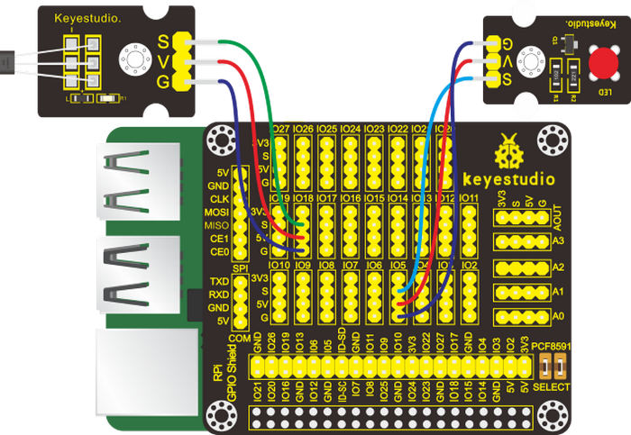

#### 5. Run Example Code：

Input the following commands in the terminal and press“Enter”:

cd /home/pi/pythonCode_A

python 17_Hall_magnetic.py

#### 6. Test Results：

When the magnetic bead is placed near the hall magnetic sensor and detected by the hall sensor, the LED will be on, the terminal will print"magnetic"; on the contrary, the LED will be off and the terminal will “nonmagnetic”.

<span style="color: rgb(255, 76, 65);">Note:</span> Press Ctrl + C on keyboard to exit code running

#### 7. Example Code：

```python
import RPi.GPIO as GPIO
import time

GPIO.setmode(GPIO.BCM)

ledPin = 5  #set led pin
hallPin = 18  #set hall magnetic pin
GPIO.setup(ledPin,GPIO.OUT)
GPIO.setup(hallPin,GPIO.IN)

while True:                     ##loop 
    if GPIO.input(hallPin):    #When Magnetic is not detected
        GPIO.output(ledPin,GPIO.LOW)  #turn off the led
        print("nonmagnetic")
    else:
        GPIO.output(ledPin,GPIO.HIGH)  #turn on the led
        print("magnetic")
```


### Project 18：5V Relay

#### 1. Description：

From a safety perspective, we specially designed this relay module with NO (normally open) and NC (normally closed) terminals. In this lesson, we will learn a special and easy-to-use switch, which is the relay module. Use the relay to start the motor.

In daily life, the electronic device is driven by 220V AC and controlled by switch. People will be in danger once the electricity leakage happens, connecting switch to 220V AC directly.

Therefore, we design a relay module with NO and NC ends. Let’s get started.

#### 2. Components：

|  |    |  |  |
| ----------------------- | ------------------------- | ----------------------- | ----------------------- |
| Raspberry Pi*1          | RPI GPIO-PCF8591 Shield*1 | 5V Relay Module*1       | F-F DuPont Wires        |

#### 3. Component Knowledge

**Relay:** It is an "automatic switch" that uses a small current to control the operation of a large current.

Control input voltage: 5V

Rated load: 5A 250VAC (NO/NC) 5A 24VDC (NO/NC)

#### 4. Schematic Diagram：

| Relay Module | RPI GPIO-PCF8591 Shield |
| :----------: | :---------------------: |
|      S       |        S（IO18）        |
|      V       |           5V            |
|      G       |            G            |


#### 5. Run Example Code：

Input the following commands in the terminal and press“Enter”:

cd /home/pi/pythonCode_A

python 18_relay.py

#### 6. Test Results：

The light of the relay module will flash.

<span style="color: rgb(255, 76, 65);">Note:</span> Press Ctrl + C on keyboard to exit code running.

#### 7. Example Code：

```python
import RPi.GPIO as GPIO
from time import sleep

relayPin = 18   #define relay pin

GPIO.setmode(GPIO.BCM)
GPIO.setwarnings(False)
GPIO.setup(relayPin,GPIO.OUT)

while True:
	GPIO.output(relayPin,GPIO.HIGH)  #Starting relay
	print("turn on")
	sleep(2)
	GPIO.output(relayPin,GPIO.LOW)  #Close relay
	print("turn off")
	sleep(1)

GPIO.cleanup()
```

### Project 19: Touch capacitive Alarm

#### 1. Description：

Touch-sensitive alarm is very commonplace in daily life, especially found in home anti-theft and car anti-theft systems. When someone touches the alarming mental material, the device alarms to warn people. And it is of high sensitivity and high reliability evidenced by issuing alarm the moment it is touched.

#### 2. Components：

|  |    |  |    |  |
| ----------------------- | ------------------------- | ----------------------- | ------------------------- | ------------------------ |
| Raspberry Pi*1          | RPI GPIO-PCF8591 Shield*1 | Active Buzzer*1         | Capacitive Touch Sensor*1 | F-F DuPont Wires         |

#### 3. Component Knowledge：

**Capacitive Touch Sensor：**

It mainly uses touch detection IC and can be found in many electronic devices. It uses the most popular capacitive sensing technology, just like the smart buttons on your phone. The touching area of this small sensor can feel the touch of humans and metals by responding with high or low level. It can still detect the touch though covered by a piece of paper and cloth. The sensitivity reduces with the increase of items between the touch-sensitive area and the object performing the touch.

The touch detection IC is designed to replace the traditional button with a variable area key, featuring low power consumption and wide operating voltage.

When the module is powered up, it needs a stabilization time of about 0.5 sec. During this time period, do not touch the keypad. At this time, all functions are disabled, and self-calibration is always performed. No touching the key, the recalibration period is about 4.0sec. 

Capacitive touch sensors are used in many devices such as digital audio players, computer displays, mobile phones, mobile devices, tablets and others. 

#### 4. Schematic Diagram：

| Active Buzzer | RPI GPIO-PCF8591 Shield |      | Capacitive Touch Sensor | RPI GPIO-PCF8591 Shield |
| :-----------: | :---------------------: | ---- | :---------------------: | :---------------------: |
|       S       |        S（IO27）        |      |            S            |        S（IO18）        |
|       V       |           5V            |      |            V            |           5V            |
|       G       |            G            |      |            G            |            G            |

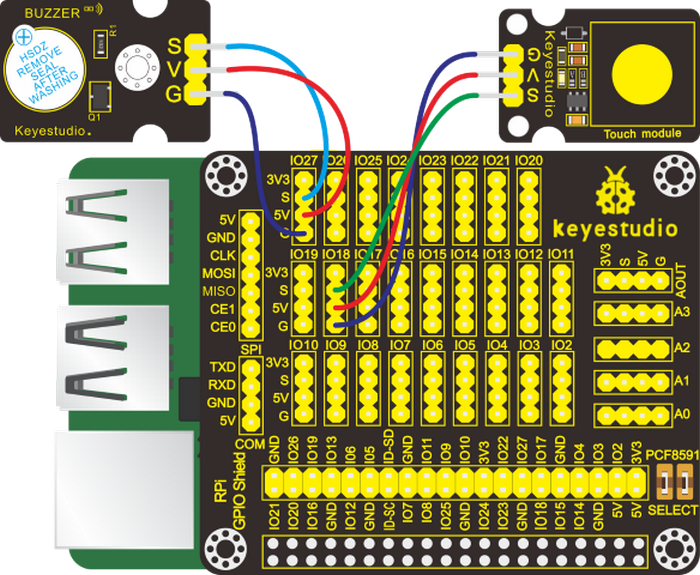

#### 5. Run Example Code：

Input the following commands in the terminal and press“Enter”:

cd /home/pi/pythonCode_A

python 19_touch_alarm.py

#### 6. Test Results：

When we touch the touch area of the capacitive touch sensor, the terminal will print the digital signal 1 and buzzer will emit sounds; otherwise, the buzzer won’t make sounds, the digital signal 0 will be output.

<span style="color: rgb(255, 76, 65);">Note:</span> Press Ctrl + C on keyboard to exit code running.

#### 7. Example Code：

```python
import RPi.GPIO as GPIO
from time import sleep

#active buzzer
buzPin = 27
#touch pin
touchPin = 18

GPIO.setmode(GPIO.BCM) # use BCM numbers
GPIO.setup(buzPin,GPIO.OUT)  #set buzPin OUTPUT mode
GPIO.setup(touchPin,GPIO.IN)  # set touchPin INPUT mode

while True:
    val = GPIO.input(touchPin)
    print(val)
    if(val == 1):  #Judge whether the touch area is touched
        GPIO.output(buzPin,GPIO.HIGH)  #Buzzer ring
    else:
        GPIO.output(buzPin,GPIO.LOW)   #Buzzer off
        
GPIO.cleanup() # Release all GPIO
```

### Project 20：Obstacle Avoidance Sensor

#### 1. Description：

In this chapter, we will introduce the obstacle avoidance.

#### 2. Components：

|        |   |  |      |
| ------------------------------ | ------------------------- | ------------------------ | ---- |
| Raspberry Pi*1                 | RPI GPIO-PCF8591 Shield*1 | Active Buzzer*1          |      |
|        |   |  |      |
| IR Obstacle Avoidance Sensor*1 | F-F DuPont Wires          | Red LED Module*1         |      |

#### 3. Component Knowledge：

**IR Obstacle Avoidance Sensor：**

It has a pair of infrared emissions and receiving tubes. When encountering an obstacle (reflective surface), the infrared light will be reflected back, and the signal terminal will output low level(0). Flat (0). If no obstacle is detected, the emitted infrared rays will weaken as the distance value increases, eventually disappear, the receiving tube cannot receive the infrared ray, and the sensor signal terminal will output high level (1). In this case, this sensor can determine whether there is an obstacle in front. You can rotate the potentiometer knob on the sensor to adjust the detection distance. The effective distance 2-40cm, working voltage is 3.3V-5V.

#### 4. Schematic Diagram：

|   Active Buzzer    |   RPI GPIO-PCF8591 Shield   |      | IR Obstacle Avoidance Sensor | RPI GPIO-PCF8591 Shield |
| :----------------: | :-------------------------: | ---- | :--------------------------: | :---------------------: |
|         S          |          S（IO27）          |      |              S               |        S（IO18）        |
|         V          |             5V              |      |              V               |           5V            |
|         G          |              G              |      |              G               |            G            |
|                    |                             |      |                              |                         |
| **Red LED Module** | **RPI GPIO-PCF8591 Shield** |      |                              |                         |
|         S          |          S（IO5）           |      |                              |                         |
|         V          |             5V              |      |                              |                         |
|         G          |              G              |      |                              |                         |

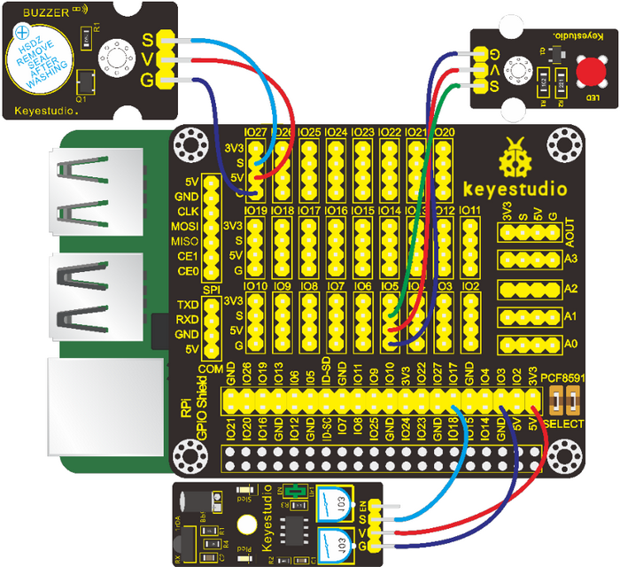

#### 5. Run Example Code

Input the following commands in the terminal and press“Enter”

cd /home/pi/pythonCode_A

python20_obstacle_avoidance.py

#### 6. Test Results：

When the obstacle avoidance sensor detects an obstacle, the terminal will print the digital signal 0, and the buzzer will emit sound, and the LED will blink; otherwise, the terminal will print the digital signal 1, LED will be off and no sound will be emitted.

<span style="color: rgb(255, 76, 65);">Note:</span> Press Ctrl + C on keyboard to exit code running.

#### 7. Example Code：

```python
import RPi.GPIO as GPIO
from time import sleep

#active buzzer pin
buzPin = 27
#led pin
ledPin = 5
#obstacle avoidance pin
obstaclePin = 18

GPIO.setmode(GPIO.BCM) # use BCM numbers
GPIO.setup(buzPin,GPIO.OUT)  #set buzPin OUTPUT mode
GPIO.setup(ledPin,GPIO.OUT)  #set ledPin OUTPUT mode
GPIO.setup(obstaclePin,GPIO.IN)  # set obstacle avoidance Pin INPUT mode

while True:
    val = GPIO.input(obstaclePin)
    print(val)
    if(val == 0):  #Judge whether obstacle avoidance is detected
        GPIO.output(buzPin,GPIO.HIGH)  #Buzzer ring
        GPIO.output(ledPin,GPIO.HIGH)  #led on
        sleep(0.2)
        GPIO.output(ledPin,GPIO.LOW)  #led off
        sleep(0.1)
    else:
        GPIO.output(buzPin,GPIO.LOW)   #Buzzer off
        GPIO.output(ledPin,GPIO.LOW)  #led off
        
GPIO.cleanup() # Release all GPIO
```

### Project 21：Reed Switch Module

#### 1. Description：

In this project, you will learn how to use a reed switch module and a Raspberry Pi to detect magnetic fields and control an LED.

#### 2. Components：

|  |   |  |  |  |
| ------------------------ | ------------------------- | ------------------------ | ------------------------ | ------------------------ |
| Raspberry Pi*1           | RPI GPIO-PCF8591 Shield*1 | Red LED Module*1         | Reed Switch Module*1     | F-F DuPont Wires         |

#### 3. Component Knowledge：

**Reed Switch Module:** 

Reed Switch is a special switch and a main component for reed relay and proximity switch. Reed switch is usually comprised of two soft magnetic materials and metal reed contact.

Reed switch has been widely applied in household appliances, cars, communication, industry, healthcare and security areas. Furthermore, it can also be applied to other sensors and electric devices such as liquidometer, door magnet, reed relay, oil level sensor and proximity sensor (magnetic sensor). It can be used under high-risk environment.

#### 4. Schematic Diagram：

| Red LED Module | RPI GPIO-PCF8591 Shield |      | Reed Switch Module | RPI GPIO-PCF8591 Shield |
| :------------: | :---------------------: | ---- | :----------------: | :---------------------: |
|       S        |        S（IO5）         |      |         S          |        S（IO18）        |
|       V        |           5V            |      |         V          |           5V            |
|       G        |            G            |      |         G          |            G            |


#### 5. Run Example Code：

Input the following commands in the terminal and press“Enter”:

cd /home/pi/pythonCode_A

python 21_reed_switch.py

#### 6. Test Results：

When the reed sensor detects that the magnetic field, the terminal will print the digital signal 0, while the LED will be on; On the contrary, the digital signal 1 will be output, and the LED will be off.

<span style="color: rgb(255, 76, 65);">Note:</span> Press Ctrl + C on keyboard to exit code running.

#### 7. Example Code：

```python
import RPi.GPIO as GPIO
from time import sleep

#led pin
ledPin = 5
#reed switch pin
reedPin = 18

GPIO.setmode(GPIO.BCM) # use BCM numbers
GPIO.setup(ledPin,GPIO.OUT)  #set ledPin OUTPUT mode
GPIO.setup(reedPin,GPIO.IN)  # set reed switch Pin INPUT mode

while True:
    val = GPIO.input(reedPin)
    print(val)
    if(val == 0):  #Judge whether magnetism is detected
        GPIO.output(ledPin,GPIO.HIGH)  #led on
    else:
        GPIO.output(ledPin,GPIO.LOW)  #led off
        
GPIO.cleanup() # Release all GPIO
```


### Project 22：Vibration Sensor

#### 1. Description：

We often encounter vibration alarms. In this project, let's learn to use a vibration sensor and buzzer to make a simple vibration alarm.

#### 2. Components：

|  |   |  |  |  |
| ------------------------ | ------------------------- | ------------------------ | ------------------------ | ------------------------ |
| Raspberry Pi*1           | RPI GPIO-PCF8591 Shield*1 | Active Buzzer*1          | Vibration Sensor*1       | F-F Dupont Wires         |

#### 3. Component Knowledge：

**Vibration Sensor：**

This is a commonly used vibration module/sensor. It has non-directional operation characteristics, which means it can be triggered to work by forces from any angles. The fully sealed package makes it waterproof and dustproof. And it is suitable for triggering in small current circuits.

After powering up the sensor, when it is not triggered by any forces, the circuit is open（OFF）, the signal end outputs high level and the LED on it remains off; when it is activated by an external force to reach its vibration threshold, the circuit is close（ON）, the signal end outputs low level and the LED on it lights up; and when the force exerted dies out, the circuit returns to open (OFF)state. The sensitivity of the sensor can be altered by rotating the potentiometer on it.

#### 4. Schematic Diagram：

| Active Buzzer | RPI GPIO-PCF8591 Shield |      | Vibration Sensor | RPI GPIO-PCF8591 Shield |
| :-----------: | :---------------------: | ---- | :--------------: | :---------------------: |
|       S       |        S（IO5）         |      |        S         |        S（IO18）        |
|       V       |           5V            |      |        V         |           5V            |
|       G       |            G            |      |        G         |            G            |


#### 5. Run Example Code：

Input the following commands in the terminal and press“Enter”:

cd /home/pi/pythonCode_A

python 22_Vibrating_alarm.py

#### 6. Test Results：

After running the program, when the vibration sensor is triggered, the terminal keeps printing “buzzer ring...，...buzzer off”and the buzzer rings constantly; otherwise, the terminal prints “...buzzer off”and the buzzer becomes silent.

<span style="color: rgb(255, 76, 65);">Note:</span> Press Ctrl + C on keyboard to exit code running.

#### 7. Example Code：

```python
import RPi.GPIO as GPIO

buzPin = 5    # pin5 --- buzeer
vibPin = 18    # pin18 --- vibration sensor

buz_status = 0
def setup():
    GPIO.setmode(GPIO.BCM)  # use BCM numbers
    GPIO.setwarnings(False)
    GPIO.setup(buzPin,GPIO.OUT)   # Set buzPin's mode is output
    GPIO.setup(vibPin,GPIO.IN,pull_up_down=GPIO.PUD_UP)    # Set vibPin's mode is input, and pull up to high level(3.3V)

def swbuz(ev=None):
    global buz_status
    buz_status = not buz_status
    GPIO.output(buzPin, buz_status)  # switch buz status(ring-->off; off-->ring)
    if buz_status == 1:
        print 'buzzer ring...'
    else:
        print '...buzzer off'

def loop():
    GPIO.add_event_detect(vibPin, GPIO.FALLING, callback=swbuz) # wait for falling
    while True:
        pass   # Don't do anything

def destroy():
    GPIO.output(buzPin, GPIO.LOW)     # buzzer off
    GPIO.cleanup()                     # Release resource

if __name__ == '__main__':     # Program start from here
    setup()
    try:
        loop()
    except KeyboardInterrupt:  
        destroy()
```


### Project 23：Servo

#### 1. Description：

Servo is applied widely, especially for robot like human robots and moving robots. In this lesson, we will learn how it works.

#### 2. Components：

|  |   |  |
| ------------------------ | ------------------------- | ------------------------ | 
| Raspberry Pi*1           | RPI GPIO-PCF8591 Shield*1 | Servo*1                  |

#### 3. Component Knowledge

**Servo:**

A location(angle) driver which can rotate a certain angle with high accuracy. It has three external wires which are brown, red and orange,. Brown one is grounded, red one is positive pole of power and orange one is signal wire.

The rotation angle of servo motor is controlled by regulating the duty cycle of PWM (Pulse-Width Modulation) signal. The standard cycle of PWM signal is 20ms (50Hz). Theoretically, the width is distributed between 1ms-2ms, but in fact, it's between 0.5ms-2.5ms. The width corresponds the rotation angle from 0° to 180°. But note that for different brand motor, the same signal may have different rotation angle. 


#### 4. Schematic Diagram：

|    Servo    | RPI GPIO-PCF8591 Shield |
| :---------: | :---------------------: |
| Orange Wire |        S（IO18）        |
|  Red Wire   |           5V            |
| Brown Wire  |            G            |


#### 5. Run Example Code：

Input the following commands in the terminal and press“Enter”:

cd /home/pi/pythonCode_A

python 23_servo.py

#### 6. Test Results：

Enter the angle value and servo rotates the corresponding value, as shown below:


<span style="color: rgb(255, 76, 65);">Note:</span> Press Ctrl + C on keyboard to exit code running.

#### 7. Example Code：

```python
import RPi.GPIO as GPIO
import time

servo_min_angle = 2.5  #define pulse duty cycle for minimun angle of servo
servo_max_angle = 12.5  #define pulse duty cycle for maximun angle of servo

servopin = 18   #servo Pin
GPIO.setmode(GPIO.BCM)  #BCM numbers

GPIO.setup(servopin,GPIO.OUT)
p = GPIO.PWM(servopin,50)  #set 50Hz , The working frequency of the steering gear is 50Hz
p.start(0)  # start PWM
time.sleep(2)

#define function, map a value from one range to another range
def map(angle, val1, val2, min_angle, max_angle):
    return (max_angle-min_angle)*(angle-val1)/(val2-val1)+min_angle

while(True):  #loop
    p.ChangeDutyCycle(0)   #set 
    time.sleep(0.4)
    b = input("input Angle:")
    b = int(b)
    c = map(b, 0, 180, servo_min_angle, servo_max_angle)  #map angle from 0~180 to 2.5~12.5
    p.ChangeDutyCycle(c) 
    time.sleep(0.4)
    
p.stop()
GPIO.cleanup()
```


### Project 24：Adjust the Brightness of LED

#### 1. Description：

Some of the lamps on market can be adjusted to display different brightness, which gives us better shopping experiences. And in this project, we will learn how to make this happen.

#### 2. Components：

|  |   |  |  |  |
| ------------------------ | ------------------------- | ------------------------ | ------------------------ | ------------------------ |
| Raspberry Pi*1           | RPI GPIO-PCF8591 Shield*1 | Red LED Module*1         | Potentiometer*1          | F-F DuPont Wires         |

#### 3. Component Knowledge：

**PCF8591 A/D Conversion Chip：**

PCF8591 A/D conversion chip is installed at the back of the RPI GPIO-PCF8591 shield，and its chip’s voltage resolution is 5V/255≈0.01961. However, Raspberry Pi doesn’t AD/DA function.

The external shield with AD/DA function is needed if Raspberry Pi is interfaced with analog sensors.

We use a pcf8591 AD/DA converter which requires iic communication.

Then we need to open iic communication of Raspberry Pi, as shown below:

Input <span style="color: rgb(0, 209, 0);">sudo raspi-config</span> in the terminal and press <span style="color: rgb(255, 169, 0);">Enter</span> to open the interface of Raspberry Pi.


Press key <span style="color: rgb(255, 76, 65);">↑</span>, <span style="color: rgb(255, 76, 65);">↓</span>, <span style="color: rgb(255, 76, 65);">←</span> and <span style="color: rgb(255, 76, 65);">→</span> and then press <span style="color: rgb(255, 76, 65);">Enter</span>


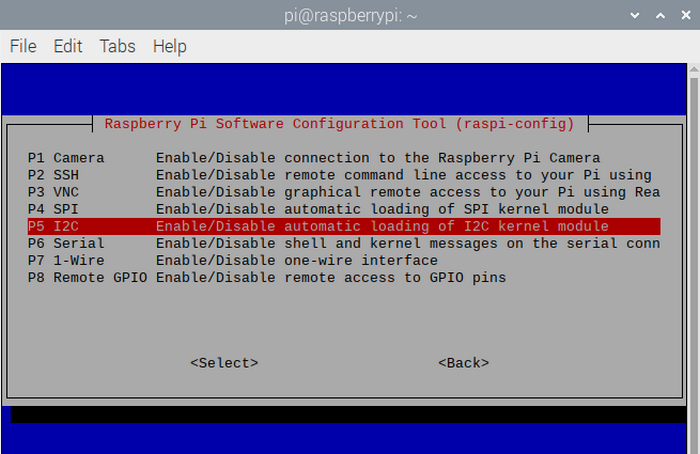


More information about I2C communication, check it in the link: <https://www.nxp.com/docs/en/user-guide/UM10204.pdf>

**PCF8591 Pins:**

More details about PCF8591 chip, you could look through chip specification folder .

From the below figure, PCF8591 has an analog output pin Aout and four analog input pin A0-A3.


<span style="color: rgb(255, 76, 65);">Check the address of iic module（PCF8591）of Raspberry Pi, enter command i2cdetect -y 1 and press Enter</span>.

The iic address of PCF8591 is 0x48.


Used to read the address of pin A0\~A3.

The address of analog output pin AOUT: 0x40, that is, 64 converting from hexadecimal to decimal.

A0 = 0x40 \#\#A0 ----\> port address

A1 = 0x41

A2 = 0x42

A3 = 0x43

**Adjustable Potentiometer**

The rotary potentiometer means the change of resistance.

We could convert the resistance’s change into the voltage’s when setting circuit. Then, voltage changes will be output to GPIO port through module signals.

Wiring according to the below figure and rotate clockwise, resistance value reduces.

#### 4. Schematic Diagram：

| Red LED Module | RPI GPIO-PCF8591 Shield |      | Adjustable Potentiometer | RPI GPIO-PCF8591 Shield |
| :------------: | :---------------------: | ---- | :----------------------: | :---------------------: |
|       S        |        S（IO11）        |      |            S             |         S（A0）         |
|       V        |           5V            |      |            V             |           5V            |
|       G        |            G            |      |            G             |            G            |


#### 5. Run Example Code：

Input the following commands in the terminal and press“Enter”:

cd /home/pi/pythonCode_A

python 24_potentiometer_LED.py

#### 6. Test Results：

Terminal prints the analog value read by adjustable potentiometer. The LED brightness will vary with the the rotary of potentiometer.

<span style="color: rgb(255, 76, 65);">Note:</span> Press Ctrl + C on keyboard to exit code running.

#### 7. Example Code：

```python
import RPi.GPIO as GPIO
import smbus
import time
address = 0x48 #default address of PCF8591
bus=smbus.SMBus(1)  #Create an instance of smbus
cmd=0x40 #command
# A0 = 0x40      ##A0  ----> port address
# A1 = 0x41
# A2 = 0x42
# A3 = 0x43

ledPin = 11
GPIO.setmode(GPIO.BCM)
GPIO.setup(ledPin,GPIO.OUT)
GPIO.output(ledPin,GPIO.LOW)
p = GPIO.PWM(ledPin,100)
p.start(0)

def analogRead(chn):   #read ADC value,chn:0,1,2,3
    value = bus.read_byte_data(address,cmd+chn)
    return value
 
def analogWrite(value):#write DAC value
    bus.write_byte_data(address,cmd,value) 

def loop():
    while True:
        value = analogRead(0) #read the ADC value ofchannel 0
        analogWrite(value) #write the DAC value
        p.ChangeDutyCycle(value*100/255) #Convert ADC value to duty cycle of PWM
        voltage = value / 255.0 * 3.3 #calculate the voltage value
        print ('ADC Value : %d, Voltage : %.2f'%(value,voltage))
        time.sleep(0.01)

def destroy():
    bus.close()
 
if __name__ == '__main__':
    print ('Program is starting ... ')
    try:
        loop()
    except KeyboardInterrupt:
        destroy()
```

#### 8. Explanation：

| smbus                                  | Smbus is based on iic communication. <br />We treat it as iic communication library. |
| -------------------------------------- | ------------------------------------------------------------ |
| bus.read_byte_data(address,cmd+chn)    | Read the corresponding modules with iic address，address is the address of pcf8591 module，cmd+chn correspond to the address of analog port pcf8591: A0 = 0x40，A1 = 0x41，A2 = 0x42，A3 = 0x43 |
| bus.write_byte_data(address,cmd,value) | D/A analog value outputs, address is address of pcf8591 module，cmd outputs the address of pins，value: output value |
| Smbus library file                     | <https://pypi.org/project/smbus2/0.1.2/>                |

### Project 25：Photoresistor

#### 1. Description：

Photo resistor (Photovaristor) is a resistor whose resistance varies according to different incident light strength. It's made based on the photoelectric effect of semiconductor. In this lesson, let’s explain how it works.

#### 2. Components：

|  |   |  |  |  |
| ------------------------ | ------------------------- | ------------------------ | ------------------------ | ------------------------ |
| Raspberry Pi*1           | RPI GPIO-PCF8591 Shield*1 | Red LED Module*1         | Photoresistor*1          | F-F DuPont Wires         |

#### 3. Component Knowledge

**Photoresistor：**

Photo resistor (Photovaristor) is a resistor whose resistance varies according to different incident light strength. It's made based on the photoelectric effect of semiconductor. If the incident light is intense, its resistance reduces; if the incident light is weak, the resistance increases. 

If incident light on a photoresistor exceeds a certain frequency, photons absorbed by the semiconductor give bound electrons enough energy to jump into the conduction band. The resulting free electrons (and their hole partners) conduct electricity, thereby lowering resistance. 

#### 4. Schematic Diagram：

| Red LED Module | RPI GPIO-PCF8591 Shield |      | Photoresistor | RPI GPIO-PCF8591 Shield |
| :------------: | :---------------------: | ---- | :-----------: | :---------------------: |
|       S        |        S（IO5）         |      |       S       |         S（A0）         |
|       V        |           5V            |      |       V       |           5V            |
|       G        |            G            |      |       G       |            G            |


#### 5. Run Example Code：

**Special Note:** The I2C communication method is used in the experiment. We need to check the iic address first(<span style="color: rgb(255, 76, 65);">enter command：i2cdetect -y 1 and press“Enter”</span>). If failed, check the wiring is correct or not. If correct, you need to enable I2C communication function of Raspberry Pi, project 24 is for your reference.

After enabling the I2C communication，input the following commands and press "Enter":

cd /home/pi/pythonCode_A

python 25_photo_sensor.py

#### 6. Test Results：

Terminal prints the value tested by photoresistor. LED will turn on if the ambient environment is dim; otherwise, LED will be off.

<span style="color: rgb(255, 76, 65);">Note:</span> Press Ctrl + C on keyboard to exit code running.

#### 7. Example Code：

```python
import RPi.GPIO as GPIO
import smbus   
import time

GPIO.setmode(GPIO.BCM)
GPIO.setwarnings(False)

led = 5
GPIO.setup(led,GPIO.OUT)
 
address = 0x48 ##address  ---> device address
cmd = 0x40     ##DA converter command
A0 = 0x40      ##A0  ----> port address
A1 = 0x41
A2 = 0x42
A3 = 0x43
bus = smbus.SMBus(1)            ##start the bus

def analogRead(count):   #function,read analog data
    read_val = bus.read_byte_data(address,cmd+count)
    return read_val

while True:                     ##loop 
    #Vout = 10                  ##10*0.0196=0.196V
    #bus.write_byte_data(address,cmd,Vout) ##DA converter
    value = analogRead(0) ##read A0 data
    if(value<100):   #When the ambient brightness is less than 100, the LED light will be on
        GPIO.output(led,GPIO.LOW)
    else:
        GPIO.output(led,GPIO.HIGH)

    print("data:%1.0f" %(value))   ##print data
    
time.sleep(0.5)                ##delay 0.5 second
GPIO.cleanup()
```


### Project 26：Sound-activated Light

#### 1. Description：

You might find the lights automatically on when you pass them, nevertheless, they will be off if the surrounding is quiet. Do you know why?

Actually, it is sound sensor that controls them on and off.

#### 2. Components:

|  |   |  |  |  |
| ------------------------ | ------------------------- | ------------------------ | ------------------------ | ------------------------ |
| Raspberry Pi*1           | RPI GPIO-PCF8591 Shield*1 | Red LED Module*1         | Analog Sound Sensor*1    | F-F DuPont Wires         |

#### 3. Component：

A sound sensor is defined as a module that detects sound waves through its intensity and converting it to electrical signals.

It has a built-in capacitive electret microphone which is highly sensitive to sound. Sound waves cause the thin film of the electret to vibrate and then the capacitance changes, thus producing the corresponding changed voltage. Since the voltage change is extremely weak, it needs to be amplified. So it is converted into a voltage ranging from 0 to 5V, which is received by data acquisition unit after A/D adapter conversion and then sent to an MCU.

The module can be applied to noise monitoring in traffic artery, and detection of noises within the boundary of industrial enterprises, factories, and construction sites, detection of noises in urban regions, and noise detection and assessment of living surroundings. 

#### 4. Schematic Diagram：

| Red LED Module | RPI GPIO-PCF8591 Shield |      | Analog Sound Sensor | RPI GPIO-PCF8591 Shield |
| :------------: | :---------------------: | ---- | :-----------------: | :---------------------: |
|       S        |        S（IO5）         |      |          S          |         S（A0）         |
|       V        |           5V            |      |          V          |           5V            |
|       G        |            G            |      |          G          |            G            |


#### 5. Run Example Code：

<span style="color: rgb(255, 76, 65);">Special Note:</span> The I2C communication method is used in the experiment. We need to check the iic address first(<span style="color: rgb(255, 76, 65);">enter command：i2cdetect -y 1 and press“Enter”</span>). If failed, check the wiring is correct or not. If correct, you need to enable I2C communication function of Raspberry Pi, project 24 is for your reference.

After enabling the I2C communication，input the following commands and press "Enter":

cd /home/pi/pythonCode_A

python 26_sound_led.py

#### 6. Test Results：

When you clap your hands suddenly, LED will be on; if you clap again, LED will be off.

<span style="color: rgb(255, 76, 65);">Note:</span> Press Ctrl + C on keyboard to exit code running.

#### 7. Example Code：

```python
import RPi.GPIO as GPIO
import smbus
import time

GPIO.setmode(GPIO.BCM)
GPIO.setwarnings(False)

led = 5
GPIO.setup(led,GPIO.OUT)
 
address = 0x48 ##address  ---> device address
cmd = 0x40     ##DA converter command
A0 = 0x40      ##A0  ----> port address
A1 = 0x41
A2 = 0x42
A3 = 0x43
bus = smbus.SMBus(1)            ##start the bus

flag = 0
mode = 0

def analogRead(count):   #function,read analog data
    read_val = bus.read_byte_data(address,cmd+count)
    return read_val

while True:                     ##loop
    value = analogRead(0) ##read A0 data
    if(value>50):
        flag += 1
        mode = flag % 2
    if(mode == 0):
        GPIO.output(led,GPIO.LOW)
    else:
        GPIO.output(led,GPIO.HIGH)

    print("data:%1.0f" %(value))   ##print data
    time.sleep(0.05)                ##delay 0.05 second
    
GPIO.cleanup()
```


### Project 27：LCD1602

#### 1. Description：

In this chapter, we will use a 1602 I2C module as a display and connect it to the Raspberry Pi. And we will show you how to control a 1602 LCD module.

#### 2. Components：

|  |   |  |  |
| ------------------------ | ------------------------- | ------------------------ | ------------------------ |
| Raspberry Pi*1           | RPI GPIO-PCF8591 Shield*1 | I2C LCD1602 Module*1     | F-F DuPont Wires         |

#### 3. Component Knowledge：

**LCD1602 Display Module**

The display has an LCD 1602 LCD display and I2C LCD. But we use an I2C LCD 1602 in this project. It can display characters of 16 column and 2 row. It also can display numbers, letters, symbols, ASCII codes, etc. As shown below:


The I2C LCD1602 display integrates an I2C interface, a connected serial input & parallel output. This makes us operate the LCD1602 with only 4 lines.


The IC chip used in this module is PCF8574T (PCF8574AT) whose default I2C address is 0x27 (0x3f). You can also view the RPI bus on your I2C device address by command "I2CDetect -y 1".

#### 4. Schematic Diagram：

| I2C LCD1602 Module | RPI GPIO-PCF8591 Shield |
| :----------------: | :---------------------: |
|        GND         |           GND           |
|        VCC         |           5V            |
|        SDA         |           IO2           |
|        SCL         |           IO3           |


#### 5. Run Example Code：

<span style="color: rgb(255, 76, 65);">Special Note:</span> The I2C communication method is used in the experiment. We need to check the iic address first(<span style="color: rgb(255, 76, 65);">enter command：i2cdetect -y 1 and press“Enter”</span>). If failed, check the wiring is correct or not. If correct, you need to enable I2C communication function of Raspberry Pi, project 24 is for your reference.

After enabling the I2C communication，input the following commands and press "Enter":

cd /home/pi/pythonCode_A/27_I2CLCD1602

python 27_I2CLCD1602.py

#### 6. Test Results：

The LCD1602 screen will display the CPU temperature and system time of your Raspberry Pi.

<span style="color: rgb(255, 76, 65);">Note:</span> after uploading code, if you can't see anything on the display or display is unclear, try to rotate the blue knob on the back of the LCD1602, adjust the contrast until the screen can clear the time and temperature.

<span style="color: rgb(255, 76, 65);">Note:</span> Press Ctrl + C on keyboard to exit code running.

#### 7. Example Code：

```python
from PCF8574 import PCF8574_GPIO
from Adafruit_LCD1602 import Adafruit_CharLCD

from time import sleep, strftime
from datetime import datetime
 
def get_cpu_temp():     # get CPU temperature and store it into file "/sys/class/thermal/thermal_zone0/temp"
    tmp = open('/sys/class/thermal/thermal_zone0/temp')
    cpu = tmp.read()
    tmp.close()
    return '{:.2f}'.format( float(cpu)/1000 ) + ' C'
 
def get_time_now():     # get system time
    return datetime.now().strftime('    %H:%M:%S')
    
def loop():
    mcp.output(3,1)     # turn on LCD backlight
    lcd.begin(16,2)     # set number of LCD lines and columns
    while(True):         
        #lcd.clear()
        lcd.setCursor(0,0)  # set cursor position
        lcd.message( 'CPU: ' + get_cpu_temp()+'\n' )# display CPU temperature
        lcd.message( get_time_now() )   # display the time
        sleep(1)
        
def destroy():
    lcd.clear()
    
PCF8574_address = 0x27  # I2C address of the PCF8574 chip.
PCF8574A_address = 0x3F  # I2C address of the PCF8574A chip.
# Create PCF8574 GPIO adapter.
try:
    mcp = PCF8574_GPIO(PCF8574_address)
except:
    try:
        mcp = PCF8574_GPIO(PCF8574A_address)
    except:
        print ('I2C Address Error !')
        exit(1)
# Create LCD, passing in MCP GPIO adapter.
lcd = Adafruit_CharLCD(pin_rs=0, pin_e=2, pins_db=[4,5,6,7], GPIO=mcp)

if __name__ == '__main__':
    print ('Program is starting ... ')
    try:
        loop()
    except KeyboardInterrupt:
        destroy()
  
```


### Project 28：Water Level Monitor

#### 1. Description：

If you have ever had a water heater explode or ever tried to make submersible electronics, then you know how important it is to detect when water is around. Let’s know more about water level sensor.

#### 2. Components:

|  |   |  |  |  |
| ------------------------ | ------------------------- | ------------------------ | ------------------------ | ------------------------ |
| Raspberry Pi*1           | RPI GPIO-PCF8591 Shield*1 | Active Buzzer*1          | Water Level Sensor*1     | F-F DuPont Wires         |

#### 3. Component Knowledge

**Water Level Sensor：**

Our water sensor is easy- to-use, portable and cost-effective, designed to identify and detect water level and water drop.

This sensor measures the volume of water drop and water quantity through an array of traces of exposed parallel wires.

It could convert water content to analog signals, and output analog value could be used by function of application. It has the features of low consumption as well.

#### 4. Schematic Diagram：

| Active Buzzer | RPI GPIO-PCF8591 Shield |      | Water Level Sensor | RPI GPIO-PCF8591 Shield |
| :-----------: | :---------------------: | ---- | :----------------: | :---------------------: |
|       S       |        S（IO18）        |      |         S          |         S（A0）         |
|       V       |           5V            |      |         V          |           5V            |
|       G       |            G            |      |         G          |            G            |


#### 5. Run Example Code：

<span style="color: rgb(255, 76, 65);">Special Note:</span> The I2C communication method is used in the experiment. We need to check the iic address first(<span style="color: rgb(255, 76, 65);">enter command：i2cdetect -y 1 and press“Enter”</span>). If failed, check the wiring is correct or not. If correct, you need to enable I2C communication function of Raspberry Pi, project 24 is for your reference.

After enabling the I2C communication，input the following commands and press "Enter":

cd /home/pi/pythonCode_A

python 28_water_buzzer.py

#### 6. Test Results：

When water covers the detection part of the sensor, the buzzer will emit sounds.

<span style="color: rgb(255, 76, 65);">Note:</span> Press Ctrl + C on keyboard to exit code running.

#### 7. Example Code：

```python
import RPi.GPIO as GPIO
import smbus
import time

GPIO.setmode(GPIO.BCM)
GPIO.setwarnings(False)

buz = 18
GPIO.setup(buz,GPIO.OUT)
 
address = 0x48 ##address  ---> device address
cmd = 0x40     ##DA converter command
A0 = 0x40      ##A0  ----> port address
A1 = 0x41
A2 = 0x42
A3 = 0x43
bus = smbus.SMBus(1)            ##start the bus

def analogRead(count):   #function,read analog data
    read_val = bus.read_byte_data(address,cmd+count)
    return read_val

while True:                     ##loop
    value = analogRead(0) ##read A0 data
    if(value>30):
        GPIO.output(buz,GPIO.HIGH)
    else:
        GPIO.output(buz,GPIO.LOW)

    print("data:%1.0f" %(value))   ##print data
    time.sleep(0.05)                ##delay 0.05 second
    
GPIO.cleanup()
```


### Project 29：Flower-watering Device

#### 1. Description：

The household plants are popular in many a communities. They will die if you forget to water them, how about making an automatic watering device?

#### 2. Components：
|  |    |  |  |
| ------------------------ | ------------------------- | ------------------------ | ------------------------ | 
| Raspberry Pi*1           | RPI GPIO-PCF8591 Shield*1 |  Soil Humidity Sensor*1     | F-F DuPont Wires         |

#### 3. Component Knowledge

**Soil Humidity Sensor：**

This is a simple soil humidity sensor aims to detect the soil humidity. 

If the soil is in lack of water, the analog value output by the sensor will decrease; otherwise, it will increase. If you use this sensor to make an automatic watering device, it can detect whether your botany is thirsty to prevent it from withering when you go out. 

Using the sensor with controller makes your plant more comfortable and your garden smarter. The soil humidity sensor module is not as complicated as you might think, and if you need to detect the soil in your project, it will be your best choice.

#### 4. Schematic Diagram：

| Soil Humidity Sensor | RPI GPIO-PCF8591 Shield |
| :------------------: | :---------------------: |
|          S           |         S（A0）         |
|          V           |           5V            |
|          G           |            G            |


#### 5. Run Example Code：

<span style="color: rgb(255, 76, 65);">Special Note:</span> The I2C communication method is used in the experiment. We need to check the iic address first(<span style="color: rgb(255, 76, 65);">enter command：i2cdetect -y 1 and press“Enter”</span>). If failed, check the wiring is correct or not. If correct, you need to enable I2C communication function of Raspberry Pi, project 24 is for your reference.

After enabling the I2C communication，input the following commands and press "Enter":

cd /home/pi/pythonCode_A

python 29_soil.py

#### 6. Test Results：

Insert the soil humidity sensor into the plant pot, then the terminal will print the soil humidity value.

<span style="color: rgb(255, 76, 65);">Note:</span> Press Ctrl + C on keyboard to exit code running.

#### 7. Example Code：

```python
import RPi.GPIO as GPIO
import smbus   
import time

GPIO.setmode(GPIO.BCM)
GPIO.setwarnings(False)

address = 0x48 ##address--->device address
cmd = 0x40     ##DA converter command
A0 = 0x40      ##A0  ----> port address
A1 = 0x41
A2 = 0x42
A3 = 0x43
bus = smbus.SMBus(1)            ##start the bus
while True:                     ##loop 
    #Vout = 10                  ##10*0.0196=0.196V
    #bus.write_byte_data(address,cmd,Vout) ##DA converter
    bus.write_byte(address,A0)     ##which port of the device you want to access
    value = bus.read_byte(address) ##access the data
    print("data:%1.0f" %(value))   ##print data
    
time.sleep(0.5)                ##delay 0.5 second
GPIO.cleanup()
```


### Project 30：Temperature Alarm

#### 1. Description：

In the cold winter, in order to prevent the greenhouse vegetables from being frozen, the vegetable farmers will heat the greenhouse vegetables so that the temperature in the greenhouse is suitable. 

In this project, we will learn to make a temperature alert model.

#### 2. Components：

|  |   |  |   |  |
| ------------------------ | ------------------------- | ------------------------ | ------------------------- | ------------------------ |
| Raspberry Pi*1           | RPI GPIO-PCF8591 Shield*1 | Active Buzzer*1          | LM35 Temperature Sensor*1 | F-F DuPont Wires         |

#### 3. Component Knowledge：

**LM35 Temperature Sensor：**

The temperature sensor based on the semiconductor LM35 is a temperature sensor that is proportional to a total proportion of a Celsius temperature, and its output voltage is a temperature standard. 

LM35DZ is a widely used temperature sensor. Since it adopts internal compensation, the output can start from 0 ° C. 

Sensitivity is 10 mV /℃;

The output temperature range is from 0℃～100℃,

Conversion formula: output 0V when temperature is 1℃, the output voltage increases by 10 mV.

Operating voltage: 4-30V;

Accuracy: ± 1℃.

The maximum linear error: ± 0.5℃;

The static current: 80ua.

#### 4. Schematic Diagram：

| Active Buzzer | RPI GPIO-PCF8591 Shield |      | LM35Temperature Sensor | RPI GPIO-PCF8591 Shield |
| :-----------: | :---------------------: | ---- | :--------------------: | :---------------------: |
|       S       |        S（IO18）        |      |           S            |         S（A0）         |
|       V       |           5V            |      |           V            |           5V            |
|       G       |            G            |      |           G            |            G            |

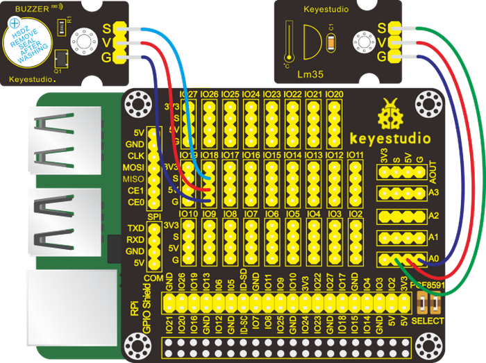

#### 5. Run Example Code：

<span style="color: rgb(255, 76, 65);">Special Note:</span> The I2C communication method is used in the experiment. We need to check the iic address first(<span style="color: rgb(255, 76, 65);">enter command：i2cdetect -y 1 and press“Enter”</span>). If failed, check the wiring is correct or not. If correct, you need to enable I2C communication function of Raspberry Pi, project 24 is for your reference.

After the I2C communication function is enabled, then input the following commands in the terminal and press "Enter":

cd /home/pi/pythonCode_A

python 30_LM35.py

#### 6. Test Results：

After the program is activated, the terminal prints the temperature value. When the temperature value is greater than 20°, the buzzer will emit sounds; on the contrary, the buzzer won’t emit sounds.

<span style="color: rgb(255, 76, 65);">Note:</span> Press Ctrl + C on keyboard to exit code running.

#### 7. Example Code：

The temperature value 20 in the code can be adjusted according to the local temperature.

```python
import RPi.GPIO as GPIO
import time
import smbus

GPIO.setwarnings(False)
GPIO.setmode(GPIO.BCM)       # Use BCM GPIO numbers

buz = 18
GPIO.setup(buz,GPIO.OUT)

address = 0x48 ##address--->device address
cmd = 0x40
A0 = 0x40    ##A0---->port address
A1 = 0x41
A2 = 0x42
A3 = 0x43
bus = smbus.SMBus(1) 

def analogRead(count):   #function,read analog data
    read_val = bus.read_byte_data(address,cmd+count)
    return read_val

while True:
    temp = analogRead(0)   ##read A0 data
    if(temp>20):
        GPIO.output(buz,GPIO.HIGH)
    else:
        GPIO.output(buz,GPIO.LOW)
        
    print("Temp = %s"%(temp))    ##print data
    time.sleep(0.1);   ##delay 0.5 second
    
GPIO.cleanup()
```


### Project 31: Steam Sensor

#### 1. Description：

Our lives are surrounded by air everywhere. The air contains many ingredients, some of which are useful, some are harmful, some of which have a significant impact on the human body, and some of which have a slight effect on the human body. 

So in this lesson, you will learn how to use a steam sensor and Raspberry Pi to detect the vapor content in the air.

#### 2. Components：

|  |   |  |  |
| ------------------------ | ------------------------- | ------------------------ | ------------------------ |
| Raspberry Pi*1           | RPI GPIO-PCF8591 Shield*1 | Steam Sensor*1           | F-F DuPont Wires         |

#### 3. Component Knowledge：

**Steam Sensor：**

This is a commonly used steam sensor. Its principle is to detect the amount of water by bare printed parallel lines on the circuit board. The more the water is, the more wires will be connected. As the conductive contact area increases, the output voltage will gradually rise. It can detect water vapor in the air as well. The steam sensor can be used as a rain water detector and level switch. When the humidity on the sensor surface surges, the output voltage will increase.

#### 4. Schematic Diagram：

| Steam Sensor | RPI GPIO-PCF8591 Shield |
| :----------: | :---------------------: |
|      S       |         S（A0）         |
|      V       |           5V            |
|      G       |            G            |


#### 5. Run Example Code：

<span style="color: rgb(255, 76, 65);">Special Note:</span> The I2C communication method is used in the experiment. We need to check the iic address first(<span style="color: rgb(255, 76, 65);">enter command：i2cdetect -y 1 and press“Enter”</span>). If failed, check the wiring is correct or not. If correct, you need to enable I2C communication function of Raspberry Pi, project 24 is for your reference.

After enabling the I2C communication，input the following commands and press "Enter":

cd /home/pi/pythonCode_A

python 31_water_vapor.py

#### 6. Test Results：

The terminal shows the steam content in the air.

<span style="color: rgb(255, 76, 65);">Note:</span> Press Ctrl + C on keyboard to exit code running.

#### 7. Example Code：

```python
import RPi.GPIO as GPIO
import time
import smbus

GPIO.setwarnings(False)
GPIO.setmode(GPIO.BCM)       # Use BCM GPIO numbers

address = 0x48 ##address--->device address
cmd = 0x40
A0 = 0x40    ##A0---->port address
A1 = 0x41
A2 = 0x42
A3 = 0x43
bus = smbus.SMBus(1) 

def analogRead(count):   #function,read analog data
    read_val = bus.read_byte_data(address,cmd+count)
    return read_val

while True:
    value = analogRead(0)   ##read A0 data
    print("water content = %s"%(value))    ##print data
    time.sleep(0.1);   ##delay 0.5 second
    
GPIO.cleanup()
```


### Project 32：Gas Leakage Alarm

#### 1. Description：

Some households have access to gas, which is composed of CO, CO2, N2, H2 and CH4. CO is one of toxic gases. People will be in danger if absorbing too much CO. However, we could tackle with this problem over a gas leakage alarm.

Gas MQ-2 leakage alarm detects the presence of a combustible or toxic gas and react by displaying a reading, setting off an audible or visual alarm.

#### 2. Components：

|  |   |  |  |  |
| ------------------------ | ------------------------- | ------------------------ | ------------------------ | ------------------------ |
| Raspberry Pi*1           | RPI GPIO-PCF8591 Shield*1 | Active Buzzer*1          | MQ-2 Gas Sensor*1        | F-F DuPont Wires         |

#### 3. Component Knowledge：

**MQ-2 Gas Sensor**：

MQ-2 gas sensor adopts the material sensitive to gas------SnO2 with low electricity conductivity. When beset with combustible gas, its electricity conductivity varies with the of the concentration of flammable gas, however, the simple circuit could convert the change of  electricity conductivity into the output signals of the concentration of gas sensor.

MQ-2 gas sensor is a multi-purpose and cost-effective. It can detect the concentration of flammable gas and smoke in the range of 300~10000ppm.Meanwhile, it has high sensitivity to natural gas, liquefied petroleum gas and other smoke, especially to alkanes smoke.

**Note：**

(1) The sensitivity of the alcohol sensor can be adjusted by rotating the potentiometer on it.

Turning the knob clockwise, the threshold value increases while turning it counterclockwise, the threshold value decreases.


(2)The sensor may not be able to output stable and accurate data immediately, and it needs to be warmed up for about 1 minute to collect stable data.

#### 4. Schematic Diagram：

| Active Buzzer | RPI GPIO-PCF8591 Shield |      | MQ-2 Gas Sensor | RPI GPIO-PCF8591 Shield |
| :-----------: | :---------------------: | ---- | :-------------: | :---------------------: |
|       S       |        S（IO18）        |      |        S        |         S（A0）         |
|       V       |           5V            |      |        V        |           5V            |
|       G       |            G            |      |        G        |            G            |


#### 5. Run Example Code：

<span style="color: rgb(255, 76, 65);">Special Note:</span> The I2C communication method is used in the experiment. We need to check the iic address first(<span style="color: rgb(255, 76, 65);">enter command：i2cdetect -y 1 and press“Enter”</span>). If failed, check the wiring is correct or not. If correct, you need to enable I2C communication function of Raspberry Pi, project 24 is for your reference.

After enabling the I2C communication，input the following commands and press "Enter":

cd /home/pi/pythonCode_A

python 32_gas_MQ_2.py

#### 6. Test Results：

The terminal will show the gas analog value detected by MQ-2 sensor; when the value is more than 60, the buzzer will emit sounds.

<span style="color: rgb(255, 76, 65);">Note:</span> Press Ctrl + C on keyboard to exit code running.

#### 7. Example Code：

```python
import RPi.GPIO as GPIO
import time
import smbus

#pcf8591
address=0x48
cmd=0x40
A0=0x40##A0---->port address
A1=0x41
A2=0x42
A3=0x43
bus=smbus.SMBus(1)

#buzzer
buzPin = 18  #set buzPin to 18
GPIO.setmode(GPIO.BCM) # use BCM numbers
GPIO.setwarnings(False)
GPIO.setup(buzPin,GPIO.OUT)  #set buzPin OUTPUT mode

 
def main():
    while True:
        Value = analogRead(0)
        print("MQ-2 = %s"%(value))
        time.sleep(0.01)

def analogRead(count):
    read_val=bus.read_byte_data(address,cmd+count)
    if(read_val > 60):
        GPIO.output(buzPin,GPIO.HIGH)  #Buzzer ring
    else:
        GPIO.output(buzPin,GPIO.LOW)  #Buzzer stop
    mq2_val = str(read_val)  # int to string
    return mq2_val

if __name__ == '__main__':
 
    try:
        main()
    except KeyboardInterrupt:
        pass
    finally:
        GPIO.cleanup()
```


### Project 33：Alcohol Tester

#### 1. Description：

In this project, you will learn how to use an analog alcohol sensor and Raspberry Pi to detect the alcohol content in the air. 

This analog sensor-MQ3 is suitable for detecting the alcohol. It can be used in a breath analyzer. It has a good selectivity because it has higher sensitivity to alcohol and lower sensitivity to Benzine. 

#### 2. Components：

|  |   |  |  |  |
| ------------------------ | ------------------------- | ------------------------ | ------------------------ | ------------------------ |
| Raspberry Pi*1           | RPI GPIO-PCF8591 Shield*1 | Active Buzzer*1          | MQ-3 Gas Sensor*1        | F-F DuPont Wires         |

#### 3. Component Knowledge：

**MQ-3 Alcohol Sensor：**

This analog gas sensor - MQ3 adapts a gas-sensitive material called tin dioxide (SnO2) which is of low conductivity in clean air. Therefore, when there is alcohol vapor detected, its conductivity increases with the increase of the alcohol vapor concentration and it outputs signals (digital and analog signals). The higher the alcohol concentration it senses, the greater the analog value the terminal outputs.

<span style="color: rgb(255, 76, 65);">Note:</span> the sensitivity of the alcohol sensor can be adjusted by rotating the potentiometer on it.


Please note that the sensor may not be able to output stable and accurate data immediately, and it needs to be warmed up for about 1 minute to collect stable data.

#### 4. Schematic Diagram：

| Active Buzzer | RPI GPIO-PCF8591 Shield |      | MQ-3 Alcohol Sensor | RPI GPIO-PCF8591 Shield |
| :-----------: | :---------------------: | ---- | :-----------------: | :---------------------: |
|       S       |        S（IO18）        |      |          S          |         S（A0）         |
|       V       |           5V            |      |          V          |           5V            |
|       G       |            G            |      |          G          |            G            |


#### 5. Run Example Code：

<span style="color: rgb(255, 76, 65);">Special Note:</span> The I2C communication method is used in the experiment. We need to check the iic address first(<span style="color: rgb(255, 76, 65);">enter command：i2cdetect -y 1 and press“Enter”</span>). If failed, check the wiring is correct or not. If correct, you need to enable I2C communication function of Raspberry Pi, project 24 is for your reference.

After enabling the I2C communication，input the following commands and press "Enter":

cd /home/pi/pythonCode_A

python 33_alcohol_MQ_3.py

#### 6. Test Results：

After running the program, the terminal displays the analog alcohol value in the air detected by the MQ-3 alcohol sensor. And when the analog value is bigger that 80, the buzzer make a sound; otherwise, it reminds silent.

<span style="color: rgb(255, 76, 65);">Note:</span> Press Ctrl + C on keyboard to exit code running.

#### 7. Example Code：

```python
import RPi.GPIO as GPIO
import time
import smbus

#pcf8591
address=0x48
cmd=0x40
A0=0x40##A0---->port address
A1=0x41
A2=0x42
A3=0x43
bus=smbus.SMBus(1)

#buzzer
buzPin = 18  #set buzPin to 18
GPIO.setmode(GPIO.BCM) # use BCM numbers
GPIO.setwarnings(False)
GPIO.setup(buzPin,GPIO.OUT)  #set buzPin OUTPUT mode

 
def main():
    while True:
        value = analogRead(0)
        print("MQ-3 = %s"%(value))
        time.sleep(0.01)

def analogRead(count):
    read_val=bus.read_byte_data(address,cmd+count)
    if(read_val > 80):
        GPIO.output(buzPin,GPIO.HIGH)  #Buzzer ring
    else:
        GPIO.output(buzPin,GPIO.LOW)  #Buzzer stop
    mq3_val = str(read_val)  # int to string
    return mq3_val

if __name__ == '__main__':
 
    try:
        main()
    except KeyboardInterrupt:
        pass
    finally:
        GPIO.cleanup()
```


### Project 34：Joystick Module

#### 1. Description：

Many a people play games with gamepad. But do you know who it work?

Let’s learn about it.

#### 2. Components：

|  |   |  |  |
| ------------------------ | ------------------------- | ------------------------ | ------------------------ |
| Raspberry Pi*1           | RPI GPIO-PCF8591 Shield*1 | Joystick Module*1        | F-F DuPont Wires         |

#### 3. Component Knowledge：

**Joystick Module：**

This is a joystick very similar to the ‘analog’ joysticks on PS2 (PlayStation 2) controllers. It is a self-centering spring loaded joystick, meaning when you release the joystick it will center itself. It also contains a comfortable cup-type knob/cap which gives the feel of a thumb-stick.

It has three signal pins which are connected GND, VCC and signal end（B, X, Y). The X pin is **X-axis** (left to right), the Y pin is **Y-axis** (front and back) and signal B end is Z-axis(usually used as digital port and pushbutton).

VCC is connected to V/VCC（3.3/5V）of MCU, GND to G/GND of MCU and the voltage is around 1.65V/2.5V in initial status.

X axis gives readout of the joystick in the horizontal direction (X-coordinate) i.e. how far left and right the joystick is pushed.

Y axis gives readout of the joystick in the vertical direction (Y-coordinate) i.e. how far up and down the joystick is pushed.

Z axis is the output from the pushbutton. It’s normally open, meaning the digital readout from the SW pin will be HIGH. When the button is pushed, it will connect to GND, giving output LOW.

#### 4. Schematic Diagram：

| Joystick Module | RPI GPIO-PCF8591 Shield |
| :-------------: | :---------------------: |
|        Y        |         S（A1）         |
|        X        |         S（A0）         |
|        B        |         S(IO26)         |
|        V        |           5V            |
|        G        |            G            |


#### 5. Run Example Code：

<span style="color: rgb(255, 76, 65);">Special Note:</span> The I2C communication method is used in the experiment. We need to check the iic address first(<span style="color: rgb(255, 76, 65);">enter command：i2cdetect -y 1 and press“Enter”</span>). If failed, check the wiring is correct or not. If correct, you need to enable I2C communication function of Raspberry Pi, project 24 is for your reference.

After enabling the I2C communication，input the following commands and press "Enter":

cd /home/pi/pythonCode_A

python 34_joystick.py

#### 6. Test Results：

Move joystick , the terminal will show the responding data change. If you press it,“The key is pressed”is displayed in the terminal.

<span style="color: rgb(255, 76, 65);">Note:</span> Press Ctrl + C on keyboard to exit code running.

#### 7. Example Code：

```python
import RPi.GPIO as GPIO
import smbus   
import time

GPIO.setmode(GPIO.BCM)
GPIO.setwarnings(False)

key = 26  # joystic button pin
GPIO.setup(key,GPIO.IN)
 
address = 0x48 ##address  ---> device address
cmd = 0x40     ##DA converter command
A0 = 0x40      ##A0  ----> port address
A1 = 0x41
A2 = 0x42
A3 = 0x43
bus = smbus.SMBus(1)            ##start the bus

def analogRead(count):   #function,read analog data
    read_val = bus.read_byte_data(address,cmd+count)
    return read_val

while True:                     ##loop 
    #Vout = 10                  ##10*0.0196=0.196V
    #bus.write_byte_data(address,cmd,Vout) ##DA converter
    x_val = analogRead(0) ##read A0 data
    y_val = analogRead(1) #read A1 data
    print("x:%1.0f  y:%1.0f" %(x_val,y_val))          ##print data
    if GPIO.input(key):   
        print("The key is pressed")   

GPIO.cleanup()
```


### Project 35：Ultrasonic Sensor

#### 1. Description：

An ultrasonic sensor is an electronic device that measures the distance of a target object by emitting ultrasonic sound waves, and converts the reflected sound into an electrical signal. 

#### 2. Components：

|  |   |  |  |
| ------------------------ | ------------------------- | ------------------------ | ------------------------ |
| Raspberry Pi*1           | RPI GPIO-PCF8591 Shield*1 | Ultrasonic Sensor*1      | F-F DuPont Wires         |

#### 3. Component Knowledge：

**Ultrasonic Sensor：**

The ultrasonic module will emit the ultrasonic waves after trigger signal. When the ultrasonic waves encounter the object and are reflected back, the module outputs an echo signal, so it can determine the distance of object from the time difference between trigger signal and echo signal. 

The t is the time that emitting signal meets obstacle and returns.

and the propagation speed of sound in the air is about 343m/s, therefore,  distance = speed * time, because the ultrasonic wave emits and comes back, which is 2 times of distance, so it needs to be divided by 2, the distance measured by ultrasonic wave = (speed * time)/2 .

1. Use method and timing chart of ultrasonic module:

2. Setting the delay time of Trig pin of SR04 to 10μs at least, which can trigger it to detect distance.

3. After triggering, the module will automatically send eight 40KHz ultrasonic pulses and detect whether there is a signal return. This step will be completed automatically by the module.

4. If the signal returns, the Echo pin will output a high level, and the duration of the high level is the time from the transmission of the ultrasonic wave to the return.


#### 4. Schematic Diagram：

| Ultrasonic Sensor | RPI GPIO-PCF8591 Shield |
| :---------------: | :---------------------: |
|        Vcc        |           5V            |
|       Trig        |         S(IO23)         |
|       Echo        |         S(IO24)         |
|        Gnd        |           GND           |


#### 5. Run Example Code：

Input the following commands in the terminal and press“Enter”:

cd /home/pi/pythonCode_A

python 35_ultrasonic.py

#### 6. Test Results：

The terminal will print the detected distance value, and its unit is cm.

<span style="color: rgb(255, 76, 65);">Note:</span> Press Ctrl + C on keyboard to exit code running.

#### 7. Example Code：

```python
import RPi.GPIO as GPIO
import time
 
GPIO.setmode(GPIO.BCM)
  
#define GPIO pin
GPIO_TRIGGER = 23
GPIO_ECHO = 24
  
#set GPIO mode (IN / OUT)
GPIO.setup(GPIO_TRIGGER, GPIO.OUT)
GPIO.setup(GPIO_ECHO, GPIO.IN)

def distance():
    # 10us is the trigger signal
    GPIO.output(GPIO_TRIGGER, True)
    time.sleep(0.00001)  #10us
    GPIO.output(GPIO_TRIGGER, False)
    
    start_time = time.time()
    stop_time = time.time()
    
    while GPIO.input(GPIO_ECHO) == 0:   #Indicates that the ultrasonic wave has been emitted
        start_time = time.time()  #Record launch time
  
    while GPIO.input(GPIO_ECHO) == 1:   #Indicates that the returned ultrasound has been received
        stop_time = time.time()   #Record receiving time
  
    time_elapsed = stop_time - start_time  #Time difference from transmit to receive
    distance = (time_elapsed * 34300) / 2  #Calculate the distance
    return distance   #Return to calculated distance
  
if __name__ == '__main__':   #Program entry
    try:
        while True:  
            dist = distance()  #
            print("Measured Distance = {:.2f} cm".format(dist)) #{:.2f},Keep two decimal places
            time.sleep(0.1)
  
        # Reset by pressing CTRL + C
    except KeyboardInterrupt:
        print("Measurement stopped by User")
        GPIO.cleanup()
```


### Project 36：Light Intensity Detection

#### 1. Description：

In this chapter, we will use the TEMT6000 ambient light sensor whose sensitivity
is better than photoresistor. We will learn how to test ambient light intensity
using TEMT6000 environmental sensor and Raspberry Pi.

#### 2. Components：

|  |   |  | |
|-------------------------------------------------|-------------------------------------------------|-------------------------------------------------|-------------------------------------------------|
| Raspberry Pi\*1                                 | RPI GPIO-PCF8591 Shield\*1                      | TEMT6000 Ambient Light Sensor\*1                | F-F DuPont Wires                                |

#### 3. Component Knowledge：

**TEMT6000 Ambient Light Sensor：**

This module is mainly composed of a highly sensitive visible photocell (NPN type) triode, which can magnify the captured tiny light illumination changes by about 100 times, and is easily recognized by the microcontroller for AD conversion. 

And the light intensity is directly proportional to current flowing through. Therefore, it is easy to figure out the light intensity as long as its voltage is known.

Its response to visible light illumination is similar to that of the human eye, so that can detect the intensity of ambient light.

#### 4. Schematic Diagram：

| TEMT6000 Ambient Light Sensor | RPI GPIO-PCF8591 Shield |
| :---------------------------: | :---------------------: |
|               S               |          S(A0)          |
|               V               |           5V            |
|               G               |            G            |


#### 5. Run Example Code：

<span style="color: rgb(255, 76, 65);">Special Note:</span> The I2C communication method is used in the experiment. We need to check the iic address first(<span style="color: rgb(255, 76, 65);">enter command：i2cdetect -y 1 and press“Enter”</span>). If failed, check the wiring is correct or not. If correct, you need to enable I2C communication function of Raspberry Pi, project 24 is for your reference.

After enabling the I2C communication，input the following commands and press "Enter":

cd /home/pi/pythonCode_A

python 36_TEMT6000_Ambient_Light.py

#### 6. Test Results：

The terminal will show the ambient light value. The stronger the ambient light, the larger the analog value.

<span style="color: rgb(255, 76, 65);">Note:</span> Press Ctrl + C on keyboard to exit code running.

#### 7. Example Code：

```python
import RPi.GPIO as GPIO
import smbus   
import time

GPIO.setmode(GPIO.BCM)
GPIO.setwarnings(False)
 
address = 0x48 ##address  ---> device address
cmd = 0x40     ##DA converter command
A0 = 0x40      ##A0  ----> port address
A1 = 0x41
A2 = 0x42
A3 = 0x43
bus = smbus.SMBus(1)            ##start the bus

def analogRead(count):   #function,read analog data
    read_val = bus.read_byte_data(address,cmd+count)
    return read_val

while True:                     ##loop 
    #Vout = 10                  ##10*0.0196=0.196V
    #bus.write_byte_data(address,cmd,Vout) ##DA converter
    value = analogRead(0) ##read A0 data
    print("Ambient Light:%1.0f" %(value))   ##print data
    
time.sleep(0.5)                ##delay 0.5 second
GPIO.cleanup()
```


### Project 37：Pressure Detection

#### 1. Description：

In the previous project, we learned to obtain a variety of information through different sensors, such as temperatures, light, sound, gases, and so on. 

Now let's use the thin-film pressure sensor and the Raspberry Pi to detect external pressure sizes.

#### 2. Components:

|  |   |     |  |
| ------------------------ | ------------------------- | --------------------------- | ------------------------ |
| Raspberry Pi*1           | RPI GPIO-PCF8591 Shield*1 | Thin-film Pressure Sensor*1 | F-F DuPont Wires         |

#### 3. Component Knowledge：

**Thin-film Pressure Sensor：**

This sensor adopts the flexible Nano pressure-sensitive material with an ultra-thin film pad. It has the functions of water-proof and pressure detection.

When the sensor detects the outside pressure, the resistance of sensor will make a change. So we can use the circuit to convert the pressure signal that senses pressure change into the corresponding electric signal output. In this way, we can know the conditions of pressure changes by detecting the signal changes. 

#### 4. Schematic Diagram：

| Thin-film Pressure Sensor | RPI GPIO-PCF8591 Shield |
| :-----------------------: | :---------------------: |
|             S             |          S(A0)          |
|             V             |           5V            |
|             G             |            G            |


#### 5. Run Example Code：

<span style="color: rgb(255, 76, 65);">Special Note:</span> The I2C communication method is used in the experiment. We need to check the iic address first(<span style="color: rgb(255, 76, 65);">enter command：i2cdetect -y 1 and press“Enter”</span>). If failed, check the wiring is correct or not. If correct, you need to enable I2C communication function of Raspberry Pi, project 24 is for your reference.

After enabling the I2C communication，input the following commands and press "Enter":

cd /home/pi/pythonCode_A

python 37_pressure_transducer.py

#### 6. Test Results：

The terminal will print the external pressure analog value. The greater the external pressure, the larger the analog value; on the contrary, the smaller the analog value.

<span style="color: rgb(255, 76, 65);">Note:</span> Press Ctrl + C on keyboard to exit code running.

#### 7. Example Code：

```python
import RPi.GPIO as GPIO
import smbus   
import time

GPIO.setmode(GPIO.BCM)
GPIO.setwarnings(False)
 
address = 0x48 ##address  ---> device address
cmd = 0x40     ##DA converter command
A0 = 0x40      ##A0  ----> port address
A1 = 0x41
A2 = 0x42
A3 = 0x43
bus = smbus.SMBus(1)            ##start the bus

def analogRead(count):   #function,read analog data
    read_val = bus.read_byte_data(address,cmd+count)
    return read_val

while True:                     ##loop 
    #Vout = 10                  ##10*0.0196=0.196V
    #bus.write_byte_data(address,cmd,Vout) ##DA converter
    value = analogRead(0) ##read A0 data
    print("pressure value:%1.0f" %(value))   ##print data
    
time.sleep(0.5)                ##delay 0.5 second
GPIO.cleanup()    
```


### Project 38：Temperature Detection

#### 1. Description：

Thermistor is a resistor, and its resistance depends on temperature and temperature changes. Therefore, we can use this feature to make a thermometer.

#### 2. Components：
|  |   |     |  |
| ------------------------ | ------------------------- | --------------------------- | ------------------------ |
| Raspberry Pi*1           | RPI GPIO-PCF8591 Shield*1 | Analog Temperature Sensor*1 | F-F DuPont Wires         |

#### 3. Component Knowledge：

**Analog Temperature Sensor：**

The main part of this sensor is a thermistor which is quite sensitive to temperature. When it senses the changes of temperature, it makes changes in its resistance. This function of it can be used to detect temperature. Therefore, it has found applications in gardening, home alarm systems and other devices.

①The NTC-MF52AT thermistor of 10KΩ (P1) S and resistor R1 of 4.7K Ω are connected in series. The resistance value of the thermistor alters with temperature changes.


②Calculation of NTC thermistor:

**The calculation formula of the for NTC thermistor is:**
$$
Rt = R*EXP[B*(1/T1-1/T2)]
$$
Among them, T1 and T2 refer to degrees, which is the temperature in Kelvin;

**Rt** is the resistance of the thermistor at temperature T1;

**R** is the nominal resistance of the thermistor at normal temperature T2, and the resistance of the 10K thermistor at 25°C is 10KΩ (that is, R=10K); T2 = (273.15 \+ 25);

**EXP[n]** represents en ( e to the nth power );

The value of B is an important parameter of thermistor and **B=3950**.

We can use the value measured by the ADC converter to get the resistance value of the thermistor, and then use the formula to get the temperature value. Therefore, the temperature formula can be derived as **T1=1/(ln(Rt/R)/B+1/T2)** , where **ln** can be converted to **log**, that is.

$$
T1=1/(log(Rt/R)/B+1 /T2)
$$

The corresponding Celsius temperature is **t=T1-273.15**, and the deviation is ±0.5.

#### 4. Schematic Diagram：

| Analog Temperature Sensor | RPI GPIO-PCF8591 Shield |
| :-----------------------: | :---------------------: |
|             S             |          S(A0)          |
|             V             |           5V            |
|             G             |            G            |

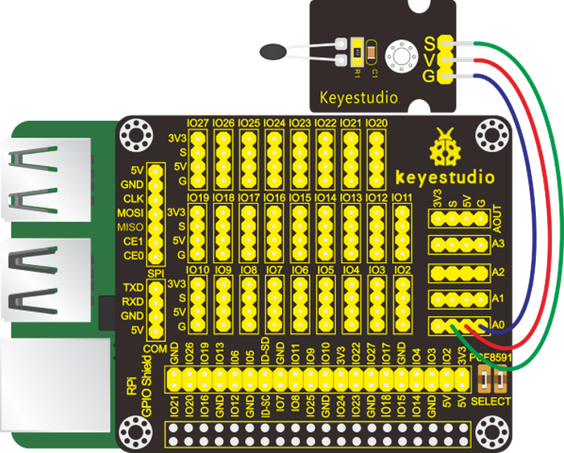

#### 5. Run Example Code：

<span style="color: rgb(255, 76, 65);">Special Note:</span> The I2C communication method is used in the experiment. We need to check the iic address first(<span style="color: rgb(255, 76, 65);">enter command：i2cdetect -y 1 and press“Enter”</span>). If failed, check the wiring is correct or not. If correct, you need to enable I2C communication function of Raspberry Pi, project 24 is for your reference.

After enabling the I2C communication，input the following commands and press "Enter":

cd /home/pi/pythonCode_A

python 38_analog_temperature.py

#### 6. Test Results：

The terminal will print the ADC value, the voltage value, and the temperature value of the analog temperature sensor.

<span style="color: rgb(255, 76, 65);">Note:</span> Press Ctrl + C on keyboard to exit code running.

#### 7. Example Code：

```python
import RPi.GPIO as GPIO
import smbus 
import math  
import time

GPIO.setmode(GPIO.BCM)
GPIO.setwarnings(False)
 
address = 0x48 ##address  ---> device address
cmd = 0x40     ##DA converter command
A0 = 0x40      ##A0  ----> port address
A1 = 0x41
A2 = 0x42
A3 = 0x43
bus = smbus.SMBus(1)            ##start the bus

def analogRead(count):   #function,read analog data
    read_val = bus.read_byte_data(address,cmd+count)
    return read_val

while True:                     ##loop 
    value = analogRead(0)        # read ADC value A0 pin
    voltage = value / 255.0 * 5.0        # calculate voltage
    Rt = 4.7 * (5.0 / voltage) - 4.7 ;   #calculate resistance value of thermistor, 5.0*(R/(Rt+R))=voltage,>>>Rt=R*(5.0/voltage)-R
    tempK = 1/(1/(273.15 + 25) + math.log(Rt/4.7)/3950.0)  # calculate temperature (Kelvin)
    tempC = tempK - 273.15       # calculate temperature (Celsius)
    print ('ADC Value : %d, Voltage : %.2f, Temperature : %.2f'%(value,voltage,tempC))

time.sleep(0.02)
GPIO.cleanup()
```


### Project 39：Ultraviolet Light Detection

#### 1. Description：

UV is a kind of physics optics. The main ultraviolet light source in nature is the sun. Most of the ultraviolet rays emitted by sunlight is absorbed by ozone in the atmosphere, and very few partially irradiates to the earth.

We can detect how much the ultraviolet rays of sunlight using ultraviolet sensors.

#### 2. Components：

|  |   |         |  |
| ------------------------ | ------------------------- | ------------------------------- | ------------------------ |
| Raspberry Pi*1           | RPI GPIO-PCF8591 Shield*1 | GUVA-S12SD Ultraviolet Sensor*1 | F-F Dupont Wires         |

#### 3. Component Knowledge：

**GUVA-S12SD Ultraviolet Sensor：**

It can detect UV and UV index, applied to some wearable devices such as watches and smartphones. It can also be used to monitor the intensity of ultraviolet rays, or ultraviolet flame detectors when used as ultraviolet sterilization items. Its output current is proportional to light intensity. This sensor is mainly for ultraviolet measurements in the sun and the UVA lamp strength measurement and UVI detection.

#### 4. Schematic Diagram：

| GUVA-S12SD Ultraviolet Sensor | RPI GPIO-PCF8591 Shield |
| :---------------------------: | :---------------------: |
|               S               |          S(A0)          |
|               V               |           5V            |
|               G               |            G            |


#### 5. Run Example Code：

<span style="color: rgb(255, 76, 65);">Special Note:</span> The I2C communication method is used in the experiment. We need to check the iic address first(<span style="color: rgb(255, 76, 65);">enter command：i2cdetect -y 1 and press“Enter”</span>). If failed, check the wiring is correct or not. If correct, you need to enable I2C communication function of Raspberry Pi, project 24 is for your reference.

After enabling the I2C communication，input the following commands and press "Enter" :

cd /home/pi/pythonCode_A

python 39_ultraviolet_ray.py

#### 6. Test Results：

Turn on an ultraviolet pen (<span style="color: rgb(0, 209, 0);">we don’t provide</span>) and point at the ultraviolet sensor , the terminal will print out the ultraviolet intensity value.

<span style="color: rgb(255, 76, 65);">Note:</span> Press Ctrl +C on keyboard to exit code running.

#### 7. Example Code：

```python
import RPi.GPIO as GPIO
import smbus
import time

GPIO.setmode(GPIO.BCM)
GPIO.setwarnings(False)
 
address = 0x48 ##address  ---> device address
cmd = 0x40     ##DA converter command
A0 = 0x40      ##A0  ----> port address
A1 = 0x41
A2 = 0x42
A3 = 0x43
bus = smbus.SMBus(1)            ##start the bus

def analogRead(count):   #function,read analog data
    read_val = bus.read_byte_data(address,cmd+count)
    return read_val

while True:                     ##loop
    value = analogRead(0) ##read A0 data
    print("ultraviolet intensity:%1.0f" %(value))   ##print data
    time.sleep(0.05)                ##delay 0.05 second
    
GPIO.cleanup()
```


