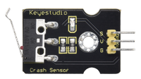

# KS3016 Raspberry Pi Sensor Starter Kit

## 1. Description:

Raspberry Pi is a credit-card sized computer of low cost with Raspberry Pi OS as its official system and also compatible with other systems like ubuntu and Windows IoT. Furthermore, it extends out 40 pins to link with sensors or modules, which makes conducting all kind of experiments possible. You could get a camera monitor by plugging a camera to Raspberry Pi. Equally, the voice interactive function could be achieved if a microphone or a camera is connected with it.

And this is a purpose-built kit for Raspberry Pi enthusiasts, through which you could acquire knowledge of Linux and Python, Java and other programming languages, as well as the application of sensors or modules.

## 2. Kit List:

When you get this kit, please confirm whether all components listed below are delivered.

|       **Product Name**        | **Quantity** |                   **Picture**                    |
| :---------------------------: | :----------: | :----------------------------------------------: |
|    RPI GPIO-PCF8591 Shield    |      1       |   |
|       White LED Module        |      1       |   |
|        Red LED Module         |      1       |   |
|     Traffic Light Module      |      1       |   |
|         3W LED Module         |      1       |   |
|          RGB Module           |      1       |   |
|      Push Button Module       |      1       |   |
|     Active Buzzer Module      |      1       |   |
| IR Obstacle Avoidance Module  |              |   |
|     Passive Buzzer Module     |      1       |   |
|       PIR Motion Sensor       |      1       |  |
|         Flame Sensor          |      1       |   |
|          Tilt Sensor          |      1       |   |
|       Collision Sensor        |      1       |   |
|     Line-tracking Sensor      |      1       |   |
|   Photo Interrupter Module    |      1       |   |
|     Hall Magnetic Sensor      |      1       |   |
|        5V Relay Module        |      1       |   |
|    Capacitive Touch Sensor    |      1       |   |
|      Reed Switch Sensor       |      1       |   |
|       Vibration Sensor        |      1       |   |
|         Relay Module          |      1       |   |
|  Rotary Potentiometer Module  |      1       |   |
|     Photoresistor Sensor      |      1       |   |
|      Analog Sound Sensor      |      1       |   |
|      I2C LCD1602 Module       |      1       |   |
|      Water Level Sensor       |      1       |   |
|     Soil Humidity Sensor      |      1       |   |
|    LM35 Temperature Sensor    |      1       |   |
|         Steam Sensor          |      1       |   |
|        MQ-2Gas Sensor         |      1       |   |
|      MQ-3 Alcohol Sensor      |      1       |   |
|        Joystick Module        |      1       |   |
|       Ultrasonic Module       |      1       |   |
| TEMT6000 Ambient Light Sensor |      1       |   |
|   Thin-film Pressure Sensor   |      1       |   |
|   Analog Temperature Sensor   |      1       |   |
| GUVA-S12SD Ultraviolet Sensor |      1       |   |
|      F-F DuPont Wire 40P      |      1       |   |
|          Screwdriver          |      1       |  |
|           USB Cable           |      1       |  |

## 3. Resources:

<https://fs.keyestudio.com/KS3016>

## 4.Tutorials

[C Language](KS3016_C\KS3016_C.md)

[JAVA](KS3016_JAVA\KS3016_JAVA.md)

[Python](KS3016_Python\KS3016_Python.md)

